```python
import pandas as pd
import matplotlib.pyplot as plt
import seaborn as sns
import numpy as np
sns.set_theme(color_codes=True)
pd.set_option('display.max_columns', None)
```


```python
pip install nbconvert[webpdf]

```

    Requirement already satisfied: nbconvert[webpdf] in c:\users\msn\appdata\local\anaconda3\lib\site-packages (6.5.4)
    Requirement already satisfied: defusedxml in c:\users\msn\appdata\local\anaconda3\lib\site-packages (from nbconvert[webpdf]) (0.7.1)
    Requirement already satisfied: nbclient>=0.5.0 in c:\users\msn\appdata\local\anaconda3\lib\site-packages (from nbconvert[webpdf]) (0.5.13)
    Requirement already satisfied: traitlets>=5.0 in c:\users\msn\appdata\local\anaconda3\lib\site-packages (from nbconvert[webpdf]) (5.7.1)
    Requirement already satisfied: beautifulsoup4 in c:\users\msn\appdata\local\anaconda3\lib\site-packages (from nbconvert[webpdf]) (4.11.1)
    Requirement already satisfied: lxml in c:\users\msn\appdata\local\anaconda3\lib\site-packages (from nbconvert[webpdf]) (4.9.1)
    Requirement already satisfied: jinja2>=3.0 in c:\users\msn\appdata\local\anaconda3\lib\site-packages (from nbconvert[webpdf]) (3.1.2)
    Requirement already satisfied: packaging in c:\users\msn\appdata\local\anaconda3\lib\site-packages (from nbconvert[webpdf]) (22.0)
    Requirement already satisfied: jupyter-core>=4.7 in c:\users\msn\appdata\local\anaconda3\lib\site-packages (from nbconvert[webpdf]) (5.2.0)
    Requirement already satisfied: bleach in c:\users\msn\appdata\local\anaconda3\lib\site-packages (from nbconvert[webpdf]) (4.1.0)
    Requirement already satisfied: mistune<2,>=0.8.1 in c:\users\msn\appdata\local\anaconda3\lib\site-packages (from nbconvert[webpdf]) (0.8.4)
    Requirement already satisfied: pandocfilters>=1.4.1 in c:\users\msn\appdata\local\anaconda3\lib\site-packages (from nbconvert[webpdf]) (1.5.0)
    Requirement already satisfied: nbformat>=5.1 in c:\users\msn\appdata\local\anaconda3\lib\site-packages (from nbconvert[webpdf]) (5.7.0)
    Requirement already satisfied: jupyterlab-pygments in c:\users\msn\appdata\local\anaconda3\lib\site-packages (from nbconvert[webpdf]) (0.1.2)
    Requirement already satisfied: entrypoints>=0.2.2 in c:\users\msn\appdata\local\anaconda3\lib\site-packages (from nbconvert[webpdf]) (0.4)
    Requirement already satisfied: tinycss2 in c:\users\msn\appdata\local\anaconda3\lib\site-packages (from nbconvert[webpdf]) (1.2.1)
    Requirement already satisfied: MarkupSafe>=2.0 in c:\users\msn\appdata\local\anaconda3\lib\site-packages (from nbconvert[webpdf]) (2.1.1)
    Requirement already satisfied: pygments>=2.4.1 in c:\users\msn\appdata\local\anaconda3\lib\site-packages (from nbconvert[webpdf]) (2.11.2)
    Requirement already satisfied: pyppeteer<1.1,>=1 in c:\users\msn\appdata\local\anaconda3\lib\site-packages (from nbconvert[webpdf]) (1.0.2)
    Requirement already satisfied: pywin32>=1.0 in c:\users\msn\appdata\local\anaconda3\lib\site-packages (from jupyter-core>=4.7->nbconvert[webpdf]) (305.1)
    Requirement already satisfied: platformdirs>=2.5 in c:\users\msn\appdata\local\anaconda3\lib\site-packages (from jupyter-core>=4.7->nbconvert[webpdf]) (2.5.2)
    Requirement already satisfied: jupyter-client>=6.1.5 in c:\users\msn\appdata\local\anaconda3\lib\site-packages (from nbclient>=0.5.0->nbconvert[webpdf]) (7.3.4)
    Requirement already satisfied: nest-asyncio in c:\users\msn\appdata\local\anaconda3\lib\site-packages (from nbclient>=0.5.0->nbconvert[webpdf]) (1.5.6)
    Requirement already satisfied: jsonschema>=2.6 in c:\users\msn\appdata\local\anaconda3\lib\site-packages (from nbformat>=5.1->nbconvert[webpdf]) (4.17.3)
    Requirement already satisfied: fastjsonschema in c:\users\msn\appdata\local\anaconda3\lib\site-packages (from nbformat>=5.1->nbconvert[webpdf]) (2.16.2)
    Requirement already satisfied: appdirs<2.0.0,>=1.4.3 in c:\users\msn\appdata\local\anaconda3\lib\site-packages (from pyppeteer<1.1,>=1->nbconvert[webpdf]) (1.4.4)
    Requirement already satisfied: websockets<11.0,>=10.0 in c:\users\msn\appdata\local\anaconda3\lib\site-packages (from pyppeteer<1.1,>=1->nbconvert[webpdf]) (10.4)
    Requirement already satisfied: tqdm<5.0.0,>=4.42.1 in c:\users\msn\appdata\local\anaconda3\lib\site-packages (from pyppeteer<1.1,>=1->nbconvert[webpdf]) (4.64.1)
    Requirement already satisfied: certifi>=2021 in c:\users\msn\appdata\local\anaconda3\lib\site-packages (from pyppeteer<1.1,>=1->nbconvert[webpdf]) (2022.12.7)
    Requirement already satisfied: urllib3<2.0.0,>=1.25.8 in c:\users\msn\appdata\local\anaconda3\lib\site-packages (from pyppeteer<1.1,>=1->nbconvert[webpdf]) (1.26.14)
    Requirement already satisfied: pyee<9.0.0,>=8.1.0 in c:\users\msn\appdata\local\anaconda3\lib\site-packages (from pyppeteer<1.1,>=1->nbconvert[webpdf]) (8.2.2)
    Requirement already satisfied: importlib-metadata>=1.4 in c:\users\msn\appdata\local\anaconda3\lib\site-packages (from pyppeteer<1.1,>=1->nbconvert[webpdf]) (4.11.3)
    Requirement already satisfied: soupsieve>1.2 in c:\users\msn\appdata\local\anaconda3\lib\site-packages (from beautifulsoup4->nbconvert[webpdf]) (2.3.2.post1)
    Requirement already satisfied: six>=1.9.0 in c:\users\msn\appdata\local\anaconda3\lib\site-packages (from bleach->nbconvert[webpdf]) (1.16.0)
    Requirement already satisfied: webencodings in c:\users\msn\appdata\local\anaconda3\lib\site-packages (from bleach->nbconvert[webpdf]) (0.5.1)
    Requirement already satisfied: zipp>=0.5 in c:\users\msn\appdata\local\anaconda3\lib\site-packages (from importlib-metadata>=1.4->pyppeteer<1.1,>=1->nbconvert[webpdf]) (3.11.0)
    Requirement already satisfied: attrs>=17.4.0 in c:\users\msn\appdata\local\anaconda3\lib\site-packages (from jsonschema>=2.6->nbformat>=5.1->nbconvert[webpdf]) (22.1.0)
    Requirement already satisfied: pyrsistent!=0.17.0,!=0.17.1,!=0.17.2,>=0.14.0 in c:\users\msn\appdata\local\anaconda3\lib\site-packages (from jsonschema>=2.6->nbformat>=5.1->nbconvert[webpdf]) (0.18.0)
    Requirement already satisfied: pyzmq>=23.0 in c:\users\msn\appdata\local\anaconda3\lib\site-packages (from jupyter-client>=6.1.5->nbclient>=0.5.0->nbconvert[webpdf]) (23.2.0)
    Requirement already satisfied: tornado>=6.0 in c:\users\msn\appdata\local\anaconda3\lib\site-packages (from jupyter-client>=6.1.5->nbclient>=0.5.0->nbconvert[webpdf]) (6.1)
    Requirement already satisfied: python-dateutil>=2.8.2 in c:\users\msn\appdata\local\anaconda3\lib\site-packages (from jupyter-client>=6.1.5->nbclient>=0.5.0->nbconvert[webpdf]) (2.8.2)
    Requirement already satisfied: colorama in c:\users\msn\appdata\local\anaconda3\lib\site-packages (from tqdm<5.0.0,>=4.42.1->pyppeteer<1.1,>=1->nbconvert[webpdf]) (0.4.6)
    Note: you may need to restart the kernel to use updated packages.
    


```python
!jupyter serverextension enable --py nbconvert

```

    Traceback (most recent call last):
      File "C:\Users\msn\AppData\Local\anaconda3\Scripts\jupyter-serverextension-script.py", line 10, in <module>
        sys.exit(main())
      File "C:\Users\msn\AppData\Local\anaconda3\lib\site-packages\jupyter_core\application.py", line 277, in launch_instance
        return super().launch_instance(argv=argv, **kwargs)
      File "C:\Users\msn\AppData\Local\anaconda3\lib\site-packages\traitlets\config\application.py", line 992, in launch_instance
        app.start()
      File "C:\Users\msn\AppData\Local\anaconda3\lib\site-packages\notebook\serverextensions.py", line 289, in start
        super().start()
      File "C:\Users\msn\AppData\Local\anaconda3\lib\site-packages\jupyter_core\application.py", line 266, in start
        self.subapp.start()
      File "C:\Users\msn\AppData\Local\anaconda3\lib\site-packages\notebook\serverextensions.py", line 208, in start
        self.toggle_server_extension_python(arg)
      File "C:\Users\msn\AppData\Local\anaconda3\lib\site-packages\notebook\serverextensions.py", line 197, in toggle_server_extension_python
        m, server_exts = _get_server_extension_metadata(package)
      File "C:\Users\msn\AppData\Local\anaconda3\lib\site-packages\notebook\serverextensions.py", line 325, in _get_server_extension_metadata
        raise KeyError(f'The Python module {module} does not include any valid server extensions')
    KeyError: 'The Python module nbconvert does not include any valid server extensions'
    


```python
import pandas as pd

# Read the CSV file into a DataFrame
df = pd.read_csv('employee.csv')

# Check the first few rows of the DataFrame
df.head()

# Check the number of unique values for each column with object datatype
df.select_dtypes(include='object').nunique()

# Check the number of unique values for each column with int datatype
df.select_dtypes(include='int').nunique()

# Drop columns: 'EmployeeNumber', 'StandardHours', 'Over18', 'PerformanceRating'
df.drop(columns=['EmployeeNumber', 'StandardHours', 'Over18', 'PerformanceRating'], inplace=True)

```


```python
df.select_dtypes(include='int')
```


<div>
<style scoped>
    .dataframe tbody tr th:only-of-type {
        vertical-align: middle;
    }

    .dataframe tbody tr th {
        vertical-align: top;
    }

    .dataframe thead th {
        text-align: right;
    }
</style>
<table border="1" class="dataframe">
  <thead>
    <tr style="text-align: right;">
      <th></th>
      <th>Age</th>
      <th>DailyRate</th>
      <th>DistanceFromHome</th>
      <th>Education</th>
      <th>EmployeeCount</th>
      <th>EnvironmentSatisfaction</th>
      <th>HourlyRate</th>
      <th>JobInvolvement</th>
      <th>JobLevel</th>
      <th>JobSatisfaction</th>
      <th>MonthlyIncome</th>
      <th>MonthlyRate</th>
      <th>NumCompaniesWorked</th>
      <th>PercentSalaryHike</th>
      <th>RelationshipSatisfaction</th>
      <th>StockOptionLevel</th>
      <th>TotalWorkingYears</th>
      <th>TrainingTimesLastYear</th>
      <th>WorkLifeBalance</th>
      <th>YearsAtCompany</th>
      <th>YearsInCurrentRole</th>
      <th>YearsSinceLastPromotion</th>
      <th>YearsWithCurrManager</th>
    </tr>
  </thead>
  <tbody>
    <tr>
      <th>0</th>
      <td>41</td>
      <td>1102</td>
      <td>1</td>
      <td>2</td>
      <td>1</td>
      <td>2</td>
      <td>94</td>
      <td>3</td>
      <td>2</td>
      <td>4</td>
      <td>5993</td>
      <td>19479</td>
      <td>8</td>
      <td>11</td>
      <td>1</td>
      <td>0</td>
      <td>8</td>
      <td>0</td>
      <td>1</td>
      <td>6</td>
      <td>4</td>
      <td>0</td>
      <td>5</td>
    </tr>
    <tr>
      <th>1</th>
      <td>49</td>
      <td>279</td>
      <td>8</td>
      <td>1</td>
      <td>1</td>
      <td>3</td>
      <td>61</td>
      <td>2</td>
      <td>2</td>
      <td>2</td>
      <td>5130</td>
      <td>24907</td>
      <td>1</td>
      <td>23</td>
      <td>4</td>
      <td>1</td>
      <td>10</td>
      <td>3</td>
      <td>3</td>
      <td>10</td>
      <td>7</td>
      <td>1</td>
      <td>7</td>
    </tr>
    <tr>
      <th>2</th>
      <td>37</td>
      <td>1373</td>
      <td>2</td>
      <td>2</td>
      <td>1</td>
      <td>4</td>
      <td>92</td>
      <td>2</td>
      <td>1</td>
      <td>3</td>
      <td>2090</td>
      <td>2396</td>
      <td>6</td>
      <td>15</td>
      <td>2</td>
      <td>0</td>
      <td>7</td>
      <td>3</td>
      <td>3</td>
      <td>0</td>
      <td>0</td>
      <td>0</td>
      <td>0</td>
    </tr>
    <tr>
      <th>3</th>
      <td>33</td>
      <td>1392</td>
      <td>3</td>
      <td>4</td>
      <td>1</td>
      <td>4</td>
      <td>56</td>
      <td>3</td>
      <td>1</td>
      <td>3</td>
      <td>2909</td>
      <td>23159</td>
      <td>1</td>
      <td>11</td>
      <td>3</td>
      <td>0</td>
      <td>8</td>
      <td>3</td>
      <td>3</td>
      <td>8</td>
      <td>7</td>
      <td>3</td>
      <td>0</td>
    </tr>
    <tr>
      <th>4</th>
      <td>27</td>
      <td>591</td>
      <td>2</td>
      <td>1</td>
      <td>1</td>
      <td>1</td>
      <td>40</td>
      <td>3</td>
      <td>1</td>
      <td>2</td>
      <td>3468</td>
      <td>16632</td>
      <td>9</td>
      <td>12</td>
      <td>4</td>
      <td>1</td>
      <td>6</td>
      <td>3</td>
      <td>3</td>
      <td>2</td>
      <td>2</td>
      <td>2</td>
      <td>2</td>
    </tr>
    <tr>
      <th>...</th>
      <td>...</td>
      <td>...</td>
      <td>...</td>
      <td>...</td>
      <td>...</td>
      <td>...</td>
      <td>...</td>
      <td>...</td>
      <td>...</td>
      <td>...</td>
      <td>...</td>
      <td>...</td>
      <td>...</td>
      <td>...</td>
      <td>...</td>
      <td>...</td>
      <td>...</td>
      <td>...</td>
      <td>...</td>
      <td>...</td>
      <td>...</td>
      <td>...</td>
      <td>...</td>
    </tr>
    <tr>
      <th>1465</th>
      <td>36</td>
      <td>884</td>
      <td>23</td>
      <td>2</td>
      <td>1</td>
      <td>3</td>
      <td>41</td>
      <td>4</td>
      <td>2</td>
      <td>4</td>
      <td>2571</td>
      <td>12290</td>
      <td>4</td>
      <td>17</td>
      <td>3</td>
      <td>1</td>
      <td>17</td>
      <td>3</td>
      <td>3</td>
      <td>5</td>
      <td>2</td>
      <td>0</td>
      <td>3</td>
    </tr>
    <tr>
      <th>1466</th>
      <td>39</td>
      <td>613</td>
      <td>6</td>
      <td>1</td>
      <td>1</td>
      <td>4</td>
      <td>42</td>
      <td>2</td>
      <td>3</td>
      <td>1</td>
      <td>9991</td>
      <td>21457</td>
      <td>4</td>
      <td>15</td>
      <td>1</td>
      <td>1</td>
      <td>9</td>
      <td>5</td>
      <td>3</td>
      <td>7</td>
      <td>7</td>
      <td>1</td>
      <td>7</td>
    </tr>
    <tr>
      <th>1467</th>
      <td>27</td>
      <td>155</td>
      <td>4</td>
      <td>3</td>
      <td>1</td>
      <td>2</td>
      <td>87</td>
      <td>4</td>
      <td>2</td>
      <td>2</td>
      <td>6142</td>
      <td>5174</td>
      <td>1</td>
      <td>20</td>
      <td>2</td>
      <td>1</td>
      <td>6</td>
      <td>0</td>
      <td>3</td>
      <td>6</td>
      <td>2</td>
      <td>0</td>
      <td>3</td>
    </tr>
    <tr>
      <th>1468</th>
      <td>49</td>
      <td>1023</td>
      <td>2</td>
      <td>3</td>
      <td>1</td>
      <td>4</td>
      <td>63</td>
      <td>2</td>
      <td>2</td>
      <td>2</td>
      <td>5390</td>
      <td>13243</td>
      <td>2</td>
      <td>14</td>
      <td>4</td>
      <td>0</td>
      <td>17</td>
      <td>3</td>
      <td>2</td>
      <td>9</td>
      <td>6</td>
      <td>0</td>
      <td>8</td>
    </tr>
    <tr>
      <th>1469</th>
      <td>34</td>
      <td>628</td>
      <td>8</td>
      <td>3</td>
      <td>1</td>
      <td>2</td>
      <td>82</td>
      <td>4</td>
      <td>2</td>
      <td>3</td>
      <td>4404</td>
      <td>10228</td>
      <td>2</td>
      <td>12</td>
      <td>1</td>
      <td>0</td>
      <td>6</td>
      <td>3</td>
      <td>4</td>
      <td>4</td>
      <td>3</td>
      <td>1</td>
      <td>2</td>
    </tr>
  </tbody>
</table>
<p>1470 rows × 23 columns</p>
</div>


```python
# Get the names of all columns with data type 'int'
int_vars = df.select_dtypes(include='int').columns.tolist()

# Create a figure with subplots
num_cols = len(int_vars)
num_rows = (num_cols + 2) // 3  # To make sure there are enough rows for the subplots
fig, axs = plt.subplots(nrows=num_rows, ncols=3, figsize=(15, 5*num_rows))
axs = axs.flatten()

# Create a histogram for each integer variable
for i, var in enumerate(int_vars):
    df[var].plot.hist(ax=axs[i])
    axs[i].set_title(var)

# Remove any extra empty subplots if needed
if num_cols < len(axs):
    for i in range(num_cols, len(axs)):
        fig.delaxes(axs[i])

# Adjust spacing between subplots
fig.tight_layout()

# Show plot
plt.show()
```


    
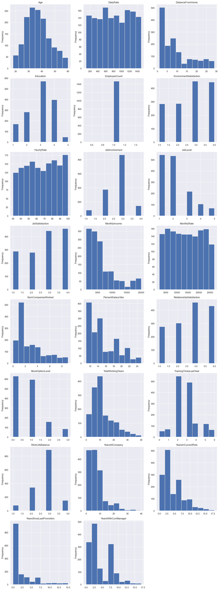
    


```python
# Get the names of all columns with data type 'int'
int_vars = df.select_dtypes(include='int').columns.tolist()

# Create a figure with subplots
num_cols = len(int_vars)
num_rows = (num_cols + 2) // 3  # To make sure there are enough rows for the subplots
fig, axs = plt.subplots(nrows=num_rows, ncols=3, figsize=(15, 5*num_rows))
axs = axs.flatten()

# Create a box plot for each integer variable using Seaborn
for i, var in enumerate(int_vars):
    sns.boxplot(x=df[var], ax=axs[i])
    axs[i].set_title(var)

# Remove any extra empty subplots if needed
if num_cols < len(axs):
    for i in range(num_cols, len(axs)):
        fig.delaxes(axs[i])

# Adjust spacing between subplots
fig.tight_layout()

# Show plot
plt.show()
```


    
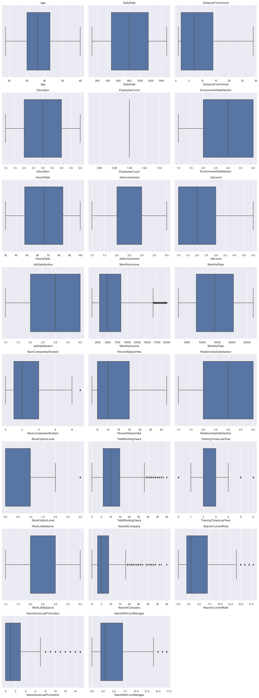
    


```python
# Filter columns with data type 'int'
int_columns = df.select_dtypes(include='int')


mean_values = int_columns.mean()
std_values = int_columns.std()
min_values = int_columns.min()
q1_values = int_columns.quantile(0.25)
q2_values = int_columns.quantile(0.5)
q3_values = int_columns.quantile(0.75)
iqr_values = q3_values - q1_values
max_values = int_columns.max()
statistics_df = pd.DataFrame({
    'Mean': mean_values,
    'Std': std_values,
    'Min': min_values,
    'Q1': q1_values,
    'Q2 (Median)': q2_values,
    'Q3': q3_values,
    'IQR': iqr_values,
    'Max': max_values
})

statistics_df
```


<div>
<style scoped>
    .dataframe tbody tr th:only-of-type {
        vertical-align: middle;
    }

    .dataframe tbody tr th {
        vertical-align: top;
    }

    .dataframe thead th {
        text-align: right;
    }
</style>
<table border="1" class="dataframe">
  <thead>
    <tr style="text-align: right;">
      <th></th>
      <th>Mean</th>
      <th>Std</th>
      <th>Min</th>
      <th>Q1</th>
      <th>Q2 (Median)</th>
      <th>Q3</th>
      <th>IQR</th>
      <th>Max</th>
    </tr>
  </thead>
  <tbody>
    <tr>
      <th>Age</th>
      <td>36.923810</td>
      <td>9.135373e+00</td>
      <td>18</td>
      <td>30.0</td>
      <td>36.0</td>
      <td>43.00</td>
      <td>13.00</td>
      <td>60</td>
    </tr>
    <tr>
      <th>DailyRate</th>
      <td>802.485714</td>
      <td>4.035091e+02</td>
      <td>102</td>
      <td>465.0</td>
      <td>802.0</td>
      <td>1157.00</td>
      <td>692.00</td>
      <td>1499</td>
    </tr>
    <tr>
      <th>DistanceFromHome</th>
      <td>9.192517</td>
      <td>8.106864e+00</td>
      <td>1</td>
      <td>2.0</td>
      <td>7.0</td>
      <td>14.00</td>
      <td>12.00</td>
      <td>29</td>
    </tr>
    <tr>
      <th>Education</th>
      <td>2.912925</td>
      <td>1.024165e+00</td>
      <td>1</td>
      <td>2.0</td>
      <td>3.0</td>
      <td>4.00</td>
      <td>2.00</td>
      <td>5</td>
    </tr>
    <tr>
      <th>EmployeeCount</th>
      <td>1.000000</td>
      <td>1.110601e-16</td>
      <td>1</td>
      <td>1.0</td>
      <td>1.0</td>
      <td>1.00</td>
      <td>0.00</td>
      <td>1</td>
    </tr>
    <tr>
      <th>EnvironmentSatisfaction</th>
      <td>2.721769</td>
      <td>1.093082e+00</td>
      <td>1</td>
      <td>2.0</td>
      <td>3.0</td>
      <td>4.00</td>
      <td>2.00</td>
      <td>4</td>
    </tr>
    <tr>
      <th>HourlyRate</th>
      <td>65.891156</td>
      <td>2.032943e+01</td>
      <td>30</td>
      <td>48.0</td>
      <td>66.0</td>
      <td>83.75</td>
      <td>35.75</td>
      <td>100</td>
    </tr>
    <tr>
      <th>JobInvolvement</th>
      <td>2.729932</td>
      <td>7.115611e-01</td>
      <td>1</td>
      <td>2.0</td>
      <td>3.0</td>
      <td>3.00</td>
      <td>1.00</td>
      <td>4</td>
    </tr>
    <tr>
      <th>JobLevel</th>
      <td>2.063946</td>
      <td>1.106940e+00</td>
      <td>1</td>
      <td>1.0</td>
      <td>2.0</td>
      <td>3.00</td>
      <td>2.00</td>
      <td>5</td>
    </tr>
    <tr>
      <th>JobSatisfaction</th>
      <td>2.728571</td>
      <td>1.102846e+00</td>
      <td>1</td>
      <td>2.0</td>
      <td>3.0</td>
      <td>4.00</td>
      <td>2.00</td>
      <td>4</td>
    </tr>
    <tr>
      <th>MonthlyIncome</th>
      <td>6502.931293</td>
      <td>4.707957e+03</td>
      <td>1009</td>
      <td>2911.0</td>
      <td>4919.0</td>
      <td>8379.00</td>
      <td>5468.00</td>
      <td>19999</td>
    </tr>
    <tr>
      <th>MonthlyRate</th>
      <td>14313.103401</td>
      <td>7.117786e+03</td>
      <td>2094</td>
      <td>8047.0</td>
      <td>14235.5</td>
      <td>20461.50</td>
      <td>12414.50</td>
      <td>26999</td>
    </tr>
    <tr>
      <th>NumCompaniesWorked</th>
      <td>2.693197</td>
      <td>2.498009e+00</td>
      <td>0</td>
      <td>1.0</td>
      <td>2.0</td>
      <td>4.00</td>
      <td>3.00</td>
      <td>9</td>
    </tr>
    <tr>
      <th>PercentSalaryHike</th>
      <td>15.209524</td>
      <td>3.659938e+00</td>
      <td>11</td>
      <td>12.0</td>
      <td>14.0</td>
      <td>18.00</td>
      <td>6.00</td>
      <td>25</td>
    </tr>
    <tr>
      <th>RelationshipSatisfaction</th>
      <td>2.712245</td>
      <td>1.081209e+00</td>
      <td>1</td>
      <td>2.0</td>
      <td>3.0</td>
      <td>4.00</td>
      <td>2.00</td>
      <td>4</td>
    </tr>
    <tr>
      <th>StockOptionLevel</th>
      <td>0.793878</td>
      <td>8.520767e-01</td>
      <td>0</td>
      <td>0.0</td>
      <td>1.0</td>
      <td>1.00</td>
      <td>1.00</td>
      <td>3</td>
    </tr>
    <tr>
      <th>TotalWorkingYears</th>
      <td>11.279592</td>
      <td>7.780782e+00</td>
      <td>0</td>
      <td>6.0</td>
      <td>10.0</td>
      <td>15.00</td>
      <td>9.00</td>
      <td>40</td>
    </tr>
    <tr>
      <th>TrainingTimesLastYear</th>
      <td>2.799320</td>
      <td>1.289271e+00</td>
      <td>0</td>
      <td>2.0</td>
      <td>3.0</td>
      <td>3.00</td>
      <td>1.00</td>
      <td>6</td>
    </tr>
    <tr>
      <th>WorkLifeBalance</th>
      <td>2.761224</td>
      <td>7.064758e-01</td>
      <td>1</td>
      <td>2.0</td>
      <td>3.0</td>
      <td>3.00</td>
      <td>1.00</td>
      <td>4</td>
    </tr>
    <tr>
      <th>YearsAtCompany</th>
      <td>7.008163</td>
      <td>6.126525e+00</td>
      <td>0</td>
      <td>3.0</td>
      <td>5.0</td>
      <td>9.00</td>
      <td>6.00</td>
      <td>40</td>
    </tr>
    <tr>
      <th>YearsInCurrentRole</th>
      <td>4.229252</td>
      <td>3.623137e+00</td>
      <td>0</td>
      <td>2.0</td>
      <td>3.0</td>
      <td>7.00</td>
      <td>5.00</td>
      <td>18</td>
    </tr>
    <tr>
      <th>YearsSinceLastPromotion</th>
      <td>2.187755</td>
      <td>3.222430e+00</td>
      <td>0</td>
      <td>0.0</td>
      <td>1.0</td>
      <td>3.00</td>
      <td>3.00</td>
      <td>15</td>
    </tr>
    <tr>
      <th>YearsWithCurrManager</th>
      <td>4.123129</td>
      <td>3.568136e+00</td>
      <td>0</td>
      <td>2.0</td>
      <td>3.0</td>
      <td>7.00</td>
      <td>5.00</td>
      <td>17</td>
    </tr>
  </tbody>
</table>
</div>


```python
# Filter columns with data type 'int'
int_columns = df.select_dtypes(include='int')
q1_values = int_columns.quantile(0.25)
q3_values = int_columns.quantile(0.75)
iqr_values = q3_values - q1_values
upper_whisker_values = q3_values + 1.5 * iqr_values
lower_whisker_values = q1_values - 1.5 * iqr_values

whisker_df = pd.DataFrame({
    'Upper Whisker': upper_whisker_values,
    'Lower Whisker': lower_whisker_values
})

whisker_df
```


<div>
<style scoped>
    .dataframe tbody tr th:only-of-type {
        vertical-align: middle;
    }

    .dataframe tbody tr th {
        vertical-align: top;
    }

    .dataframe thead th {
        text-align: right;
    }
</style>
<table border="1" class="dataframe">
  <thead>
    <tr style="text-align: right;">
      <th></th>
      <th>Upper Whisker</th>
      <th>Lower Whisker</th>
    </tr>
  </thead>
  <tbody>
    <tr>
      <th>Age</th>
      <td>62.500</td>
      <td>10.500</td>
    </tr>
    <tr>
      <th>DailyRate</th>
      <td>2195.000</td>
      <td>-573.000</td>
    </tr>
    <tr>
      <th>DistanceFromHome</th>
      <td>32.000</td>
      <td>-16.000</td>
    </tr>
    <tr>
      <th>Education</th>
      <td>7.000</td>
      <td>-1.000</td>
    </tr>
    <tr>
      <th>EmployeeCount</th>
      <td>1.000</td>
      <td>1.000</td>
    </tr>
    <tr>
      <th>EnvironmentSatisfaction</th>
      <td>7.000</td>
      <td>-1.000</td>
    </tr>
    <tr>
      <th>HourlyRate</th>
      <td>137.375</td>
      <td>-5.625</td>
    </tr>
    <tr>
      <th>JobInvolvement</th>
      <td>4.500</td>
      <td>0.500</td>
    </tr>
    <tr>
      <th>JobLevel</th>
      <td>6.000</td>
      <td>-2.000</td>
    </tr>
    <tr>
      <th>JobSatisfaction</th>
      <td>7.000</td>
      <td>-1.000</td>
    </tr>
    <tr>
      <th>MonthlyIncome</th>
      <td>16581.000</td>
      <td>-5291.000</td>
    </tr>
    <tr>
      <th>MonthlyRate</th>
      <td>39083.250</td>
      <td>-10574.750</td>
    </tr>
    <tr>
      <th>NumCompaniesWorked</th>
      <td>8.500</td>
      <td>-3.500</td>
    </tr>
    <tr>
      <th>PercentSalaryHike</th>
      <td>27.000</td>
      <td>3.000</td>
    </tr>
    <tr>
      <th>RelationshipSatisfaction</th>
      <td>7.000</td>
      <td>-1.000</td>
    </tr>
    <tr>
      <th>StockOptionLevel</th>
      <td>2.500</td>
      <td>-1.500</td>
    </tr>
    <tr>
      <th>TotalWorkingYears</th>
      <td>28.500</td>
      <td>-7.500</td>
    </tr>
    <tr>
      <th>TrainingTimesLastYear</th>
      <td>4.500</td>
      <td>0.500</td>
    </tr>
    <tr>
      <th>WorkLifeBalance</th>
      <td>4.500</td>
      <td>0.500</td>
    </tr>
    <tr>
      <th>YearsAtCompany</th>
      <td>18.000</td>
      <td>-6.000</td>
    </tr>
    <tr>
      <th>YearsInCurrentRole</th>
      <td>14.500</td>
      <td>-5.500</td>
    </tr>
    <tr>
      <th>YearsSinceLastPromotion</th>
      <td>7.500</td>
      <td>-4.500</td>
    </tr>
    <tr>
      <th>YearsWithCurrManager</th>
      <td>14.500</td>
      <td>-5.500</td>
    </tr>
  </tbody>
</table>
</div>


```python
import pandas as pd

# Assuming you already have the DataFrame 'df' containing the data

# Filter columns with data type 'int'
int_columns = df.select_dtypes(include='int')

q1_values = int_columns.quantile(0.25)
q3_values = int_columns.quantile(0.75)
iqr_values = q3_values - q1_values
upper_whisker_values = q3_values + 1.5 * iqr_values
lower_whisker_values = q1_values - 1.5 * iqr_values

outlier_count = ((int_columns < lower_whisker_values) | (int_columns > upper_whisker_values)).sum()
total_data_points = len(int_columns)
outlier_proportion = (outlier_count / total_data_points) * 100

outlier_list = {}
for col in int_columns.columns:
    outliers = int_columns[col][(int_columns[col] < lower_whisker_values[col]) | (int_columns[col] > upper_whisker_values[col])].tolist()
    outlier_list[col] = outliers

outlier_df = pd.DataFrame({
    'Outlier Count': outlier_count,
    'Outlier Proportion (%)': outlier_proportion,
    'Outlier List': outlier_list
})

outlier_df

```


<div>
<style scoped>
    .dataframe tbody tr th:only-of-type {
        vertical-align: middle;
    }

    .dataframe tbody tr th {
        vertical-align: top;
    }

    .dataframe thead th {
        text-align: right;
    }
</style>
<table border="1" class="dataframe">
  <thead>
    <tr style="text-align: right;">
      <th></th>
      <th>Outlier Count</th>
      <th>Outlier Proportion (%)</th>
      <th>Outlier List</th>
    </tr>
  </thead>
  <tbody>
    <tr>
      <th>Age</th>
      <td>0</td>
      <td>0.000000</td>
      <td>[]</td>
    </tr>
    <tr>
      <th>DailyRate</th>
      <td>0</td>
      <td>0.000000</td>
      <td>[]</td>
    </tr>
    <tr>
      <th>DistanceFromHome</th>
      <td>0</td>
      <td>0.000000</td>
      <td>[]</td>
    </tr>
    <tr>
      <th>Education</th>
      <td>0</td>
      <td>0.000000</td>
      <td>[]</td>
    </tr>
    <tr>
      <th>EmployeeCount</th>
      <td>0</td>
      <td>0.000000</td>
      <td>[]</td>
    </tr>
    <tr>
      <th>EnvironmentSatisfaction</th>
      <td>0</td>
      <td>0.000000</td>
      <td>[]</td>
    </tr>
    <tr>
      <th>HourlyRate</th>
      <td>0</td>
      <td>0.000000</td>
      <td>[]</td>
    </tr>
    <tr>
      <th>JobInvolvement</th>
      <td>0</td>
      <td>0.000000</td>
      <td>[]</td>
    </tr>
    <tr>
      <th>JobLevel</th>
      <td>0</td>
      <td>0.000000</td>
      <td>[]</td>
    </tr>
    <tr>
      <th>JobSatisfaction</th>
      <td>0</td>
      <td>0.000000</td>
      <td>[]</td>
    </tr>
    <tr>
      <th>MonthlyIncome</th>
      <td>114</td>
      <td>7.755102</td>
      <td>[19094, 18947, 19545, 18740, 18844, 18172, 173...</td>
    </tr>
    <tr>
      <th>MonthlyRate</th>
      <td>0</td>
      <td>0.000000</td>
      <td>[]</td>
    </tr>
    <tr>
      <th>NumCompaniesWorked</th>
      <td>52</td>
      <td>3.537415</td>
      <td>[9, 9, 9, 9, 9, 9, 9, 9, 9, 9, 9, 9, 9, 9, 9, ...</td>
    </tr>
    <tr>
      <th>PercentSalaryHike</th>
      <td>0</td>
      <td>0.000000</td>
      <td>[]</td>
    </tr>
    <tr>
      <th>RelationshipSatisfaction</th>
      <td>0</td>
      <td>0.000000</td>
      <td>[]</td>
    </tr>
    <tr>
      <th>StockOptionLevel</th>
      <td>85</td>
      <td>5.782313</td>
      <td>[3, 3, 3, 3, 3, 3, 3, 3, 3, 3, 3, 3, 3, 3, 3, ...</td>
    </tr>
    <tr>
      <th>TotalWorkingYears</th>
      <td>63</td>
      <td>4.285714</td>
      <td>[31, 29, 37, 38, 30, 40, 36, 34, 32, 33, 37, 3...</td>
    </tr>
    <tr>
      <th>TrainingTimesLastYear</th>
      <td>238</td>
      <td>16.190476</td>
      <td>[0, 5, 5, 5, 6, 5, 5, 5, 6, 6, 0, 0, 0, 5, 0, ...</td>
    </tr>
    <tr>
      <th>WorkLifeBalance</th>
      <td>0</td>
      <td>0.000000</td>
      <td>[]</td>
    </tr>
    <tr>
      <th>YearsAtCompany</th>
      <td>104</td>
      <td>7.074830</td>
      <td>[25, 22, 22, 27, 21, 22, 37, 25, 20, 40, 20, 2...</td>
    </tr>
    <tr>
      <th>YearsInCurrentRole</th>
      <td>21</td>
      <td>1.428571</td>
      <td>[15, 16, 18, 15, 18, 17, 16, 15, 16, 15, 16, 1...</td>
    </tr>
    <tr>
      <th>YearsSinceLastPromotion</th>
      <td>107</td>
      <td>7.278912</td>
      <td>[8, 15, 8, 8, 9, 13, 12, 10, 11, 9, 12, 15, 15...</td>
    </tr>
    <tr>
      <th>YearsWithCurrManager</th>
      <td>14</td>
      <td>0.952381</td>
      <td>[17, 15, 15, 15, 15, 17, 16, 17, 15, 17, 17, 1...</td>
    </tr>
  </tbody>
</table>
</div>


```python
# Get the names of all columns with data type 'object' (categorical columns)
cat_vars = df.select_dtypes(include='object').columns.tolist()

# Create a figure with subplots
num_cols = len(cat_vars)
num_rows = (num_cols + 2) // 3  # To make sure there are enough rows for the subplots
fig, axs = plt.subplots(nrows=num_rows, ncols=3, figsize=(15, 5*num_rows))
axs = axs.flatten()

# Create a countplot for each categorical variable using Seaborn
for i, var in enumerate(cat_vars):
    sns.countplot(x=var, data=df, ax=axs[i])
    axs[i].set_title(var)
    axs[i].tick_params(axis='x', rotation=90)  # Rotate x-axis labels for readability

# Remove any extra empty subplots if needed
if num_cols < len(axs):
    for i in range(num_cols, len(axs)):
        fig.delaxes(axs[i])

# Adjust spacing between subplots
fig.tight_layout()

# Show plot
plt.show()
```


    
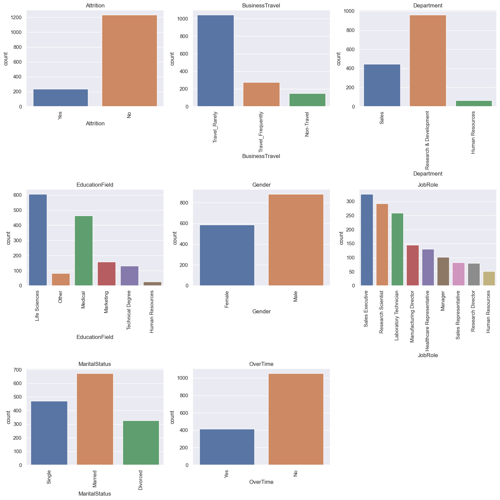
    


```python
# Create a dictionary to store unique categories and their frequencies for each column
unique_categories = {}

# Iterate over each column in the DataFrame
for col in df.columns:
    # Check if the column has object data type (categorical column)
    if df[col].dtype == 'object':
        value_counts = df[col].value_counts()
        unique_categories[col] = {
            'Categories': value_counts.index.tolist(),
            'Frequency': value_counts.values.tolist()
        }

# Display the list of unique categories and their frequencies for each column
for col, data in unique_categories.items():
    print(f"Column: {col}")
    print(pd.DataFrame(data))
    print()
```

    Column: Attrition
      Categories  Frequency
    0         No       1233
    1        Yes        237
    
    Column: BusinessTravel
              Categories  Frequency
    0      Travel_Rarely       1043
    1  Travel_Frequently        277
    2         Non-Travel        150
    
    Column: Department
                   Categories  Frequency
    0  Research & Development        961
    1                   Sales        446
    2         Human Resources         63
    
    Column: EducationField
             Categories  Frequency
    0     Life Sciences        606
    1           Medical        464
    2         Marketing        159
    3  Technical Degree        132
    4             Other         82
    5   Human Resources         27
    
    Column: Gender
      Categories  Frequency
    0       Male        882
    1     Female        588
    
    Column: JobRole
                      Categories  Frequency
    0            Sales Executive        326
    1         Research Scientist        292
    2      Laboratory Technician        259
    3     Manufacturing Director        145
    4  Healthcare Representative        131
    5                    Manager        102
    6       Sales Representative         83
    7          Research Director         80
    8            Human Resources         52
    
    Column: MaritalStatus
      Categories  Frequency
    0    Married        673
    1     Single        470
    2   Divorced        327
    
    Column: OverTime
      Categories  Frequency
    0         No       1054
    1        Yes        416
    
    


```python
# Get the names of all columns with data type 'int'
int_vars = df.select_dtypes(include='int').columns.tolist()

# Create a figure with subplots
num_cols = len(int_vars)
num_rows = (num_cols + 2) // 3  # To make sure there are enough rows for the subplots
fig, axs = plt.subplots(nrows=num_rows, ncols=3, figsize=(15, 5*num_rows))
axs = axs.flatten()

# Create a box plot for each integer variable using Seaborn with hue='attrition'
for i, var in enumerate(int_vars):
    sns.boxplot(y=var, x='Attrition', data=df, ax=axs[i])
    axs[i].set_title(var)

# Remove any extra empty subplots if needed
if num_cols < len(axs):
    for i in range(num_cols, len(axs)):
        fig.delaxes(axs[i])

# Adjust spacing between subplots
fig.tight_layout()

# Show plot
plt.show()
```


    
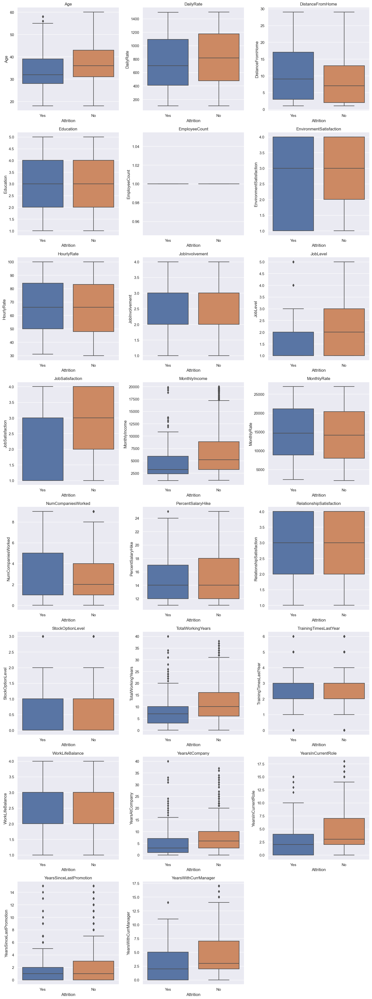
    


```python
# Get the names of all columns with data type 'int'
int_vars = df.select_dtypes(include='int').columns.tolist()

# Create a figure with subplots
num_cols = len(int_vars)
num_rows = (num_cols + 2) // 3  # To make sure there are enough rows for the subplots
fig, axs = plt.subplots(nrows=num_rows, ncols=3, figsize=(15, 5*num_rows))
axs = axs.flatten()

# Create a histogram for each integer variable
for i, var in enumerate(int_vars):
    sns.histplot(data=df, x=var, kde=True, ax=axs[i])
    axs[i].set_title(var)

# Remove any extra empty subplots if needed
if num_cols < len(axs):
    for i in range(num_cols, len(axs)):
        fig.delaxes(axs[i])

# Adjust spacing between subplots
fig.tight_layout()

# Show plot
plt.show()

```


    
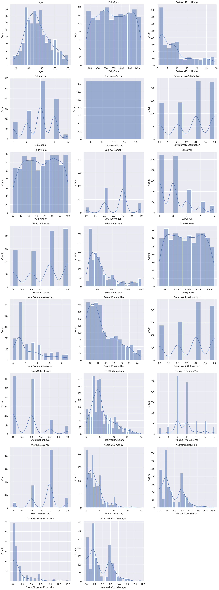
    


```python
# Get the names of all columns with data type 'object' (categorical columns)
cat_vars = df.select_dtypes(include='object').columns.tolist()

# Create a figure with subplots
num_cols = len(cat_vars)
num_rows = (num_cols + 2) // 3  # To make sure there are enough rows for the subplots
fig, axs = plt.subplots(nrows=num_rows, ncols=3, figsize=(15, 5*num_rows))
axs = axs.flatten()

# Create a countplot for each categorical variable using Seaborn with 'Attrition' as hue
for i, var in enumerate(cat_vars):
    sns.countplot(x=var, hue='Attrition', data=df, ax=axs[i])
    axs[i].set_title(var)
    axs[i].tick_params(axis='x', rotation=90)  # Rotate x-axis labels for readability

# Remove any extra empty subplots if needed
if num_cols < len(axs):
    for i in range(num_cols, len(axs)):
        fig.delaxes(axs[i])

# Adjust spacing between subplots
fig.tight_layout()

# Show plot
plt.show()

```


    
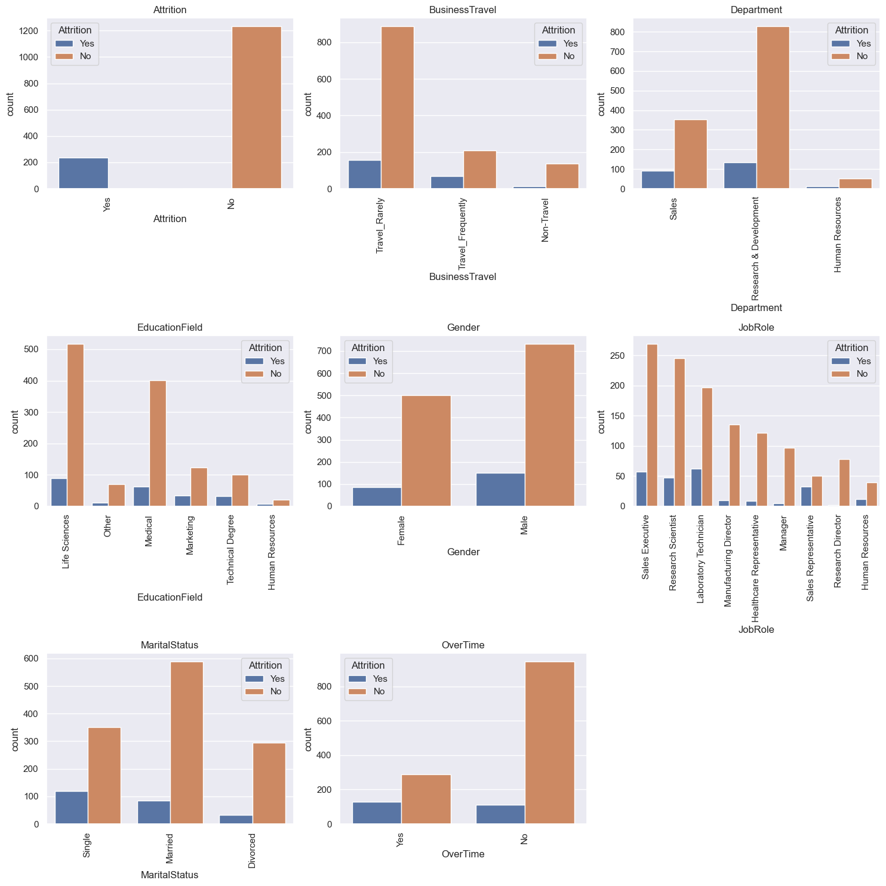
    


```python
import matplotlib.pyplot as plt
import seaborn as sns
import pandas as pd

# Assuming you already have the DataFrame 'df' containing the data

# Get the names of all columns with data type 'object' (categorical columns)
cat_vars = df.select_dtypes(include='object').columns.tolist()

# Create the stacked density plot
num_cols = len(cat_vars)
num_rows = (num_cols + 2) // 3
fig, axs = plt.subplots(nrows=num_rows, ncols=3, figsize=(15, 5*num_rows))
axs = axs.flatten()

for i, var in enumerate(cat_vars):
    sns.histplot(data=df, x=var, hue='Attrition', stat='density', multiple='stack', ax=axs[i])
    axs[i].set_title(var)
    axs[i].set_ylabel('Density')
    axs[i].tick_params(axis='x', rotation=90)

# Remove any extra empty subplots if needed
if num_cols < len(axs):
    for i in range(num_cols, len(axs)):
        fig.delaxes(axs[i])

# Adjust spacing between subplots
fig.tight_layout()

# Show plot
plt.show()
```


    
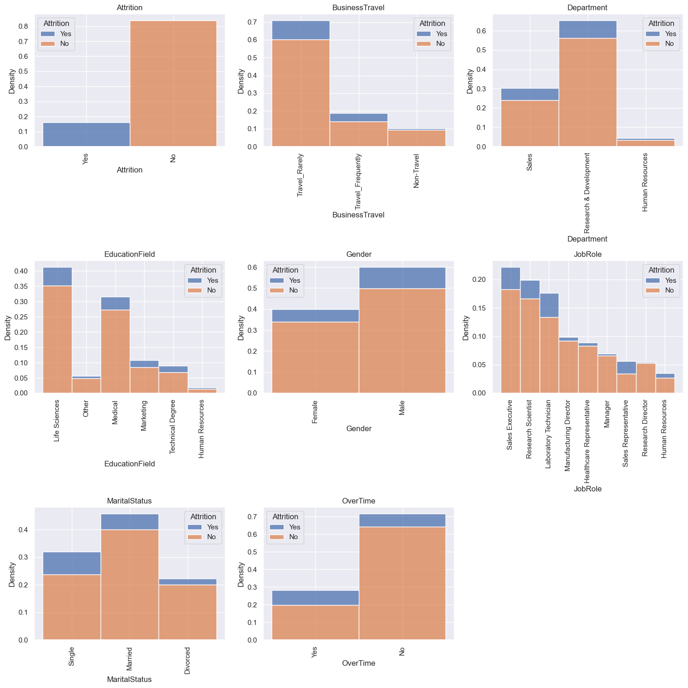
    


```python
from scipy.stats import ttest_ind

# Extract 'Total Working Years' for employees who left (Attrition = 'Yes') and stayed (Attrition = 'No')
working_years_left = df[df['Attrition'] == 'Yes']['TotalWorkingYears']
working_years_stayed = df[df['Attrition'] == 'No']['TotalWorkingYears']

# Perform the independent t-test
alpha = 0.05
t_statistic, p_value = ttest_ind(working_years_left, working_years_stayed)

# Print the results
print("Independent T-Test Results:")
print(f"T-Statistic: {t_statistic}")
print(f"P-Value: {p_value}")
```

    Independent T-Test Results:
    T-Statistic: -6.6522546135024445
    P-Value: 4.0618781112668525e-11
    


```python
from scipy.stats import f_oneway

# Extract 'Age' for employees from each department
age_Sales = df[df['Department'] == 'Sales']['Age']
age_Research_Development = df[df['Department'] == 'Research & Development']['Age']
age_Human_Resources = df[df['Department'] == 'Human Resources']['Age']

# Perform the one-way ANOVA
alpha = 0.05
f_statistic, p_value = f_oneway(age_Sales, age_Research_Development, age_Human_Resources)

# Print the results
print("One-Way ANOVA Results:")
print(f"F-Statistic: {f_statistic}")
print(f"P-Value: {p_value}")
```

    One-Way ANOVA Results:
    F-Statistic: 0.7655031924976903
    P-Value: 0.46528552999349515
    


```python
#Check missing value
check_missing = df.isnull().sum() * 100 / df.shape[0]
check_missing[check_missing > 0].sort_values(ascending=False)
```


    Series([], dtype: float64)


```python
# Loop over each column in the DataFrame where dtype is 'object'
for col in df.select_dtypes(include=['object']).columns:

    # Print the column name and the unique values
    print(f"{col}: {df[col].unique()}")
```

    Attrition: ['Yes' 'No']
    BusinessTravel: ['Travel_Rarely' 'Travel_Frequently' 'Non-Travel']
    Department: ['Sales' 'Research & Development' 'Human Resources']
    EducationField: ['Life Sciences' 'Other' 'Medical' 'Marketing' 'Technical Degree'
     'Human Resources']
    Gender: ['Female' 'Male']
    JobRole: ['Sales Executive' 'Research Scientist' 'Laboratory Technician'
     'Manufacturing Director' 'Healthcare Representative' 'Manager'
     'Sales Representative' 'Research Director' 'Human Resources']
    MaritalStatus: ['Single' 'Married' 'Divorced']
    OverTime: ['Yes' 'No']
    


```python
from sklearn import preprocessing

# Loop over each column in the DataFrame where dtype is 'object'
for col in df.select_dtypes(include=['object']).columns:

    # Initialize a LabelEncoder object
    label_encoder = preprocessing.LabelEncoder()

    # Fit the encoder to the unique values in the column
    label_encoder.fit(df[col].unique())

    # Transform the column using the encoder
    df[col] = label_encoder.transform(df[col])

    # Print the column name and the unique encoded values
    print(f"{col}: {df[col].unique()}")
```

    Attrition: [1 0]
    BusinessTravel: [2 1 0]
    Department: [2 1 0]
    EducationField: [1 4 3 2 5 0]
    Gender: [0 1]
    JobRole: [7 6 2 4 0 3 8 5 1]
    MaritalStatus: [2 1 0]
    OverTime: [1 0]
    


```python
#Correlation Heatmap
plt.figure(figsize=(20, 16))
sns.heatmap(df.corr(), fmt='.2g')
```


    <Axes: >


    
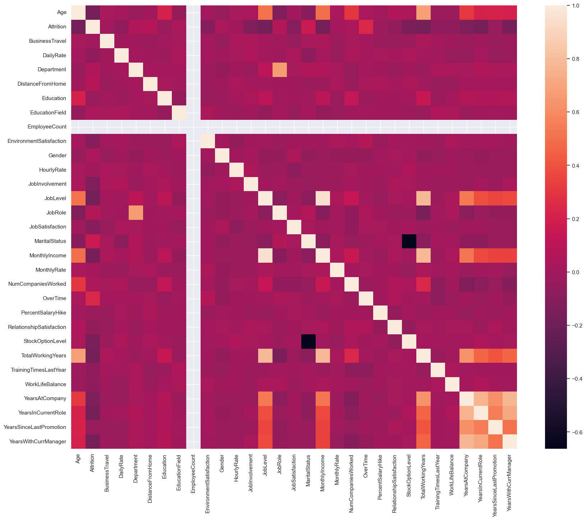
    


```python
X = df.drop('Attrition', axis=1)
y = df['Attrition']
```


```python
from sklearn.model_selection import train_test_split
X_train, X_test, y_train, y_test = train_test_split(X, y, test_size=0.2, stratify=y, random_state=0)
```


```python
from scipy import stats

# Define the columns for which you want to remove outliers
selected_columns = ['MonthlyIncome', 'StockOptionLevel', 'TotalWorkingYears', 'TrainingTimesLastYear', 'YearsAtCompany',
                    'YearsInCurrentRole', 'YearsSinceLastPromotion', 'YearsWithCurrManager']

# Calculate the Z-scores for the selected columns in the training data
z_scores = np.abs(stats.zscore(X_train[selected_columns]))

# Set a threshold value for outlier detection (e.g., 3)
threshold = 3

# Find the indices of outliers based on the threshold
outlier_indices = np.where(z_scores > threshold)[0]

# Remove the outliers from the training data
X_train = X_train.drop(X_train.index[outlier_indices])
y_train = y_train.drop(y_train.index[outlier_indices])
```


```python
!pip install xgboost

```

    Requirement already satisfied: xgboost in c:\users\msn\appdata\local\anaconda3\lib\site-packages (1.7.6)
    Requirement already satisfied: numpy in c:\users\msn\appdata\local\anaconda3\lib\site-packages (from xgboost) (1.23.5)
    Requirement already satisfied: scipy in c:\users\msn\appdata\local\anaconda3\lib\site-packages (from xgboost) (1.10.0)
    


```python
from sklearn.model_selection import GridSearchCV, cross_val_score
from sklearn.linear_model import LogisticRegression
from sklearn.tree import DecisionTreeClassifier
from xgboost import XGBClassifier


# Estimator 1: Logistic Regression
lr_classifier = LogisticRegression(solver='liblinear', random_state=42)
lr_params = {'C': [0.1, 1.0, 10.0]}

# Estimator 2: Decision Tree Classifier
dt_classifier = DecisionTreeClassifier(random_state=42)
dt_params = {'max_depth': [None, 5, 10, 15]}

# Estimator 3: XGBoost Classifier
xgb_classifier = XGBClassifier(random_state=42)
xgb_params = {
    'n_estimators': [50, 100, 150],
    'max_depth': [3, 5, 7],
    'learning_rate': [0.1, 0.01, 0.001]
}

# Cross-validation untuk Logistic Regression
lr_grid_search = GridSearchCV(lr_classifier, lr_params, cv=5, scoring='accuracy')
lr_grid_search.fit(X_train, y_train)
print("Logistic Regression - Best Parameters:", lr_grid_search.best_params_)
print("Logistic Regression - Best Cross-validation Score:", lr_grid_search.best_score_)

# Cross-validation untuk Decision Tree Classifier
dt_grid_search = GridSearchCV(dt_classifier, dt_params, cv=5, scoring='accuracy')
dt_grid_search.fit(X_train, y_train)
print("Decision Tree Classifier - Best Parameters:", dt_grid_search.best_params_)
print("Decision Tree Classifier - Best Cross-validation Score:", dt_grid_search.best_score_)

# Cross-validation untuk XGBoost Classifier
xgb_grid_search = GridSearchCV(xgb_classifier, xgb_params, cv=5, scoring='accuracy')
xgb_grid_search.fit(X_train, y_train)
print("XGBoost Classifier - Best Parameters:", xgb_grid_search.best_params_)
print("XGBoost Classifier - Best Cross-validation Score:", xgb_grid_search.best_score_)
```

    Logistic Regression - Best Parameters: {'C': 1.0}
    Logistic Regression - Best Cross-validation Score: 0.8575072069186419
    Decision Tree Classifier - Best Parameters: {'max_depth': 5}
    Decision Tree Classifier - Best Cross-validation Score: 0.8207839525944907
    XGBoost Classifier - Best Parameters: {'learning_rate': 0.1, 'max_depth': 3, 'n_estimators': 150}
    XGBoost Classifier - Best Cross-validation Score: 0.871872998078155
    


```python
from sklearn.tree import DecisionTreeClassifier
from sklearn.model_selection import GridSearchCV
dtree = DecisionTreeClassifier(class_weight='balanced')
param_grid = {
    'max_depth': [3, 4, 5, 6, 7, 8],
    'min_samples_split': [2, 3, 4],
    'min_samples_leaf': [1, 2, 3, 4],
    'random_state': [0, 42]
}

# here performing a grid search with cross-validation to find the best the hyperparameters
grid_search = GridSearchCV(dtree, param_grid, cv=5)
grid_search.fit(X_train, y_train)

# Print the best hyperparameters
print(grid_search.best_params_)
```

    {'max_depth': 4, 'min_samples_leaf': 1, 'min_samples_split': 2, 'random_state': 0}
    


```python
from sklearn.tree import DecisionTreeClassifier
dtree = DecisionTreeClassifier(random_state=0, max_depth=8, min_samples_leaf=1, min_samples_split=2, class_weight='balanced')
dtree.fit(X_train, y_train)
```


<style>#sk-container-id-1 {color: black;background-color: white;}#sk-container-id-1 pre{padding: 0;}#sk-container-id-1 div.sk-toggleable {background-color: white;}#sk-container-id-1 label.sk-toggleable__label {cursor: pointer;display: block;width: 100%;margin-bottom: 0;padding: 0.3em;box-sizing: border-box;text-align: center;}#sk-container-id-1 label.sk-toggleable__label-arrow:before {content: "▸";float: left;margin-right: 0.25em;color: #696969;}#sk-container-id-1 label.sk-toggleable__label-arrow:hover:before {color: black;}#sk-container-id-1 div.sk-estimator:hover label.sk-toggleable__label-arrow:before {color: black;}#sk-container-id-1 div.sk-toggleable__content {max-height: 0;max-width: 0;overflow: hidden;text-align: left;background-color: #f0f8ff;}#sk-container-id-1 div.sk-toggleable__content pre {margin: 0.2em;color: black;border-radius: 0.25em;background-color: #f0f8ff;}#sk-container-id-1 input.sk-toggleable__control:checked~div.sk-toggleable__content {max-height: 200px;max-width: 100%;overflow: auto;}#sk-container-id-1 input.sk-toggleable__control:checked~label.sk-toggleable__label-arrow:before {content: "▾";}#sk-container-id-1 div.sk-estimator input.sk-toggleable__control:checked~label.sk-toggleable__label {background-color: #d4ebff;}#sk-container-id-1 div.sk-label input.sk-toggleable__control:checked~label.sk-toggleable__label {background-color: #d4ebff;}#sk-container-id-1 input.sk-hidden--visually {border: 0;clip: rect(1px 1px 1px 1px);clip: rect(1px, 1px, 1px, 1px);height: 1px;margin: -1px;overflow: hidden;padding: 0;position: absolute;width: 1px;}#sk-container-id-1 div.sk-estimator {font-family: monospace;background-color: #f0f8ff;border: 1px dotted black;border-radius: 0.25em;box-sizing: border-box;margin-bottom: 0.5em;}#sk-container-id-1 div.sk-estimator:hover {background-color: #d4ebff;}#sk-container-id-1 div.sk-parallel-item::after {content: "";width: 100%;border-bottom: 1px solid gray;flex-grow: 1;}#sk-container-id-1 div.sk-label:hover label.sk-toggleable__label {background-color: #d4ebff;}#sk-container-id-1 div.sk-serial::before {content: "";position: absolute;border-left: 1px solid gray;box-sizing: border-box;top: 0;bottom: 0;left: 50%;z-index: 0;}#sk-container-id-1 div.sk-serial {display: flex;flex-direction: column;align-items: center;background-color: white;padding-right: 0.2em;padding-left: 0.2em;position: relative;}#sk-container-id-1 div.sk-item {position: relative;z-index: 1;}#sk-container-id-1 div.sk-parallel {display: flex;align-items: stretch;justify-content: center;background-color: white;position: relative;}#sk-container-id-1 div.sk-item::before, #sk-container-id-1 div.sk-parallel-item::before {content: "";position: absolute;border-left: 1px solid gray;box-sizing: border-box;top: 0;bottom: 0;left: 50%;z-index: -1;}#sk-container-id-1 div.sk-parallel-item {display: flex;flex-direction: column;z-index: 1;position: relative;background-color: white;}#sk-container-id-1 div.sk-parallel-item:first-child::after {align-self: flex-end;width: 50%;}#sk-container-id-1 div.sk-parallel-item:last-child::after {align-self: flex-start;width: 50%;}#sk-container-id-1 div.sk-parallel-item:only-child::after {width: 0;}#sk-container-id-1 div.sk-dashed-wrapped {border: 1px dashed gray;margin: 0 0.4em 0.5em 0.4em;box-sizing: border-box;padding-bottom: 0.4em;background-color: white;}#sk-container-id-1 div.sk-label label {font-family: monospace;font-weight: bold;display: inline-block;line-height: 1.2em;}#sk-container-id-1 div.sk-label-container {text-align: center;}#sk-container-id-1 div.sk-container {/* jupyter's `normalize.less` sets `[hidden] { display: none; }` but bootstrap.min.css set `[hidden] { display: none !important; }` so we also need the `!important` here to be able to override the default hidden behavior on the sphinx rendered scikit-learn.org. See: https://github.com/scikit-learn/scikit-learn/issues/21755 */display: inline-block !important;position: relative;}#sk-container-id-1 div.sk-text-repr-fallback {display: none;}</style><div id="sk-container-id-1" class="sk-top-container"><div class="sk-text-repr-fallback"><pre>DecisionTreeClassifier(class_weight=&#x27;balanced&#x27;, max_depth=8, random_state=0)</pre><b>In a Jupyter environment, please rerun this cell to show the HTML representation or trust the notebook. <br />On GitHub, the HTML representation is unable to render, please try loading this page with nbviewer.org.</b></div><div class="sk-container" hidden><div class="sk-item"><div class="sk-estimator sk-toggleable"><input class="sk-toggleable__control sk-hidden--visually" id="sk-estimator-id-1" type="checkbox" checked><label for="sk-estimator-id-1" class="sk-toggleable__label sk-toggleable__label-arrow">DecisionTreeClassifier</label><div class="sk-toggleable__content"><pre>DecisionTreeClassifier(class_weight=&#x27;balanced&#x27;, max_depth=8, random_state=0)</pre></div></div></div></div></div>


```python
from sklearn.metrics import accuracy_score
y_pred = dtree.predict(X_test)
print("Accuracy Score :", round(accuracy_score(y_test, y_pred)*100 ,2), "%")
```

    Accuracy Score : 77.89 %
    


```python
from sklearn.metrics import accuracy_score, f1_score, precision_score, recall_score, jaccard_score, log_loss
print('F-1 Score : ',(f1_score(y_test, y_pred, average='micro')))
print('Precision Score : ',(precision_score(y_test, y_pred, average='micro')))
print('Recall Score : ',(recall_score(y_test, y_pred, average='micro')))
print('Jaccard Score : ',(jaccard_score(y_test, y_pred, average='micro')))
print('Log Loss : ',(log_loss(y_test, y_pred)))
```

    F-1 Score :  0.7789115646258504
    Precision Score :  0.7789115646258503
    Recall Score :  0.7789115646258503
    Jaccard Score :  0.637883008356546
    Log Loss :  7.968834932968078
    


```python
imp_df = pd.DataFrame({
    "Feature Name": X_train.columns,
    "Importance": dtree.feature_importances_
})
fi = imp_df.sort_values(by="Importance", ascending=False)

fi2 = fi.head(10)
plt.figure(figsize=(10,8))
sns.barplot(data=fi2, x='Importance', y='Feature Name')
plt.title('Top 10 Feature Importance Each Attributes (Decision Tree)', fontsize=18)
plt.xlabel ('Importance', fontsize=16)
plt.ylabel ('Feature Name', fontsize=16)
plt.show()
```


    
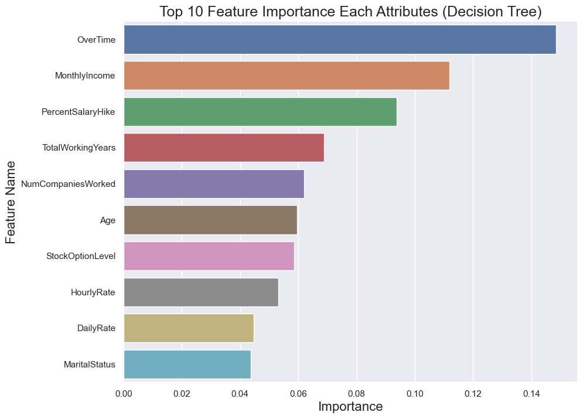
    


```python
!pip install shap

```

    Requirement already satisfied: shap in c:\users\msn\appdata\local\anaconda3\lib\site-packages (0.42.1)
    Requirement already satisfied: scipy in c:\users\msn\appdata\local\anaconda3\lib\site-packages (from shap) (1.10.0)
    Requirement already satisfied: tqdm>=4.27.0 in c:\users\msn\appdata\local\anaconda3\lib\site-packages (from shap) (4.64.1)
    Requirement already satisfied: slicer==0.0.7 in c:\users\msn\appdata\local\anaconda3\lib\site-packages (from shap) (0.0.7)
    Requirement already satisfied: cloudpickle in c:\users\msn\appdata\local\anaconda3\lib\site-packages (from shap) (2.0.0)
    Requirement already satisfied: numba in c:\users\msn\appdata\local\anaconda3\lib\site-packages (from shap) (0.56.4)
    Requirement already satisfied: numpy in c:\users\msn\appdata\local\anaconda3\lib\site-packages (from shap) (1.23.5)
    Requirement already satisfied: pandas in c:\users\msn\appdata\local\anaconda3\lib\site-packages (from shap) (1.5.3)
    Requirement already satisfied: packaging>20.9 in c:\users\msn\appdata\local\anaconda3\lib\site-packages (from shap) (22.0)
    Requirement already satisfied: scikit-learn in c:\users\msn\appdata\local\anaconda3\lib\site-packages (from shap) (1.2.1)
    Requirement already satisfied: colorama in c:\users\msn\appdata\local\anaconda3\lib\site-packages (from tqdm>=4.27.0->shap) (0.4.6)
    Requirement already satisfied: setuptools in c:\users\msn\appdata\local\anaconda3\lib\site-packages (from numba->shap) (65.6.3)
    Requirement already satisfied: llvmlite<0.40,>=0.39.0dev0 in c:\users\msn\appdata\local\anaconda3\lib\site-packages (from numba->shap) (0.39.1)
    Requirement already satisfied: python-dateutil>=2.8.1 in c:\users\msn\appdata\local\anaconda3\lib\site-packages (from pandas->shap) (2.8.2)
    Requirement already satisfied: pytz>=2020.1 in c:\users\msn\appdata\local\anaconda3\lib\site-packages (from pandas->shap) (2022.7)
    Requirement already satisfied: joblib>=1.1.1 in c:\users\msn\appdata\local\anaconda3\lib\site-packages (from scikit-learn->shap) (1.1.1)
    Requirement already satisfied: threadpoolctl>=2.0.0 in c:\users\msn\appdata\local\anaconda3\lib\site-packages (from scikit-learn->shap) (2.2.0)
    Requirement already satisfied: six>=1.5 in c:\users\msn\appdata\local\anaconda3\lib\site-packages (from python-dateutil>=2.8.1->pandas->shap) (1.16.0)
    


```python
import shap
explainer = shap.TreeExplainer(dtree)
shap_values = explainer.shap_values(X_test)
shap.summary_plot(shap_values, X_test)
```


    
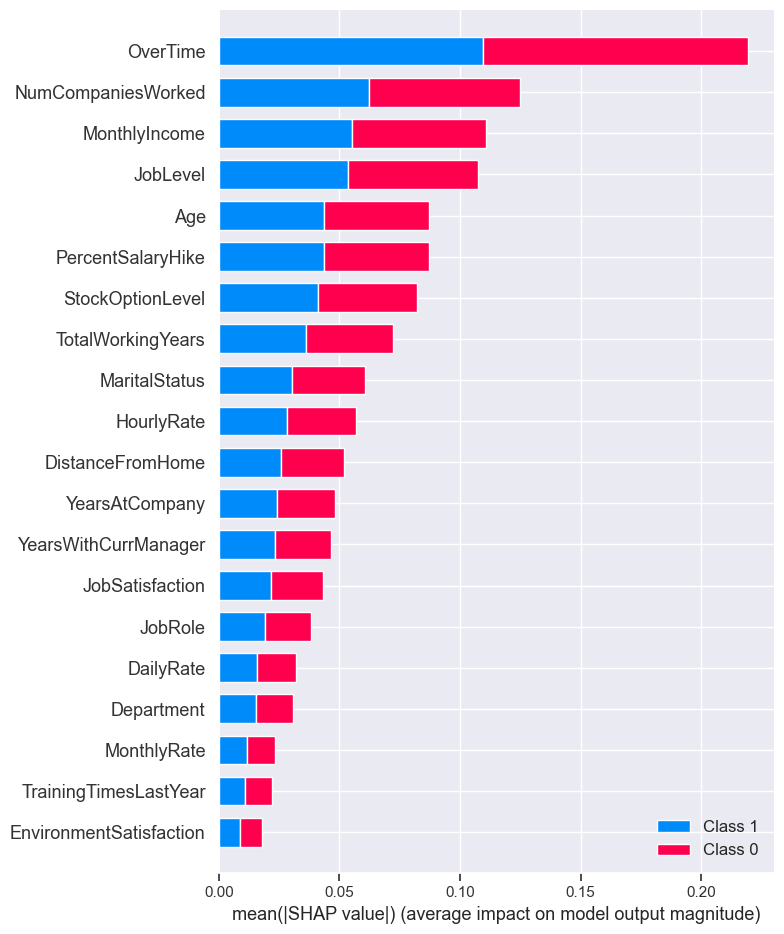
    


```python
# compute SHAP values
explainer = shap.TreeExplainer(dtree)
shap_values = explainer.shap_values(X_test)
shap.summary_plot(shap_values[1], X_test.values, feature_names = X_test.columns)
```

    No data for colormapping provided via 'c'. Parameters 'vmin', 'vmax' will be ignored
    


    
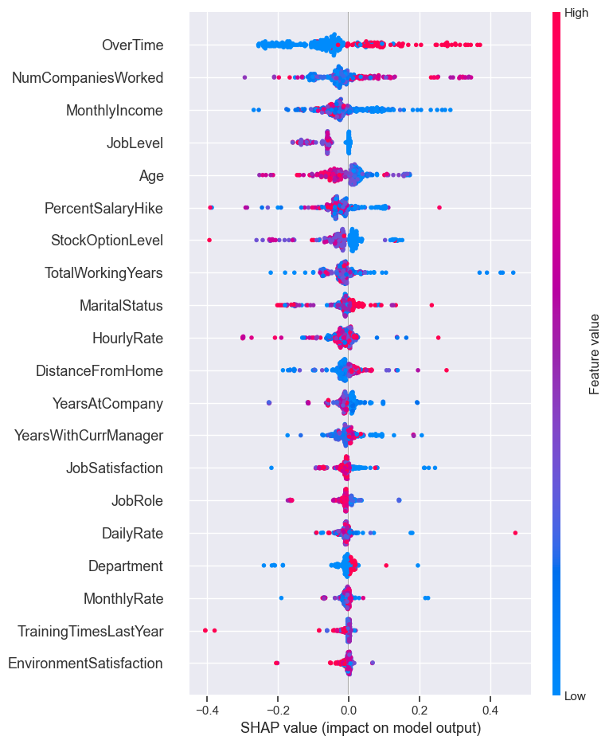
    


```python
from sklearn.metrics import confusion_matrix
cm = confusion_matrix(y_test, y_pred)
plt.figure(figsize=(5,5))
sns.heatmap(data=cm,linewidths=.5, annot=True,  cmap = 'Blues')
plt.ylabel('Actual label')
plt.xlabel('Predicted label')
all_sample_title = 'Accuracy Score for Decision Tree: {0}'.format(dtree.score(X_test, y_test))
plt.title(all_sample_title, size = 15)
```


    Text(0.5, 1.0, 'Accuracy Score for Decision Tree: 0.7789115646258503')


    

    


```python
from sklearn.metrics import roc_curve, roc_auc_score
y_pred_proba = dtree.predict_proba(X_test)[:][:,1]

df_actual_predicted = pd.concat([pd.DataFrame(np.array(y_test), columns=['y_actual']), pd.DataFrame(y_pred_proba, columns=['y_pred_proba'])], axis=1)
df_actual_predicted.index = y_test.index

fpr, tpr, tr = roc_curve(df_actual_predicted['y_actual'], df_actual_predicted['y_pred_proba'])
auc = roc_auc_score(df_actual_predicted['y_actual'], df_actual_predicted['y_pred_proba'])

plt.plot(fpr, tpr, label='AUC = %0.4f' %auc)
plt.plot(fpr, fpr, linestyle = '--', color='k')
plt.xlabel('False Positive Rate')
plt.ylabel('True Positive Rate')
plt.title('ROC Curve', size = 15)
plt.legend()
```


    <matplotlib.legend.Legend at 0x18cf0bca4d0>


    
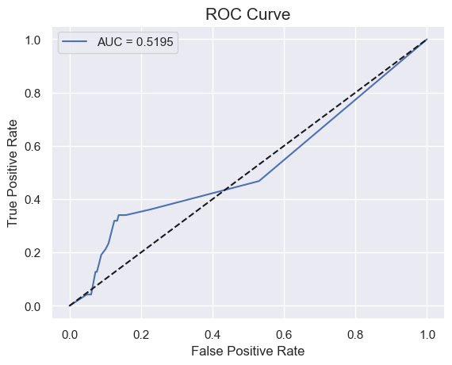
    


```python
from sklearn.ensemble import RandomForestClassifier
from sklearn.model_selection import GridSearchCV
rfc = RandomForestClassifier(class_weight='balanced')
param_grid = {
    'n_estimators': [100, 200],
    'max_depth': [None, 5, 10],
    'max_features': ['sqrt', 'log2', None],
    'random_state': [0, 42]
}

grid_search = GridSearchCV(rfc, param_grid, cv=5)
grid_search.fit(X_train, y_train)

print(grid_search.best_params_)
```

    {'max_depth': 10, 'max_features': None, 'n_estimators': 100, 'random_state': 42}
    


```python
from sklearn.ensemble import RandomForestClassifier
rfc = RandomForestClassifier(random_state=42, max_depth=None, max_features='sqrt', n_estimators=100, class_weight='balanced')
rfc.fit(X_train, y_train)
```


<style>#sk-container-id-3 {color: black;background-color: white;}#sk-container-id-3 pre{padding: 0;}#sk-container-id-3 div.sk-toggleable {background-color: white;}#sk-container-id-3 label.sk-toggleable__label {cursor: pointer;display: block;width: 100%;margin-bottom: 0;padding: 0.3em;box-sizing: border-box;text-align: center;}#sk-container-id-3 label.sk-toggleable__label-arrow:before {content: "▸";float: left;margin-right: 0.25em;color: #696969;}#sk-container-id-3 label.sk-toggleable__label-arrow:hover:before {color: black;}#sk-container-id-3 div.sk-estimator:hover label.sk-toggleable__label-arrow:before {color: black;}#sk-container-id-3 div.sk-toggleable__content {max-height: 0;max-width: 0;overflow: hidden;text-align: left;background-color: #f0f8ff;}#sk-container-id-3 div.sk-toggleable__content pre {margin: 0.2em;color: black;border-radius: 0.25em;background-color: #f0f8ff;}#sk-container-id-3 input.sk-toggleable__control:checked~div.sk-toggleable__content {max-height: 200px;max-width: 100%;overflow: auto;}#sk-container-id-3 input.sk-toggleable__control:checked~label.sk-toggleable__label-arrow:before {content: "▾";}#sk-container-id-3 div.sk-estimator input.sk-toggleable__control:checked~label.sk-toggleable__label {background-color: #d4ebff;}#sk-container-id-3 div.sk-label input.sk-toggleable__control:checked~label.sk-toggleable__label {background-color: #d4ebff;}#sk-container-id-3 input.sk-hidden--visually {border: 0;clip: rect(1px 1px 1px 1px);clip: rect(1px, 1px, 1px, 1px);height: 1px;margin: -1px;overflow: hidden;padding: 0;position: absolute;width: 1px;}#sk-container-id-3 div.sk-estimator {font-family: monospace;background-color: #f0f8ff;border: 1px dotted black;border-radius: 0.25em;box-sizing: border-box;margin-bottom: 0.5em;}#sk-container-id-3 div.sk-estimator:hover {background-color: #d4ebff;}#sk-container-id-3 div.sk-parallel-item::after {content: "";width: 100%;border-bottom: 1px solid gray;flex-grow: 1;}#sk-container-id-3 div.sk-label:hover label.sk-toggleable__label {background-color: #d4ebff;}#sk-container-id-3 div.sk-serial::before {content: "";position: absolute;border-left: 1px solid gray;box-sizing: border-box;top: 0;bottom: 0;left: 50%;z-index: 0;}#sk-container-id-3 div.sk-serial {display: flex;flex-direction: column;align-items: center;background-color: white;padding-right: 0.2em;padding-left: 0.2em;position: relative;}#sk-container-id-3 div.sk-item {position: relative;z-index: 1;}#sk-container-id-3 div.sk-parallel {display: flex;align-items: stretch;justify-content: center;background-color: white;position: relative;}#sk-container-id-3 div.sk-item::before, #sk-container-id-3 div.sk-parallel-item::before {content: "";position: absolute;border-left: 1px solid gray;box-sizing: border-box;top: 0;bottom: 0;left: 50%;z-index: -1;}#sk-container-id-3 div.sk-parallel-item {display: flex;flex-direction: column;z-index: 1;position: relative;background-color: white;}#sk-container-id-3 div.sk-parallel-item:first-child::after {align-self: flex-end;width: 50%;}#sk-container-id-3 div.sk-parallel-item:last-child::after {align-self: flex-start;width: 50%;}#sk-container-id-3 div.sk-parallel-item:only-child::after {width: 0;}#sk-container-id-3 div.sk-dashed-wrapped {border: 1px dashed gray;margin: 0 0.4em 0.5em 0.4em;box-sizing: border-box;padding-bottom: 0.4em;background-color: white;}#sk-container-id-3 div.sk-label label {font-family: monospace;font-weight: bold;display: inline-block;line-height: 1.2em;}#sk-container-id-3 div.sk-label-container {text-align: center;}#sk-container-id-3 div.sk-container {/* jupyter's `normalize.less` sets `[hidden] { display: none; }` but bootstrap.min.css set `[hidden] { display: none !important; }` so we also need the `!important` here to be able to override the default hidden behavior on the sphinx rendered scikit-learn.org. See: https://github.com/scikit-learn/scikit-learn/issues/21755 */display: inline-block !important;position: relative;}#sk-container-id-3 div.sk-text-repr-fallback {display: none;}</style><div id="sk-container-id-3" class="sk-top-container"><div class="sk-text-repr-fallback"><pre>RandomForestClassifier(class_weight=&#x27;balanced&#x27;, random_state=42)</pre><b>In a Jupyter environment, please rerun this cell to show the HTML representation or trust the notebook. <br />On GitHub, the HTML representation is unable to render, please try loading this page with nbviewer.org.</b></div><div class="sk-container" hidden><div class="sk-item"><div class="sk-estimator sk-toggleable"><input class="sk-toggleable__control sk-hidden--visually" id="sk-estimator-id-3" type="checkbox" checked><label for="sk-estimator-id-3" class="sk-toggleable__label sk-toggleable__label-arrow">RandomForestClassifier</label><div class="sk-toggleable__content"><pre>RandomForestClassifier(class_weight=&#x27;balanced&#x27;, random_state=42)</pre></div></div></div></div></div>


```python
y_pred = rfc.predict(X_test)
print("Accuracy Score :", round(accuracy_score(y_test, y_pred)*100 ,2), "%")
```

    Accuracy Score : 85.03 %
    


```python
from sklearn.metrics import accuracy_score, f1_score, precision_score, recall_score, jaccard_score, log_loss
print('F1 Score : ',(f1_score(y_test, y_pred, average='micro')))
print('Precision Score : ',(precision_score(y_test, y_pred, average='micro')))
print('Recall Score : ',(recall_score(y_test, y_pred, average='micro')))
print('Jaccard Score : ',(jaccard_score(y_test, y_pred, average='micro')))
print('Log Loss : ',(log_loss(y_test, y_pred)))
```

    F1 Score :  0.8503401360544217
    Precision Score :  0.8503401360544217
    Recall Score :  0.8503401360544217
    Jaccard Score :  0.7396449704142012
    Log Loss :  5.394288262316852
    


```python
imp_df = pd.DataFrame({
    "Feature Name": X_train.columns,
    "Importance": rfc.feature_importances_
})
fi = imp_df.sort_values(by="Importance", ascending=False)

fi2 = fi.head(10)
plt.figure(figsize=(10,8))
sns.barplot(data=fi2, x='Importance', y='Feature Name')
plt.title('Top 10 Feature Importance Each Attributes (Random Forest)', fontsize=18)
plt.xlabel ('Importance', fontsize=16)
plt.ylabel ('Feature Name', fontsize=16)
plt.show()
```


    
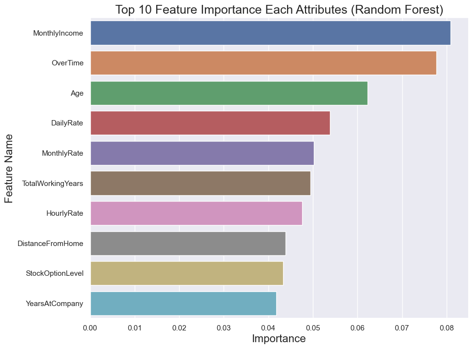
    


```python
import shap
explainer = shap.TreeExplainer(rfc)
shap_values = explainer.shap_values(X_test)
shap.summary_plot(shap_values, X_test)
```


    
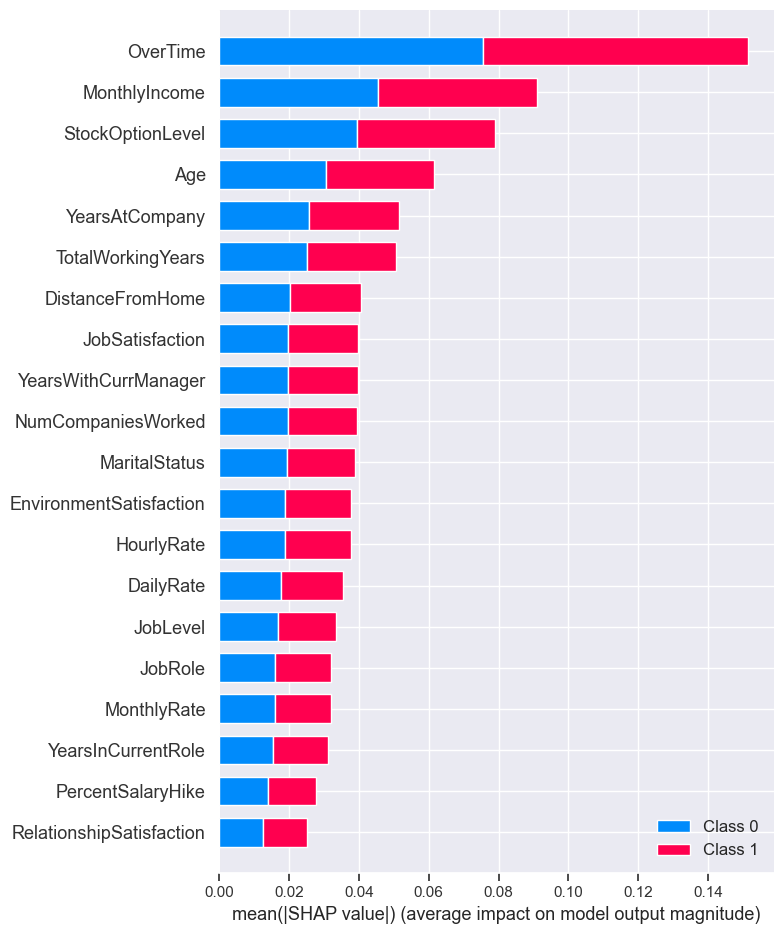
    


```python

explainer = shap.TreeExplainer(rfc)
shap_values = explainer.shap_values(X_test)
shap.summary_plot(shap_values[1], X_test.values, feature_names = X_test.columns)
```

    No data for colormapping provided via 'c'. Parameters 'vmin', 'vmax' will be ignored
    


    
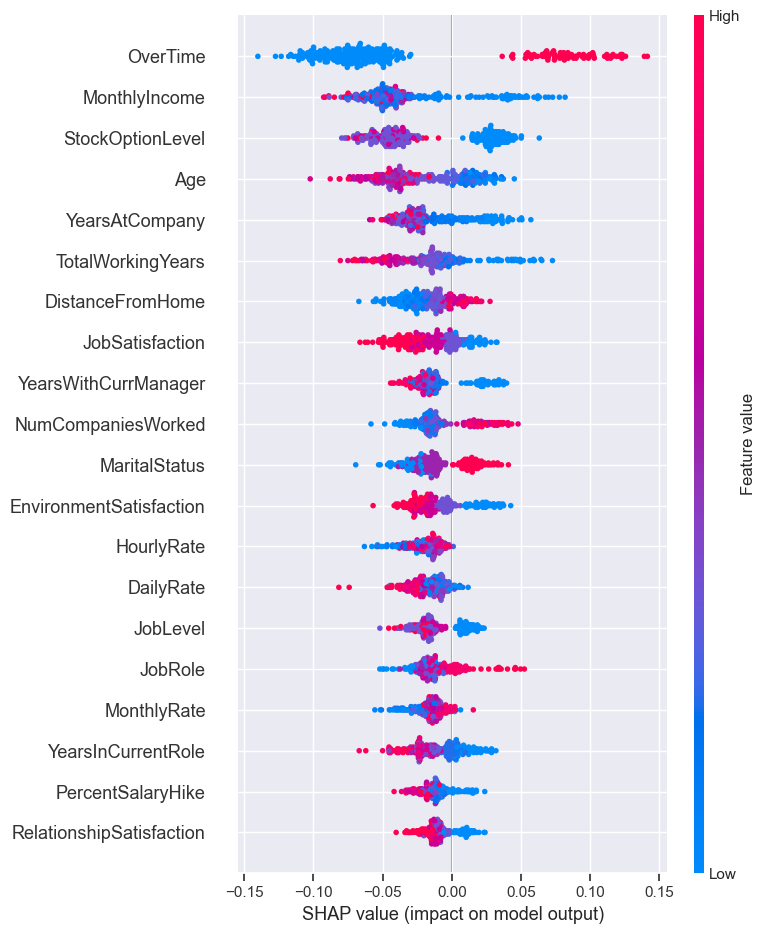
    


```python
from sklearn.metrics import confusion_matrix
cm = confusion_matrix(y_test, y_pred)
plt.figure(figsize=(5,5))
sns.heatmap(data=cm,linewidths=.5, annot=True,  cmap = 'Blues')
plt.ylabel('Actual label')
plt.xlabel('Predicted label')
all_sample_title = 'Accuracy Score for Random Forest: {0}'.format(rfc.score(X_test, y_test))
plt.title(all_sample_title, size = 15)
```


    Text(0.5, 1.0, 'Accuracy Score for Random Forest: 0.8503401360544217')


    
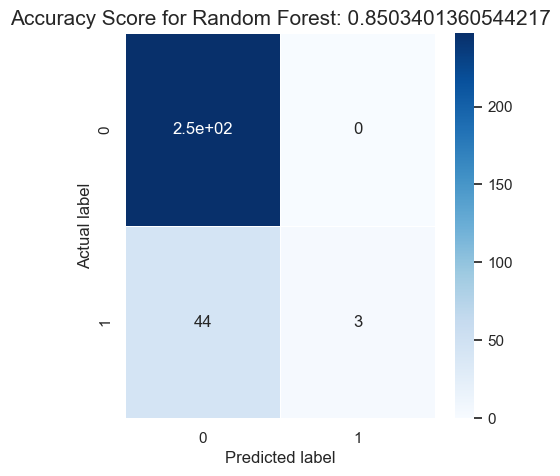
    


```python
from sklearn.metrics import roc_curve, roc_auc_score
y_pred_proba = rfc.predict_proba(X_test)[:][:,1]

df_actual_predicted = pd.concat([pd.DataFrame(np.array(y_test), columns=['y_actual']), pd.DataFrame(y_pred_proba, columns=['y_pred_proba'])], axis=1)
df_actual_predicted.index = y_test.index

fpr, tpr, tr = roc_curve(df_actual_predicted['y_actual'], df_actual_predicted['y_pred_proba'])
auc = roc_auc_score(df_actual_predicted['y_actual'], df_actual_predicted['y_pred_proba'])

plt.plot(fpr, tpr, label='AUC = %0.4f' %auc)
plt.plot(fpr, fpr, linestyle = '--', color='k')
plt.xlabel('False Positive Rate')
plt.ylabel('True Positive Rate')
plt.title('ROC Curve', size = 15)
plt.legend()
```


    <matplotlib.legend.Legend at 0x18cf0c58700>


    
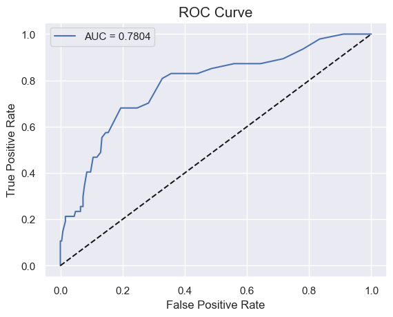
    


```python
from sklearn.model_selection import GridSearchCV
from xgboost import XGBClassifier

# Create an XGBoost classifier
xgb = XGBClassifier()

# Define the parameter grid for grid search
param_grid = {
    'n_estimators': [100, 200],
    'max_depth': [3, 5, 7],
    'learning_rate': [0.1, 0.01, 0.001],
    'gamma': [0, 0.1, 0.2]
}

# Perform a grid search with cross-validation to find the best hyperparameters
grid_search = GridSearchCV(xgb, param_grid, cv=5)
grid_search.fit(X_train, y_train)

# Print the best hyperparameters
print(grid_search.best_params_)
```

    {'gamma': 0, 'learning_rate': 0.1, 'max_depth': 3, 'n_estimators': 200}
    


```python
from xgboost import XGBClassifier
xgb = XGBClassifier(gamma=0.2, learning_rate=0.1, max_depth=7, n_estimators=200)
xgb.fit(X_train, y_train)
```


<style>#sk-container-id-4 {color: black;background-color: white;}#sk-container-id-4 pre{padding: 0;}#sk-container-id-4 div.sk-toggleable {background-color: white;}#sk-container-id-4 label.sk-toggleable__label {cursor: pointer;display: block;width: 100%;margin-bottom: 0;padding: 0.3em;box-sizing: border-box;text-align: center;}#sk-container-id-4 label.sk-toggleable__label-arrow:before {content: "▸";float: left;margin-right: 0.25em;color: #696969;}#sk-container-id-4 label.sk-toggleable__label-arrow:hover:before {color: black;}#sk-container-id-4 div.sk-estimator:hover label.sk-toggleable__label-arrow:before {color: black;}#sk-container-id-4 div.sk-toggleable__content {max-height: 0;max-width: 0;overflow: hidden;text-align: left;background-color: #f0f8ff;}#sk-container-id-4 div.sk-toggleable__content pre {margin: 0.2em;color: black;border-radius: 0.25em;background-color: #f0f8ff;}#sk-container-id-4 input.sk-toggleable__control:checked~div.sk-toggleable__content {max-height: 200px;max-width: 100%;overflow: auto;}#sk-container-id-4 input.sk-toggleable__control:checked~label.sk-toggleable__label-arrow:before {content: "▾";}#sk-container-id-4 div.sk-estimator input.sk-toggleable__control:checked~label.sk-toggleable__label {background-color: #d4ebff;}#sk-container-id-4 div.sk-label input.sk-toggleable__control:checked~label.sk-toggleable__label {background-color: #d4ebff;}#sk-container-id-4 input.sk-hidden--visually {border: 0;clip: rect(1px 1px 1px 1px);clip: rect(1px, 1px, 1px, 1px);height: 1px;margin: -1px;overflow: hidden;padding: 0;position: absolute;width: 1px;}#sk-container-id-4 div.sk-estimator {font-family: monospace;background-color: #f0f8ff;border: 1px dotted black;border-radius: 0.25em;box-sizing: border-box;margin-bottom: 0.5em;}#sk-container-id-4 div.sk-estimator:hover {background-color: #d4ebff;}#sk-container-id-4 div.sk-parallel-item::after {content: "";width: 100%;border-bottom: 1px solid gray;flex-grow: 1;}#sk-container-id-4 div.sk-label:hover label.sk-toggleable__label {background-color: #d4ebff;}#sk-container-id-4 div.sk-serial::before {content: "";position: absolute;border-left: 1px solid gray;box-sizing: border-box;top: 0;bottom: 0;left: 50%;z-index: 0;}#sk-container-id-4 div.sk-serial {display: flex;flex-direction: column;align-items: center;background-color: white;padding-right: 0.2em;padding-left: 0.2em;position: relative;}#sk-container-id-4 div.sk-item {position: relative;z-index: 1;}#sk-container-id-4 div.sk-parallel {display: flex;align-items: stretch;justify-content: center;background-color: white;position: relative;}#sk-container-id-4 div.sk-item::before, #sk-container-id-4 div.sk-parallel-item::before {content: "";position: absolute;border-left: 1px solid gray;box-sizing: border-box;top: 0;bottom: 0;left: 50%;z-index: -1;}#sk-container-id-4 div.sk-parallel-item {display: flex;flex-direction: column;z-index: 1;position: relative;background-color: white;}#sk-container-id-4 div.sk-parallel-item:first-child::after {align-self: flex-end;width: 50%;}#sk-container-id-4 div.sk-parallel-item:last-child::after {align-self: flex-start;width: 50%;}#sk-container-id-4 div.sk-parallel-item:only-child::after {width: 0;}#sk-container-id-4 div.sk-dashed-wrapped {border: 1px dashed gray;margin: 0 0.4em 0.5em 0.4em;box-sizing: border-box;padding-bottom: 0.4em;background-color: white;}#sk-container-id-4 div.sk-label label {font-family: monospace;font-weight: bold;display: inline-block;line-height: 1.2em;}#sk-container-id-4 div.sk-label-container {text-align: center;}#sk-container-id-4 div.sk-container {/* jupyter's `normalize.less` sets `[hidden] { display: none; }` but bootstrap.min.css set `[hidden] { display: none !important; }` so we also need the `!important` here to be able to override the default hidden behavior on the sphinx rendered scikit-learn.org. See: https://github.com/scikit-learn/scikit-learn/issues/21755 */display: inline-block !important;position: relative;}#sk-container-id-4 div.sk-text-repr-fallback {display: none;}</style><div id="sk-container-id-4" class="sk-top-container"><div class="sk-text-repr-fallback"><pre>XGBClassifier(base_score=None, booster=None, callbacks=None,
              colsample_bylevel=None, colsample_bynode=None,
              colsample_bytree=None, early_stopping_rounds=None,
              enable_categorical=False, eval_metric=None, feature_types=None,
              gamma=0.2, gpu_id=None, grow_policy=None, importance_type=None,
              interaction_constraints=None, learning_rate=0.1, max_bin=None,
              max_cat_threshold=None, max_cat_to_onehot=None,
              max_delta_step=None, max_depth=7, max_leaves=None,
              min_child_weight=None, missing=nan, monotone_constraints=None,
              n_estimators=200, n_jobs=None, num_parallel_tree=None,
              predictor=None, random_state=None, ...)</pre><b>In a Jupyter environment, please rerun this cell to show the HTML representation or trust the notebook. <br />On GitHub, the HTML representation is unable to render, please try loading this page with nbviewer.org.</b></div><div class="sk-container" hidden><div class="sk-item"><div class="sk-estimator sk-toggleable"><input class="sk-toggleable__control sk-hidden--visually" id="sk-estimator-id-4" type="checkbox" checked><label for="sk-estimator-id-4" class="sk-toggleable__label sk-toggleable__label-arrow">XGBClassifier</label><div class="sk-toggleable__content"><pre>XGBClassifier(base_score=None, booster=None, callbacks=None,
              colsample_bylevel=None, colsample_bynode=None,
              colsample_bytree=None, early_stopping_rounds=None,
              enable_categorical=False, eval_metric=None, feature_types=None,
              gamma=0.2, gpu_id=None, grow_policy=None, importance_type=None,
              interaction_constraints=None, learning_rate=0.1, max_bin=None,
              max_cat_threshold=None, max_cat_to_onehot=None,
              max_delta_step=None, max_depth=7, max_leaves=None,
              min_child_weight=None, missing=nan, monotone_constraints=None,
              n_estimators=200, n_jobs=None, num_parallel_tree=None,
              predictor=None, random_state=None, ...)</pre></div></div></div></div></div>


```python
from sklearn.metrics import accuracy_score
y_pred = xgb.predict(X_test)
print("Accuracy Score :", round(accuracy_score(y_test, y_pred)*100 ,2), "%")
```

    Accuracy Score : 86.39 %
    


```python
from sklearn.metrics import accuracy_score, f1_score, precision_score, recall_score, jaccard_score, log_loss
print('F-1 Score : ',(f1_score(y_test, y_pred, average='micro')))
print('Precision Score : ',(precision_score(y_test, y_pred, average='micro')))
print('Recall Score : ',(recall_score(y_test, y_pred, average='micro')))
print('Jaccard Score : ',(jaccard_score(y_test, y_pred, average='micro')))
print('Log Loss : ',(log_loss(y_test, y_pred)))
```

    F-1 Score :  0.8639455782312925
    Precision Score :  0.8639455782312925
    Recall Score :  0.8639455782312925
    Jaccard Score :  0.7604790419161677
    Log Loss :  4.903898420288048
    


```python
import shap
explainer = shap.TreeExplainer(xgb)
shap_values = explainer.shap_values(X_test)
shap.summary_plot(shap_values, X_test)
```

    No data for colormapping provided via 'c'. Parameters 'vmin', 'vmax' will be ignored
    


    
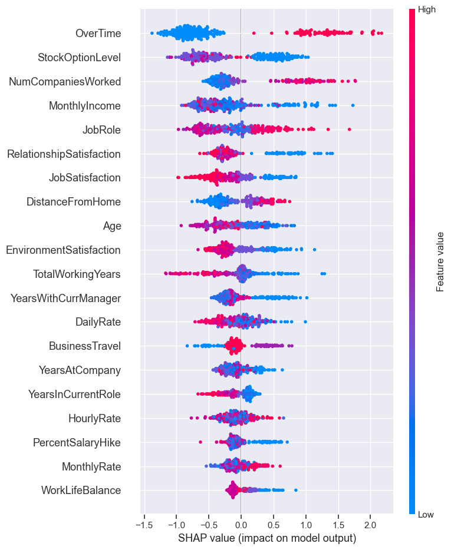
    


```python
from sklearn.metrics import confusion_matrix
cm = confusion_matrix(y_test, y_pred)
plt.figure(figsize=(5,5))
sns.heatmap(data=cm,linewidths=.5, annot=True,  cmap = 'Blues')
plt.ylabel('Actual label')
plt.xlabel('Predicted label')
all_sample_title = 'Accuracy Score for XGBoost: {0}'.format(xgb.score(X_test, y_test))
plt.title(all_sample_title, size = 15)
```


    Text(0.5, 1.0, 'Accuracy Score for XGBoost: 0.8639455782312925')


    
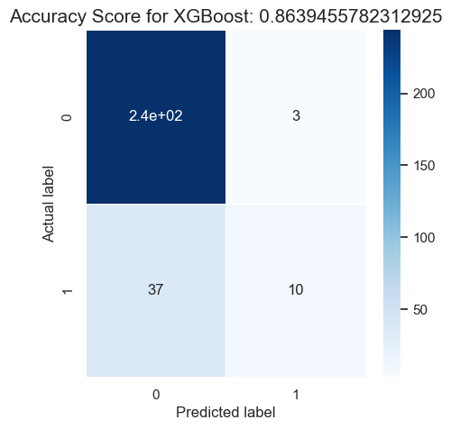
    


```python
from sklearn.metrics import roc_curve, roc_auc_score
y_pred_proba = xgb.predict_proba(X_test)[:][:,1]

df_actual_predicted = pd.concat([pd.DataFrame(np.array(y_test), columns=['y_actual']), pd.DataFrame(y_pred_proba, columns=['y_pred_proba'])], axis=1)
df_actual_predicted.index = y_test.index

fpr, tpr, tr = roc_curve(df_actual_predicted['y_actual'], df_actual_predicted['y_pred_proba'])
auc = roc_auc_score(df_actual_predicted['y_actual'], df_actual_predicted['y_pred_proba'])

plt.plot(fpr, tpr, label='AUC = %0.4f' %auc)
plt.plot(fpr, fpr, linestyle = '--', color='k')
plt.xlabel('False Positive Rate')
plt.ylabel('True Positive Rate')
plt.title('ROC Curve', size = 15)
plt.legend()
```


    <matplotlib.legend.Legend at 0x18cf0ac17e0>


    

    


```python
df1 = pd.read_csv('employee.csv')
df1.head()
```


<div>
<style scoped>
    .dataframe tbody tr th:only-of-type {
        vertical-align: middle;
    }

    .dataframe tbody tr th {
        vertical-align: top;
    }

    .dataframe thead th {
        text-align: right;
    }
</style>
<table border="1" class="dataframe">
  <thead>
    <tr style="text-align: right;">
      <th></th>
      <th>Age</th>
      <th>Attrition</th>
      <th>BusinessTravel</th>
      <th>DailyRate</th>
      <th>Department</th>
      <th>DistanceFromHome</th>
      <th>Education</th>
      <th>EducationField</th>
      <th>EmployeeCount</th>
      <th>EmployeeNumber</th>
      <th>EnvironmentSatisfaction</th>
      <th>Gender</th>
      <th>HourlyRate</th>
      <th>JobInvolvement</th>
      <th>JobLevel</th>
      <th>JobRole</th>
      <th>JobSatisfaction</th>
      <th>MaritalStatus</th>
      <th>MonthlyIncome</th>
      <th>MonthlyRate</th>
      <th>NumCompaniesWorked</th>
      <th>Over18</th>
      <th>OverTime</th>
      <th>PercentSalaryHike</th>
      <th>PerformanceRating</th>
      <th>RelationshipSatisfaction</th>
      <th>StandardHours</th>
      <th>StockOptionLevel</th>
      <th>TotalWorkingYears</th>
      <th>TrainingTimesLastYear</th>
      <th>WorkLifeBalance</th>
      <th>YearsAtCompany</th>
      <th>YearsInCurrentRole</th>
      <th>YearsSinceLastPromotion</th>
      <th>YearsWithCurrManager</th>
    </tr>
  </thead>
  <tbody>
    <tr>
      <th>0</th>
      <td>41</td>
      <td>Yes</td>
      <td>Travel_Rarely</td>
      <td>1102</td>
      <td>Sales</td>
      <td>1</td>
      <td>2</td>
      <td>Life Sciences</td>
      <td>1</td>
      <td>1</td>
      <td>2</td>
      <td>Female</td>
      <td>94</td>
      <td>3</td>
      <td>2</td>
      <td>Sales Executive</td>
      <td>4</td>
      <td>Single</td>
      <td>5993</td>
      <td>19479</td>
      <td>8</td>
      <td>Y</td>
      <td>Yes</td>
      <td>11</td>
      <td>3</td>
      <td>1</td>
      <td>80</td>
      <td>0</td>
      <td>8</td>
      <td>0</td>
      <td>1</td>
      <td>6</td>
      <td>4</td>
      <td>0</td>
      <td>5</td>
    </tr>
    <tr>
      <th>1</th>
      <td>49</td>
      <td>No</td>
      <td>Travel_Frequently</td>
      <td>279</td>
      <td>Research &amp; Development</td>
      <td>8</td>
      <td>1</td>
      <td>Life Sciences</td>
      <td>1</td>
      <td>2</td>
      <td>3</td>
      <td>Male</td>
      <td>61</td>
      <td>2</td>
      <td>2</td>
      <td>Research Scientist</td>
      <td>2</td>
      <td>Married</td>
      <td>5130</td>
      <td>24907</td>
      <td>1</td>
      <td>Y</td>
      <td>No</td>
      <td>23</td>
      <td>4</td>
      <td>4</td>
      <td>80</td>
      <td>1</td>
      <td>10</td>
      <td>3</td>
      <td>3</td>
      <td>10</td>
      <td>7</td>
      <td>1</td>
      <td>7</td>
    </tr>
    <tr>
      <th>2</th>
      <td>37</td>
      <td>Yes</td>
      <td>Travel_Rarely</td>
      <td>1373</td>
      <td>Research &amp; Development</td>
      <td>2</td>
      <td>2</td>
      <td>Other</td>
      <td>1</td>
      <td>4</td>
      <td>4</td>
      <td>Male</td>
      <td>92</td>
      <td>2</td>
      <td>1</td>
      <td>Laboratory Technician</td>
      <td>3</td>
      <td>Single</td>
      <td>2090</td>
      <td>2396</td>
      <td>6</td>
      <td>Y</td>
      <td>Yes</td>
      <td>15</td>
      <td>3</td>
      <td>2</td>
      <td>80</td>
      <td>0</td>
      <td>7</td>
      <td>3</td>
      <td>3</td>
      <td>0</td>
      <td>0</td>
      <td>0</td>
      <td>0</td>
    </tr>
    <tr>
      <th>3</th>
      <td>33</td>
      <td>No</td>
      <td>Travel_Frequently</td>
      <td>1392</td>
      <td>Research &amp; Development</td>
      <td>3</td>
      <td>4</td>
      <td>Life Sciences</td>
      <td>1</td>
      <td>5</td>
      <td>4</td>
      <td>Female</td>
      <td>56</td>
      <td>3</td>
      <td>1</td>
      <td>Research Scientist</td>
      <td>3</td>
      <td>Married</td>
      <td>2909</td>
      <td>23159</td>
      <td>1</td>
      <td>Y</td>
      <td>Yes</td>
      <td>11</td>
      <td>3</td>
      <td>3</td>
      <td>80</td>
      <td>0</td>
      <td>8</td>
      <td>3</td>
      <td>3</td>
      <td>8</td>
      <td>7</td>
      <td>3</td>
      <td>0</td>
    </tr>
    <tr>
      <th>4</th>
      <td>27</td>
      <td>No</td>
      <td>Travel_Rarely</td>
      <td>591</td>
      <td>Research &amp; Development</td>
      <td>2</td>
      <td>1</td>
      <td>Medical</td>
      <td>1</td>
      <td>7</td>
      <td>1</td>
      <td>Male</td>
      <td>40</td>
      <td>3</td>
      <td>1</td>
      <td>Laboratory Technician</td>
      <td>2</td>
      <td>Married</td>
      <td>3468</td>
      <td>16632</td>
      <td>9</td>
      <td>Y</td>
      <td>No</td>
      <td>12</td>
      <td>3</td>
      <td>4</td>
      <td>80</td>
      <td>1</td>
      <td>6</td>
      <td>3</td>
      <td>3</td>
      <td>2</td>
      <td>2</td>
      <td>2</td>
      <td>2</td>
    </tr>
  </tbody>
</table>
</div>


```python
df1.drop(columns=['EmployeeNumber', 'StandardHours', 'Over18', 'PerformanceRating'], inplace=True)

```


```python
from sklearn import preprocessing

# Loop over each column in the DataFrame where dtype is 'object'
for col in df1.select_dtypes(include=['object']).columns:

    # Initialize a LabelEncoder object
    label_encoder = preprocessing.LabelEncoder()

    # Fit the encoder to the unique values in the column
    label_encoder.fit(df1[col].unique())

    # Transform the column using the encoder
    df1[col] = label_encoder.transform(df1[col])

    # Print the column name and the unique encoded values
    print(f"{col}: {df1[col].unique()}")
```

    Attrition: [1 0]
    BusinessTravel: [2 1 0]
    Department: [2 1 0]
    EducationField: [1 4 3 2 5 0]
    Gender: [0 1]
    JobRole: [7 6 2 4 0 3 8 5 1]
    MaritalStatus: [2 1 0]
    OverTime: [1 0]
    


```python
X = df1.drop('MonthlyIncome', axis=1)
y = df1['MonthlyIncome']
```


```python
from sklearn.model_selection import train_test_split
X_train, X_test, y_train, y_test = train_test_split(X, y, test_size=0.2, random_state=0)
```


```python
from scipy import stats

# Define the columns for which you want to remove outliers
selected_columns = ['StockOptionLevel', 'TotalWorkingYears', 'TrainingTimesLastYear', 'YearsAtCompany',
                    'YearsInCurrentRole', 'YearsSinceLastPromotion', 'YearsWithCurrManager']

# Calculate the Z-scores for the selected columns in the training data
z_scores = np.abs(stats.zscore(X_train[selected_columns]))

# Set a threshold value for outlier detection (e.g., 3)
threshold = 3

# Find the indices of outliers based on the threshold
outlier_indices = np.where(z_scores > threshold)[0]

# Remove the outliers from the training data
X_train = X_train.drop(X_train.index[outlier_indices])
y_train = y_train.drop(y_train.index[outlier_indices])
```


```python
from sklearn.model_selection import GridSearchCV, cross_val_score
from sklearn.linear_model import LinearRegression
from sklearn.preprocessing import PolynomialFeatures
from sklearn.tree import DecisionTreeRegressor
from sklearn.ensemble import RandomForestRegressor
from xgboost import XGBRegressor
from sklearn.metrics import mean_squared_error

# Regressor 1: Linear/Polynomial Regression
linear_regressor = LinearRegression()
poly_regressor = LinearRegression()


polynomial_features = PolynomialFeatures(degree=2)
X_train_poly = polynomial_features.fit_transform(X_train)
X_test_poly = polynomial_features.transform(X_test)

# Cross-validation Linear Regression
linear_scores = cross_val_score(linear_regressor, X_train, y_train, cv=5, scoring='neg_mean_squared_error')
linear_rmse = np.sqrt(-linear_scores.mean())

# Cross-validation Polynomial Regression
poly_scores = cross_val_score(poly_regressor, X_train_poly, y_train, cv=5, scoring='neg_mean_squared_error')
poly_rmse = np.sqrt(-poly_scores.mean())

print("Linear Regression - Cross-validation RMSE:", linear_rmse)
print("Polynomial Regression - Cross-validation RMSE:", poly_rmse)

# Regressor 2: Decision Tree/Random Forest/XGBoost Regressor
dt_regressor = DecisionTreeRegressor(random_state=42)
rf_regressor = RandomForestRegressor(random_state=42)
xgb_regressor = XGBRegressor(random_state=42)

# Hyperparameter grid for Decision Tree Regressor
dt_params = {
    'max_depth': [2, 4, 6, 8, None],
    'min_samples_split': [2, 4, 6, 8],
    'min_samples_leaf': [1, 2, 3, 4],
    'max_features': ['auto', 'sqrt', 'log2']
}

# Hyperparameter grid for Random Forest Regressor
rf_params = {
    'n_estimators': [50, 100, 150],
    'max_depth': [None, 5, 10],
    'min_samples_split': [2, 5, 10]
}

# Hyperparameter grid for XGBoost Regressor
xgb_params = {
    'n_estimators': [50, 100, 150],
    'max_depth': [3, 5, 7],
    'learning_rate': [0.1, 0.01, 0.001]
}

# Hyperparameter grid for Polynomial Regression
poly_params = {
    'fit_intercept': [True, False],
    'normalize': [True, False]
}

# Hyperparameter grid for Linear Regression
linear_params = {
    'fit_intercept': [True, False],
    'normalize': [True, False]
}

# GridSearchCV for Decision Tree Regressor
dt_grid_search = GridSearchCV(dt_regressor, dt_params, cv=5, scoring='neg_mean_squared_error')
dt_grid_search.fit(X_train, y_train)
print("Decision Tree Regressor - Best Parameters:", dt_grid_search.best_params_)
print("Decision Tree Regressor - Best Cross-validation RMSE:", np.sqrt(-dt_grid_search.best_score_))

# GridSearchCV for Random Forest Regressor
rf_grid_search = GridSearchCV(rf_regressor, rf_params, cv=5, scoring='neg_mean_squared_error')
rf_grid_search.fit(X_train, y_train)
print("Random Forest Regressor - Best Parameters:", rf_grid_search.best_params_)
print("Random Forest Regressor - Best Cross-validation RMSE:", np.sqrt(-rf_grid_search.best_score_))

# GridSearchCV for XGBoost Regressor
xgb_grid_search = GridSearchCV(xgb_regressor, xgb_params, cv=5, scoring='neg_mean_squared_error')
xgb_grid_search.fit(X_train, y_train)
print("XGBoost Regressor - Best Parameters:", xgb_grid_search.best_params_)
print("XGBoost Regressor - Best Cross-validation RMSE:", np.sqrt(-xgb_grid_search.best_score_))

# GridSearchCV for Polynomial Regression
poly_grid_search = GridSearchCV(poly_regressor, poly_params, cv=5, scoring='neg_mean_squared_error')
poly_grid_search.fit(X_train_poly, y_train)
print("Polynomial Regression - Best Parameters:", poly_grid_search.best_params_)
print("Polynomial Regression - Best Cross-validation RMSE:", np.sqrt(-poly_grid_search.best_score_))

# GridSearchCV for Linear Regression
linear_grid_search = GridSearchCV(linear_regressor, linear_params, cv=5, scoring='neg_mean_squared_error')
linear_grid_search.fit(X_train, y_train)
print("Linear Regression - Best Parameters:", linear_grid_search.best_params_)
print("Linear Regression - Best Cross-validation RMSE:", np.sqrt(-linear_grid_search.best_score_))

```

    Linear Regression - Cross-validation RMSE: 1446.717735010558
    Polynomial Regression - Cross-validation RMSE: 1915.870471038135
    

    `max_features='auto'` has been deprecated in 1.1 and will be removed in 1.3. To keep the past behaviour, explicitly set `max_features=1.0'`.
    `max_features='auto'` has been deprecated in 1.1 and will be removed in 1.3. To keep the past behaviour, explicitly set `max_features=1.0'`.
    `max_features='auto'` has been deprecated in 1.1 and will be removed in 1.3. To keep the past behaviour, explicitly set `max_features=1.0'`.
    `max_features='auto'` has been deprecated in 1.1 and will be removed in 1.3. To keep the past behaviour, explicitly set `max_features=1.0'`.
    `max_features='auto'` has been deprecated in 1.1 and will be removed in 1.3. To keep the past behaviour, explicitly set `max_features=1.0'`.
    `max_features='auto'` has been deprecated in 1.1 and will be removed in 1.3. To keep the past behaviour, explicitly set `max_features=1.0'`.
    `max_features='auto'` has been deprecated in 1.1 and will be removed in 1.3. To keep the past behaviour, explicitly set `max_features=1.0'`.
    `max_features='auto'` has been deprecated in 1.1 and will be removed in 1.3. To keep the past behaviour, explicitly set `max_features=1.0'`.
    `max_features='auto'` has been deprecated in 1.1 and will be removed in 1.3. To keep the past behaviour, explicitly set `max_features=1.0'`.
    `max_features='auto'` has been deprecated in 1.1 and will be removed in 1.3. To keep the past behaviour, explicitly set `max_features=1.0'`.
    `max_features='auto'` has been deprecated in 1.1 and will be removed in 1.3. To keep the past behaviour, explicitly set `max_features=1.0'`.
    `max_features='auto'` has been deprecated in 1.1 and will be removed in 1.3. To keep the past behaviour, explicitly set `max_features=1.0'`.
    `max_features='auto'` has been deprecated in 1.1 and will be removed in 1.3. To keep the past behaviour, explicitly set `max_features=1.0'`.
    `max_features='auto'` has been deprecated in 1.1 and will be removed in 1.3. To keep the past behaviour, explicitly set `max_features=1.0'`.
    `max_features='auto'` has been deprecated in 1.1 and will be removed in 1.3. To keep the past behaviour, explicitly set `max_features=1.0'`.
    `max_features='auto'` has been deprecated in 1.1 and will be removed in 1.3. To keep the past behaviour, explicitly set `max_features=1.0'`.
    `max_features='auto'` has been deprecated in 1.1 and will be removed in 1.3. To keep the past behaviour, explicitly set `max_features=1.0'`.
    `max_features='auto'` has been deprecated in 1.1 and will be removed in 1.3. To keep the past behaviour, explicitly set `max_features=1.0'`.
    `max_features='auto'` has been deprecated in 1.1 and will be removed in 1.3. To keep the past behaviour, explicitly set `max_features=1.0'`.
    `max_features='auto'` has been deprecated in 1.1 and will be removed in 1.3. To keep the past behaviour, explicitly set `max_features=1.0'`.
    `max_features='auto'` has been deprecated in 1.1 and will be removed in 1.3. To keep the past behaviour, explicitly set `max_features=1.0'`.
    `max_features='auto'` has been deprecated in 1.1 and will be removed in 1.3. To keep the past behaviour, explicitly set `max_features=1.0'`.
    `max_features='auto'` has been deprecated in 1.1 and will be removed in 1.3. To keep the past behaviour, explicitly set `max_features=1.0'`.
    `max_features='auto'` has been deprecated in 1.1 and will be removed in 1.3. To keep the past behaviour, explicitly set `max_features=1.0'`.
    `max_features='auto'` has been deprecated in 1.1 and will be removed in 1.3. To keep the past behaviour, explicitly set `max_features=1.0'`.
    `max_features='auto'` has been deprecated in 1.1 and will be removed in 1.3. To keep the past behaviour, explicitly set `max_features=1.0'`.
    `max_features='auto'` has been deprecated in 1.1 and will be removed in 1.3. To keep the past behaviour, explicitly set `max_features=1.0'`.
    `max_features='auto'` has been deprecated in 1.1 and will be removed in 1.3. To keep the past behaviour, explicitly set `max_features=1.0'`.
    `max_features='auto'` has been deprecated in 1.1 and will be removed in 1.3. To keep the past behaviour, explicitly set `max_features=1.0'`.
    `max_features='auto'` has been deprecated in 1.1 and will be removed in 1.3. To keep the past behaviour, explicitly set `max_features=1.0'`.
    `max_features='auto'` has been deprecated in 1.1 and will be removed in 1.3. To keep the past behaviour, explicitly set `max_features=1.0'`.
    `max_features='auto'` has been deprecated in 1.1 and will be removed in 1.3. To keep the past behaviour, explicitly set `max_features=1.0'`.
    `max_features='auto'` has been deprecated in 1.1 and will be removed in 1.3. To keep the past behaviour, explicitly set `max_features=1.0'`.
    `max_features='auto'` has been deprecated in 1.1 and will be removed in 1.3. To keep the past behaviour, explicitly set `max_features=1.0'`.
    `max_features='auto'` has been deprecated in 1.1 and will be removed in 1.3. To keep the past behaviour, explicitly set `max_features=1.0'`.
    `max_features='auto'` has been deprecated in 1.1 and will be removed in 1.3. To keep the past behaviour, explicitly set `max_features=1.0'`.
    `max_features='auto'` has been deprecated in 1.1 and will be removed in 1.3. To keep the past behaviour, explicitly set `max_features=1.0'`.
    `max_features='auto'` has been deprecated in 1.1 and will be removed in 1.3. To keep the past behaviour, explicitly set `max_features=1.0'`.
    `max_features='auto'` has been deprecated in 1.1 and will be removed in 1.3. To keep the past behaviour, explicitly set `max_features=1.0'`.
    `max_features='auto'` has been deprecated in 1.1 and will be removed in 1.3. To keep the past behaviour, explicitly set `max_features=1.0'`.
    `max_features='auto'` has been deprecated in 1.1 and will be removed in 1.3. To keep the past behaviour, explicitly set `max_features=1.0'`.
    `max_features='auto'` has been deprecated in 1.1 and will be removed in 1.3. To keep the past behaviour, explicitly set `max_features=1.0'`.
    `max_features='auto'` has been deprecated in 1.1 and will be removed in 1.3. To keep the past behaviour, explicitly set `max_features=1.0'`.
    `max_features='auto'` has been deprecated in 1.1 and will be removed in 1.3. To keep the past behaviour, explicitly set `max_features=1.0'`.
    `max_features='auto'` has been deprecated in 1.1 and will be removed in 1.3. To keep the past behaviour, explicitly set `max_features=1.0'`.
    `max_features='auto'` has been deprecated in 1.1 and will be removed in 1.3. To keep the past behaviour, explicitly set `max_features=1.0'`.
    `max_features='auto'` has been deprecated in 1.1 and will be removed in 1.3. To keep the past behaviour, explicitly set `max_features=1.0'`.
    `max_features='auto'` has been deprecated in 1.1 and will be removed in 1.3. To keep the past behaviour, explicitly set `max_features=1.0'`.
    `max_features='auto'` has been deprecated in 1.1 and will be removed in 1.3. To keep the past behaviour, explicitly set `max_features=1.0'`.
    `max_features='auto'` has been deprecated in 1.1 and will be removed in 1.3. To keep the past behaviour, explicitly set `max_features=1.0'`.
    `max_features='auto'` has been deprecated in 1.1 and will be removed in 1.3. To keep the past behaviour, explicitly set `max_features=1.0'`.
    `max_features='auto'` has been deprecated in 1.1 and will be removed in 1.3. To keep the past behaviour, explicitly set `max_features=1.0'`.
    `max_features='auto'` has been deprecated in 1.1 and will be removed in 1.3. To keep the past behaviour, explicitly set `max_features=1.0'`.
    `max_features='auto'` has been deprecated in 1.1 and will be removed in 1.3. To keep the past behaviour, explicitly set `max_features=1.0'`.
    `max_features='auto'` has been deprecated in 1.1 and will be removed in 1.3. To keep the past behaviour, explicitly set `max_features=1.0'`.
    `max_features='auto'` has been deprecated in 1.1 and will be removed in 1.3. To keep the past behaviour, explicitly set `max_features=1.0'`.
    `max_features='auto'` has been deprecated in 1.1 and will be removed in 1.3. To keep the past behaviour, explicitly set `max_features=1.0'`.
    `max_features='auto'` has been deprecated in 1.1 and will be removed in 1.3. To keep the past behaviour, explicitly set `max_features=1.0'`.
    `max_features='auto'` has been deprecated in 1.1 and will be removed in 1.3. To keep the past behaviour, explicitly set `max_features=1.0'`.
    `max_features='auto'` has been deprecated in 1.1 and will be removed in 1.3. To keep the past behaviour, explicitly set `max_features=1.0'`.
    `max_features='auto'` has been deprecated in 1.1 and will be removed in 1.3. To keep the past behaviour, explicitly set `max_features=1.0'`.
    `max_features='auto'` has been deprecated in 1.1 and will be removed in 1.3. To keep the past behaviour, explicitly set `max_features=1.0'`.
    `max_features='auto'` has been deprecated in 1.1 and will be removed in 1.3. To keep the past behaviour, explicitly set `max_features=1.0'`.
    `max_features='auto'` has been deprecated in 1.1 and will be removed in 1.3. To keep the past behaviour, explicitly set `max_features=1.0'`.
    `max_features='auto'` has been deprecated in 1.1 and will be removed in 1.3. To keep the past behaviour, explicitly set `max_features=1.0'`.
    `max_features='auto'` has been deprecated in 1.1 and will be removed in 1.3. To keep the past behaviour, explicitly set `max_features=1.0'`.
    `max_features='auto'` has been deprecated in 1.1 and will be removed in 1.3. To keep the past behaviour, explicitly set `max_features=1.0'`.
    `max_features='auto'` has been deprecated in 1.1 and will be removed in 1.3. To keep the past behaviour, explicitly set `max_features=1.0'`.
    `max_features='auto'` has been deprecated in 1.1 and will be removed in 1.3. To keep the past behaviour, explicitly set `max_features=1.0'`.
    `max_features='auto'` has been deprecated in 1.1 and will be removed in 1.3. To keep the past behaviour, explicitly set `max_features=1.0'`.
    `max_features='auto'` has been deprecated in 1.1 and will be removed in 1.3. To keep the past behaviour, explicitly set `max_features=1.0'`.
    `max_features='auto'` has been deprecated in 1.1 and will be removed in 1.3. To keep the past behaviour, explicitly set `max_features=1.0'`.
    `max_features='auto'` has been deprecated in 1.1 and will be removed in 1.3. To keep the past behaviour, explicitly set `max_features=1.0'`.
    `max_features='auto'` has been deprecated in 1.1 and will be removed in 1.3. To keep the past behaviour, explicitly set `max_features=1.0'`.
    `max_features='auto'` has been deprecated in 1.1 and will be removed in 1.3. To keep the past behaviour, explicitly set `max_features=1.0'`.
    `max_features='auto'` has been deprecated in 1.1 and will be removed in 1.3. To keep the past behaviour, explicitly set `max_features=1.0'`.
    `max_features='auto'` has been deprecated in 1.1 and will be removed in 1.3. To keep the past behaviour, explicitly set `max_features=1.0'`.
    `max_features='auto'` has been deprecated in 1.1 and will be removed in 1.3. To keep the past behaviour, explicitly set `max_features=1.0'`.
    `max_features='auto'` has been deprecated in 1.1 and will be removed in 1.3. To keep the past behaviour, explicitly set `max_features=1.0'`.
    `max_features='auto'` has been deprecated in 1.1 and will be removed in 1.3. To keep the past behaviour, explicitly set `max_features=1.0'`.
    `max_features='auto'` has been deprecated in 1.1 and will be removed in 1.3. To keep the past behaviour, explicitly set `max_features=1.0'`.
    `max_features='auto'` has been deprecated in 1.1 and will be removed in 1.3. To keep the past behaviour, explicitly set `max_features=1.0'`.
    `max_features='auto'` has been deprecated in 1.1 and will be removed in 1.3. To keep the past behaviour, explicitly set `max_features=1.0'`.
    `max_features='auto'` has been deprecated in 1.1 and will be removed in 1.3. To keep the past behaviour, explicitly set `max_features=1.0'`.
    `max_features='auto'` has been deprecated in 1.1 and will be removed in 1.3. To keep the past behaviour, explicitly set `max_features=1.0'`.
    `max_features='auto'` has been deprecated in 1.1 and will be removed in 1.3. To keep the past behaviour, explicitly set `max_features=1.0'`.
    `max_features='auto'` has been deprecated in 1.1 and will be removed in 1.3. To keep the past behaviour, explicitly set `max_features=1.0'`.
    `max_features='auto'` has been deprecated in 1.1 and will be removed in 1.3. To keep the past behaviour, explicitly set `max_features=1.0'`.
    `max_features='auto'` has been deprecated in 1.1 and will be removed in 1.3. To keep the past behaviour, explicitly set `max_features=1.0'`.
    `max_features='auto'` has been deprecated in 1.1 and will be removed in 1.3. To keep the past behaviour, explicitly set `max_features=1.0'`.
    `max_features='auto'` has been deprecated in 1.1 and will be removed in 1.3. To keep the past behaviour, explicitly set `max_features=1.0'`.
    `max_features='auto'` has been deprecated in 1.1 and will be removed in 1.3. To keep the past behaviour, explicitly set `max_features=1.0'`.
    `max_features='auto'` has been deprecated in 1.1 and will be removed in 1.3. To keep the past behaviour, explicitly set `max_features=1.0'`.
    `max_features='auto'` has been deprecated in 1.1 and will be removed in 1.3. To keep the past behaviour, explicitly set `max_features=1.0'`.
    `max_features='auto'` has been deprecated in 1.1 and will be removed in 1.3. To keep the past behaviour, explicitly set `max_features=1.0'`.
    `max_features='auto'` has been deprecated in 1.1 and will be removed in 1.3. To keep the past behaviour, explicitly set `max_features=1.0'`.
    `max_features='auto'` has been deprecated in 1.1 and will be removed in 1.3. To keep the past behaviour, explicitly set `max_features=1.0'`.
    `max_features='auto'` has been deprecated in 1.1 and will be removed in 1.3. To keep the past behaviour, explicitly set `max_features=1.0'`.
    `max_features='auto'` has been deprecated in 1.1 and will be removed in 1.3. To keep the past behaviour, explicitly set `max_features=1.0'`.
    `max_features='auto'` has been deprecated in 1.1 and will be removed in 1.3. To keep the past behaviour, explicitly set `max_features=1.0'`.
    `max_features='auto'` has been deprecated in 1.1 and will be removed in 1.3. To keep the past behaviour, explicitly set `max_features=1.0'`.
    `max_features='auto'` has been deprecated in 1.1 and will be removed in 1.3. To keep the past behaviour, explicitly set `max_features=1.0'`.
    `max_features='auto'` has been deprecated in 1.1 and will be removed in 1.3. To keep the past behaviour, explicitly set `max_features=1.0'`.
    `max_features='auto'` has been deprecated in 1.1 and will be removed in 1.3. To keep the past behaviour, explicitly set `max_features=1.0'`.
    `max_features='auto'` has been deprecated in 1.1 and will be removed in 1.3. To keep the past behaviour, explicitly set `max_features=1.0'`.
    `max_features='auto'` has been deprecated in 1.1 and will be removed in 1.3. To keep the past behaviour, explicitly set `max_features=1.0'`.
    `max_features='auto'` has been deprecated in 1.1 and will be removed in 1.3. To keep the past behaviour, explicitly set `max_features=1.0'`.
    `max_features='auto'` has been deprecated in 1.1 and will be removed in 1.3. To keep the past behaviour, explicitly set `max_features=1.0'`.
    `max_features='auto'` has been deprecated in 1.1 and will be removed in 1.3. To keep the past behaviour, explicitly set `max_features=1.0'`.
    `max_features='auto'` has been deprecated in 1.1 and will be removed in 1.3. To keep the past behaviour, explicitly set `max_features=1.0'`.
    `max_features='auto'` has been deprecated in 1.1 and will be removed in 1.3. To keep the past behaviour, explicitly set `max_features=1.0'`.
    `max_features='auto'` has been deprecated in 1.1 and will be removed in 1.3. To keep the past behaviour, explicitly set `max_features=1.0'`.
    `max_features='auto'` has been deprecated in 1.1 and will be removed in 1.3. To keep the past behaviour, explicitly set `max_features=1.0'`.
    `max_features='auto'` has been deprecated in 1.1 and will be removed in 1.3. To keep the past behaviour, explicitly set `max_features=1.0'`.
    `max_features='auto'` has been deprecated in 1.1 and will be removed in 1.3. To keep the past behaviour, explicitly set `max_features=1.0'`.
    `max_features='auto'` has been deprecated in 1.1 and will be removed in 1.3. To keep the past behaviour, explicitly set `max_features=1.0'`.
    `max_features='auto'` has been deprecated in 1.1 and will be removed in 1.3. To keep the past behaviour, explicitly set `max_features=1.0'`.
    `max_features='auto'` has been deprecated in 1.1 and will be removed in 1.3. To keep the past behaviour, explicitly set `max_features=1.0'`.
    `max_features='auto'` has been deprecated in 1.1 and will be removed in 1.3. To keep the past behaviour, explicitly set `max_features=1.0'`.
    `max_features='auto'` has been deprecated in 1.1 and will be removed in 1.3. To keep the past behaviour, explicitly set `max_features=1.0'`.
    `max_features='auto'` has been deprecated in 1.1 and will be removed in 1.3. To keep the past behaviour, explicitly set `max_features=1.0'`.
    `max_features='auto'` has been deprecated in 1.1 and will be removed in 1.3. To keep the past behaviour, explicitly set `max_features=1.0'`.
    `max_features='auto'` has been deprecated in 1.1 and will be removed in 1.3. To keep the past behaviour, explicitly set `max_features=1.0'`.
    `max_features='auto'` has been deprecated in 1.1 and will be removed in 1.3. To keep the past behaviour, explicitly set `max_features=1.0'`.
    `max_features='auto'` has been deprecated in 1.1 and will be removed in 1.3. To keep the past behaviour, explicitly set `max_features=1.0'`.
    `max_features='auto'` has been deprecated in 1.1 and will be removed in 1.3. To keep the past behaviour, explicitly set `max_features=1.0'`.
    `max_features='auto'` has been deprecated in 1.1 and will be removed in 1.3. To keep the past behaviour, explicitly set `max_features=1.0'`.
    `max_features='auto'` has been deprecated in 1.1 and will be removed in 1.3. To keep the past behaviour, explicitly set `max_features=1.0'`.
    `max_features='auto'` has been deprecated in 1.1 and will be removed in 1.3. To keep the past behaviour, explicitly set `max_features=1.0'`.
    `max_features='auto'` has been deprecated in 1.1 and will be removed in 1.3. To keep the past behaviour, explicitly set `max_features=1.0'`.
    `max_features='auto'` has been deprecated in 1.1 and will be removed in 1.3. To keep the past behaviour, explicitly set `max_features=1.0'`.
    `max_features='auto'` has been deprecated in 1.1 and will be removed in 1.3. To keep the past behaviour, explicitly set `max_features=1.0'`.
    `max_features='auto'` has been deprecated in 1.1 and will be removed in 1.3. To keep the past behaviour, explicitly set `max_features=1.0'`.
    `max_features='auto'` has been deprecated in 1.1 and will be removed in 1.3. To keep the past behaviour, explicitly set `max_features=1.0'`.
    `max_features='auto'` has been deprecated in 1.1 and will be removed in 1.3. To keep the past behaviour, explicitly set `max_features=1.0'`.
    `max_features='auto'` has been deprecated in 1.1 and will be removed in 1.3. To keep the past behaviour, explicitly set `max_features=1.0'`.
    `max_features='auto'` has been deprecated in 1.1 and will be removed in 1.3. To keep the past behaviour, explicitly set `max_features=1.0'`.
    `max_features='auto'` has been deprecated in 1.1 and will be removed in 1.3. To keep the past behaviour, explicitly set `max_features=1.0'`.
    `max_features='auto'` has been deprecated in 1.1 and will be removed in 1.3. To keep the past behaviour, explicitly set `max_features=1.0'`.
    `max_features='auto'` has been deprecated in 1.1 and will be removed in 1.3. To keep the past behaviour, explicitly set `max_features=1.0'`.
    `max_features='auto'` has been deprecated in 1.1 and will be removed in 1.3. To keep the past behaviour, explicitly set `max_features=1.0'`.
    `max_features='auto'` has been deprecated in 1.1 and will be removed in 1.3. To keep the past behaviour, explicitly set `max_features=1.0'`.
    `max_features='auto'` has been deprecated in 1.1 and will be removed in 1.3. To keep the past behaviour, explicitly set `max_features=1.0'`.
    `max_features='auto'` has been deprecated in 1.1 and will be removed in 1.3. To keep the past behaviour, explicitly set `max_features=1.0'`.
    `max_features='auto'` has been deprecated in 1.1 and will be removed in 1.3. To keep the past behaviour, explicitly set `max_features=1.0'`.
    `max_features='auto'` has been deprecated in 1.1 and will be removed in 1.3. To keep the past behaviour, explicitly set `max_features=1.0'`.
    `max_features='auto'` has been deprecated in 1.1 and will be removed in 1.3. To keep the past behaviour, explicitly set `max_features=1.0'`.
    `max_features='auto'` has been deprecated in 1.1 and will be removed in 1.3. To keep the past behaviour, explicitly set `max_features=1.0'`.
    `max_features='auto'` has been deprecated in 1.1 and will be removed in 1.3. To keep the past behaviour, explicitly set `max_features=1.0'`.
    `max_features='auto'` has been deprecated in 1.1 and will be removed in 1.3. To keep the past behaviour, explicitly set `max_features=1.0'`.
    `max_features='auto'` has been deprecated in 1.1 and will be removed in 1.3. To keep the past behaviour, explicitly set `max_features=1.0'`.
    `max_features='auto'` has been deprecated in 1.1 and will be removed in 1.3. To keep the past behaviour, explicitly set `max_features=1.0'`.
    `max_features='auto'` has been deprecated in 1.1 and will be removed in 1.3. To keep the past behaviour, explicitly set `max_features=1.0'`.
    `max_features='auto'` has been deprecated in 1.1 and will be removed in 1.3. To keep the past behaviour, explicitly set `max_features=1.0'`.
    `max_features='auto'` has been deprecated in 1.1 and will be removed in 1.3. To keep the past behaviour, explicitly set `max_features=1.0'`.
    `max_features='auto'` has been deprecated in 1.1 and will be removed in 1.3. To keep the past behaviour, explicitly set `max_features=1.0'`.
    `max_features='auto'` has been deprecated in 1.1 and will be removed in 1.3. To keep the past behaviour, explicitly set `max_features=1.0'`.
    `max_features='auto'` has been deprecated in 1.1 and will be removed in 1.3. To keep the past behaviour, explicitly set `max_features=1.0'`.
    `max_features='auto'` has been deprecated in 1.1 and will be removed in 1.3. To keep the past behaviour, explicitly set `max_features=1.0'`.
    `max_features='auto'` has been deprecated in 1.1 and will be removed in 1.3. To keep the past behaviour, explicitly set `max_features=1.0'`.
    `max_features='auto'` has been deprecated in 1.1 and will be removed in 1.3. To keep the past behaviour, explicitly set `max_features=1.0'`.
    `max_features='auto'` has been deprecated in 1.1 and will be removed in 1.3. To keep the past behaviour, explicitly set `max_features=1.0'`.
    `max_features='auto'` has been deprecated in 1.1 and will be removed in 1.3. To keep the past behaviour, explicitly set `max_features=1.0'`.
    `max_features='auto'` has been deprecated in 1.1 and will be removed in 1.3. To keep the past behaviour, explicitly set `max_features=1.0'`.
    `max_features='auto'` has been deprecated in 1.1 and will be removed in 1.3. To keep the past behaviour, explicitly set `max_features=1.0'`.
    `max_features='auto'` has been deprecated in 1.1 and will be removed in 1.3. To keep the past behaviour, explicitly set `max_features=1.0'`.
    `max_features='auto'` has been deprecated in 1.1 and will be removed in 1.3. To keep the past behaviour, explicitly set `max_features=1.0'`.
    `max_features='auto'` has been deprecated in 1.1 and will be removed in 1.3. To keep the past behaviour, explicitly set `max_features=1.0'`.
    `max_features='auto'` has been deprecated in 1.1 and will be removed in 1.3. To keep the past behaviour, explicitly set `max_features=1.0'`.
    `max_features='auto'` has been deprecated in 1.1 and will be removed in 1.3. To keep the past behaviour, explicitly set `max_features=1.0'`.
    `max_features='auto'` has been deprecated in 1.1 and will be removed in 1.3. To keep the past behaviour, explicitly set `max_features=1.0'`.
    `max_features='auto'` has been deprecated in 1.1 and will be removed in 1.3. To keep the past behaviour, explicitly set `max_features=1.0'`.
    `max_features='auto'` has been deprecated in 1.1 and will be removed in 1.3. To keep the past behaviour, explicitly set `max_features=1.0'`.
    `max_features='auto'` has been deprecated in 1.1 and will be removed in 1.3. To keep the past behaviour, explicitly set `max_features=1.0'`.
    `max_features='auto'` has been deprecated in 1.1 and will be removed in 1.3. To keep the past behaviour, explicitly set `max_features=1.0'`.
    `max_features='auto'` has been deprecated in 1.1 and will be removed in 1.3. To keep the past behaviour, explicitly set `max_features=1.0'`.
    `max_features='auto'` has been deprecated in 1.1 and will be removed in 1.3. To keep the past behaviour, explicitly set `max_features=1.0'`.
    `max_features='auto'` has been deprecated in 1.1 and will be removed in 1.3. To keep the past behaviour, explicitly set `max_features=1.0'`.
    `max_features='auto'` has been deprecated in 1.1 and will be removed in 1.3. To keep the past behaviour, explicitly set `max_features=1.0'`.
    `max_features='auto'` has been deprecated in 1.1 and will be removed in 1.3. To keep the past behaviour, explicitly set `max_features=1.0'`.
    `max_features='auto'` has been deprecated in 1.1 and will be removed in 1.3. To keep the past behaviour, explicitly set `max_features=1.0'`.
    `max_features='auto'` has been deprecated in 1.1 and will be removed in 1.3. To keep the past behaviour, explicitly set `max_features=1.0'`.
    `max_features='auto'` has been deprecated in 1.1 and will be removed in 1.3. To keep the past behaviour, explicitly set `max_features=1.0'`.
    `max_features='auto'` has been deprecated in 1.1 and will be removed in 1.3. To keep the past behaviour, explicitly set `max_features=1.0'`.
    `max_features='auto'` has been deprecated in 1.1 and will be removed in 1.3. To keep the past behaviour, explicitly set `max_features=1.0'`.
    `max_features='auto'` has been deprecated in 1.1 and will be removed in 1.3. To keep the past behaviour, explicitly set `max_features=1.0'`.
    `max_features='auto'` has been deprecated in 1.1 and will be removed in 1.3. To keep the past behaviour, explicitly set `max_features=1.0'`.
    `max_features='auto'` has been deprecated in 1.1 and will be removed in 1.3. To keep the past behaviour, explicitly set `max_features=1.0'`.
    `max_features='auto'` has been deprecated in 1.1 and will be removed in 1.3. To keep the past behaviour, explicitly set `max_features=1.0'`.
    `max_features='auto'` has been deprecated in 1.1 and will be removed in 1.3. To keep the past behaviour, explicitly set `max_features=1.0'`.
    `max_features='auto'` has been deprecated in 1.1 and will be removed in 1.3. To keep the past behaviour, explicitly set `max_features=1.0'`.
    `max_features='auto'` has been deprecated in 1.1 and will be removed in 1.3. To keep the past behaviour, explicitly set `max_features=1.0'`.
    `max_features='auto'` has been deprecated in 1.1 and will be removed in 1.3. To keep the past behaviour, explicitly set `max_features=1.0'`.
    `max_features='auto'` has been deprecated in 1.1 and will be removed in 1.3. To keep the past behaviour, explicitly set `max_features=1.0'`.
    `max_features='auto'` has been deprecated in 1.1 and will be removed in 1.3. To keep the past behaviour, explicitly set `max_features=1.0'`.
    `max_features='auto'` has been deprecated in 1.1 and will be removed in 1.3. To keep the past behaviour, explicitly set `max_features=1.0'`.
    `max_features='auto'` has been deprecated in 1.1 and will be removed in 1.3. To keep the past behaviour, explicitly set `max_features=1.0'`.
    `max_features='auto'` has been deprecated in 1.1 and will be removed in 1.3. To keep the past behaviour, explicitly set `max_features=1.0'`.
    `max_features='auto'` has been deprecated in 1.1 and will be removed in 1.3. To keep the past behaviour, explicitly set `max_features=1.0'`.
    `max_features='auto'` has been deprecated in 1.1 and will be removed in 1.3. To keep the past behaviour, explicitly set `max_features=1.0'`.
    `max_features='auto'` has been deprecated in 1.1 and will be removed in 1.3. To keep the past behaviour, explicitly set `max_features=1.0'`.
    `max_features='auto'` has been deprecated in 1.1 and will be removed in 1.3. To keep the past behaviour, explicitly set `max_features=1.0'`.
    `max_features='auto'` has been deprecated in 1.1 and will be removed in 1.3. To keep the past behaviour, explicitly set `max_features=1.0'`.
    `max_features='auto'` has been deprecated in 1.1 and will be removed in 1.3. To keep the past behaviour, explicitly set `max_features=1.0'`.
    `max_features='auto'` has been deprecated in 1.1 and will be removed in 1.3. To keep the past behaviour, explicitly set `max_features=1.0'`.
    `max_features='auto'` has been deprecated in 1.1 and will be removed in 1.3. To keep the past behaviour, explicitly set `max_features=1.0'`.
    `max_features='auto'` has been deprecated in 1.1 and will be removed in 1.3. To keep the past behaviour, explicitly set `max_features=1.0'`.
    `max_features='auto'` has been deprecated in 1.1 and will be removed in 1.3. To keep the past behaviour, explicitly set `max_features=1.0'`.
    `max_features='auto'` has been deprecated in 1.1 and will be removed in 1.3. To keep the past behaviour, explicitly set `max_features=1.0'`.
    `max_features='auto'` has been deprecated in 1.1 and will be removed in 1.3. To keep the past behaviour, explicitly set `max_features=1.0'`.
    `max_features='auto'` has been deprecated in 1.1 and will be removed in 1.3. To keep the past behaviour, explicitly set `max_features=1.0'`.
    `max_features='auto'` has been deprecated in 1.1 and will be removed in 1.3. To keep the past behaviour, explicitly set `max_features=1.0'`.
    `max_features='auto'` has been deprecated in 1.1 and will be removed in 1.3. To keep the past behaviour, explicitly set `max_features=1.0'`.
    `max_features='auto'` has been deprecated in 1.1 and will be removed in 1.3. To keep the past behaviour, explicitly set `max_features=1.0'`.
    `max_features='auto'` has been deprecated in 1.1 and will be removed in 1.3. To keep the past behaviour, explicitly set `max_features=1.0'`.
    `max_features='auto'` has been deprecated in 1.1 and will be removed in 1.3. To keep the past behaviour, explicitly set `max_features=1.0'`.
    `max_features='auto'` has been deprecated in 1.1 and will be removed in 1.3. To keep the past behaviour, explicitly set `max_features=1.0'`.
    `max_features='auto'` has been deprecated in 1.1 and will be removed in 1.3. To keep the past behaviour, explicitly set `max_features=1.0'`.
    `max_features='auto'` has been deprecated in 1.1 and will be removed in 1.3. To keep the past behaviour, explicitly set `max_features=1.0'`.
    `max_features='auto'` has been deprecated in 1.1 and will be removed in 1.3. To keep the past behaviour, explicitly set `max_features=1.0'`.
    `max_features='auto'` has been deprecated in 1.1 and will be removed in 1.3. To keep the past behaviour, explicitly set `max_features=1.0'`.
    `max_features='auto'` has been deprecated in 1.1 and will be removed in 1.3. To keep the past behaviour, explicitly set `max_features=1.0'`.
    `max_features='auto'` has been deprecated in 1.1 and will be removed in 1.3. To keep the past behaviour, explicitly set `max_features=1.0'`.
    `max_features='auto'` has been deprecated in 1.1 and will be removed in 1.3. To keep the past behaviour, explicitly set `max_features=1.0'`.
    `max_features='auto'` has been deprecated in 1.1 and will be removed in 1.3. To keep the past behaviour, explicitly set `max_features=1.0'`.
    `max_features='auto'` has been deprecated in 1.1 and will be removed in 1.3. To keep the past behaviour, explicitly set `max_features=1.0'`.
    `max_features='auto'` has been deprecated in 1.1 and will be removed in 1.3. To keep the past behaviour, explicitly set `max_features=1.0'`.
    `max_features='auto'` has been deprecated in 1.1 and will be removed in 1.3. To keep the past behaviour, explicitly set `max_features=1.0'`.
    `max_features='auto'` has been deprecated in 1.1 and will be removed in 1.3. To keep the past behaviour, explicitly set `max_features=1.0'`.
    `max_features='auto'` has been deprecated in 1.1 and will be removed in 1.3. To keep the past behaviour, explicitly set `max_features=1.0'`.
    `max_features='auto'` has been deprecated in 1.1 and will be removed in 1.3. To keep the past behaviour, explicitly set `max_features=1.0'`.
    `max_features='auto'` has been deprecated in 1.1 and will be removed in 1.3. To keep the past behaviour, explicitly set `max_features=1.0'`.
    `max_features='auto'` has been deprecated in 1.1 and will be removed in 1.3. To keep the past behaviour, explicitly set `max_features=1.0'`.
    `max_features='auto'` has been deprecated in 1.1 and will be removed in 1.3. To keep the past behaviour, explicitly set `max_features=1.0'`.
    `max_features='auto'` has been deprecated in 1.1 and will be removed in 1.3. To keep the past behaviour, explicitly set `max_features=1.0'`.
    `max_features='auto'` has been deprecated in 1.1 and will be removed in 1.3. To keep the past behaviour, explicitly set `max_features=1.0'`.
    `max_features='auto'` has been deprecated in 1.1 and will be removed in 1.3. To keep the past behaviour, explicitly set `max_features=1.0'`.
    `max_features='auto'` has been deprecated in 1.1 and will be removed in 1.3. To keep the past behaviour, explicitly set `max_features=1.0'`.
    `max_features='auto'` has been deprecated in 1.1 and will be removed in 1.3. To keep the past behaviour, explicitly set `max_features=1.0'`.
    `max_features='auto'` has been deprecated in 1.1 and will be removed in 1.3. To keep the past behaviour, explicitly set `max_features=1.0'`.
    `max_features='auto'` has been deprecated in 1.1 and will be removed in 1.3. To keep the past behaviour, explicitly set `max_features=1.0'`.
    `max_features='auto'` has been deprecated in 1.1 and will be removed in 1.3. To keep the past behaviour, explicitly set `max_features=1.0'`.
    `max_features='auto'` has been deprecated in 1.1 and will be removed in 1.3. To keep the past behaviour, explicitly set `max_features=1.0'`.
    `max_features='auto'` has been deprecated in 1.1 and will be removed in 1.3. To keep the past behaviour, explicitly set `max_features=1.0'`.
    `max_features='auto'` has been deprecated in 1.1 and will be removed in 1.3. To keep the past behaviour, explicitly set `max_features=1.0'`.
    `max_features='auto'` has been deprecated in 1.1 and will be removed in 1.3. To keep the past behaviour, explicitly set `max_features=1.0'`.
    `max_features='auto'` has been deprecated in 1.1 and will be removed in 1.3. To keep the past behaviour, explicitly set `max_features=1.0'`.
    `max_features='auto'` has been deprecated in 1.1 and will be removed in 1.3. To keep the past behaviour, explicitly set `max_features=1.0'`.
    `max_features='auto'` has been deprecated in 1.1 and will be removed in 1.3. To keep the past behaviour, explicitly set `max_features=1.0'`.
    `max_features='auto'` has been deprecated in 1.1 and will be removed in 1.3. To keep the past behaviour, explicitly set `max_features=1.0'`.
    `max_features='auto'` has been deprecated in 1.1 and will be removed in 1.3. To keep the past behaviour, explicitly set `max_features=1.0'`.
    `max_features='auto'` has been deprecated in 1.1 and will be removed in 1.3. To keep the past behaviour, explicitly set `max_features=1.0'`.
    `max_features='auto'` has been deprecated in 1.1 and will be removed in 1.3. To keep the past behaviour, explicitly set `max_features=1.0'`.
    `max_features='auto'` has been deprecated in 1.1 and will be removed in 1.3. To keep the past behaviour, explicitly set `max_features=1.0'`.
    `max_features='auto'` has been deprecated in 1.1 and will be removed in 1.3. To keep the past behaviour, explicitly set `max_features=1.0'`.
    `max_features='auto'` has been deprecated in 1.1 and will be removed in 1.3. To keep the past behaviour, explicitly set `max_features=1.0'`.
    `max_features='auto'` has been deprecated in 1.1 and will be removed in 1.3. To keep the past behaviour, explicitly set `max_features=1.0'`.
    `max_features='auto'` has been deprecated in 1.1 and will be removed in 1.3. To keep the past behaviour, explicitly set `max_features=1.0'`.
    `max_features='auto'` has been deprecated in 1.1 and will be removed in 1.3. To keep the past behaviour, explicitly set `max_features=1.0'`.
    `max_features='auto'` has been deprecated in 1.1 and will be removed in 1.3. To keep the past behaviour, explicitly set `max_features=1.0'`.
    `max_features='auto'` has been deprecated in 1.1 and will be removed in 1.3. To keep the past behaviour, explicitly set `max_features=1.0'`.
    `max_features='auto'` has been deprecated in 1.1 and will be removed in 1.3. To keep the past behaviour, explicitly set `max_features=1.0'`.
    `max_features='auto'` has been deprecated in 1.1 and will be removed in 1.3. To keep the past behaviour, explicitly set `max_features=1.0'`.
    `max_features='auto'` has been deprecated in 1.1 and will be removed in 1.3. To keep the past behaviour, explicitly set `max_features=1.0'`.
    `max_features='auto'` has been deprecated in 1.1 and will be removed in 1.3. To keep the past behaviour, explicitly set `max_features=1.0'`.
    `max_features='auto'` has been deprecated in 1.1 and will be removed in 1.3. To keep the past behaviour, explicitly set `max_features=1.0'`.
    `max_features='auto'` has been deprecated in 1.1 and will be removed in 1.3. To keep the past behaviour, explicitly set `max_features=1.0'`.
    `max_features='auto'` has been deprecated in 1.1 and will be removed in 1.3. To keep the past behaviour, explicitly set `max_features=1.0'`.
    `max_features='auto'` has been deprecated in 1.1 and will be removed in 1.3. To keep the past behaviour, explicitly set `max_features=1.0'`.
    `max_features='auto'` has been deprecated in 1.1 and will be removed in 1.3. To keep the past behaviour, explicitly set `max_features=1.0'`.
    `max_features='auto'` has been deprecated in 1.1 and will be removed in 1.3. To keep the past behaviour, explicitly set `max_features=1.0'`.
    `max_features='auto'` has been deprecated in 1.1 and will be removed in 1.3. To keep the past behaviour, explicitly set `max_features=1.0'`.
    `max_features='auto'` has been deprecated in 1.1 and will be removed in 1.3. To keep the past behaviour, explicitly set `max_features=1.0'`.
    `max_features='auto'` has been deprecated in 1.1 and will be removed in 1.3. To keep the past behaviour, explicitly set `max_features=1.0'`.
    `max_features='auto'` has been deprecated in 1.1 and will be removed in 1.3. To keep the past behaviour, explicitly set `max_features=1.0'`.
    `max_features='auto'` has been deprecated in 1.1 and will be removed in 1.3. To keep the past behaviour, explicitly set `max_features=1.0'`.
    `max_features='auto'` has been deprecated in 1.1 and will be removed in 1.3. To keep the past behaviour, explicitly set `max_features=1.0'`.
    `max_features='auto'` has been deprecated in 1.1 and will be removed in 1.3. To keep the past behaviour, explicitly set `max_features=1.0'`.
    `max_features='auto'` has been deprecated in 1.1 and will be removed in 1.3. To keep the past behaviour, explicitly set `max_features=1.0'`.
    `max_features='auto'` has been deprecated in 1.1 and will be removed in 1.3. To keep the past behaviour, explicitly set `max_features=1.0'`.
    `max_features='auto'` has been deprecated in 1.1 and will be removed in 1.3. To keep the past behaviour, explicitly set `max_features=1.0'`.
    `max_features='auto'` has been deprecated in 1.1 and will be removed in 1.3. To keep the past behaviour, explicitly set `max_features=1.0'`.
    `max_features='auto'` has been deprecated in 1.1 and will be removed in 1.3. To keep the past behaviour, explicitly set `max_features=1.0'`.
    `max_features='auto'` has been deprecated in 1.1 and will be removed in 1.3. To keep the past behaviour, explicitly set `max_features=1.0'`.
    `max_features='auto'` has been deprecated in 1.1 and will be removed in 1.3. To keep the past behaviour, explicitly set `max_features=1.0'`.
    `max_features='auto'` has been deprecated in 1.1 and will be removed in 1.3. To keep the past behaviour, explicitly set `max_features=1.0'`.
    `max_features='auto'` has been deprecated in 1.1 and will be removed in 1.3. To keep the past behaviour, explicitly set `max_features=1.0'`.
    `max_features='auto'` has been deprecated in 1.1 and will be removed in 1.3. To keep the past behaviour, explicitly set `max_features=1.0'`.
    `max_features='auto'` has been deprecated in 1.1 and will be removed in 1.3. To keep the past behaviour, explicitly set `max_features=1.0'`.
    `max_features='auto'` has been deprecated in 1.1 and will be removed in 1.3. To keep the past behaviour, explicitly set `max_features=1.0'`.
    `max_features='auto'` has been deprecated in 1.1 and will be removed in 1.3. To keep the past behaviour, explicitly set `max_features=1.0'`.
    `max_features='auto'` has been deprecated in 1.1 and will be removed in 1.3. To keep the past behaviour, explicitly set `max_features=1.0'`.
    `max_features='auto'` has been deprecated in 1.1 and will be removed in 1.3. To keep the past behaviour, explicitly set `max_features=1.0'`.
    `max_features='auto'` has been deprecated in 1.1 and will be removed in 1.3. To keep the past behaviour, explicitly set `max_features=1.0'`.
    `max_features='auto'` has been deprecated in 1.1 and will be removed in 1.3. To keep the past behaviour, explicitly set `max_features=1.0'`.
    `max_features='auto'` has been deprecated in 1.1 and will be removed in 1.3. To keep the past behaviour, explicitly set `max_features=1.0'`.
    `max_features='auto'` has been deprecated in 1.1 and will be removed in 1.3. To keep the past behaviour, explicitly set `max_features=1.0'`.
    `max_features='auto'` has been deprecated in 1.1 and will be removed in 1.3. To keep the past behaviour, explicitly set `max_features=1.0'`.
    `max_features='auto'` has been deprecated in 1.1 and will be removed in 1.3. To keep the past behaviour, explicitly set `max_features=1.0'`.
    `max_features='auto'` has been deprecated in 1.1 and will be removed in 1.3. To keep the past behaviour, explicitly set `max_features=1.0'`.
    `max_features='auto'` has been deprecated in 1.1 and will be removed in 1.3. To keep the past behaviour, explicitly set `max_features=1.0'`.
    `max_features='auto'` has been deprecated in 1.1 and will be removed in 1.3. To keep the past behaviour, explicitly set `max_features=1.0'`.
    `max_features='auto'` has been deprecated in 1.1 and will be removed in 1.3. To keep the past behaviour, explicitly set `max_features=1.0'`.
    `max_features='auto'` has been deprecated in 1.1 and will be removed in 1.3. To keep the past behaviour, explicitly set `max_features=1.0'`.
    `max_features='auto'` has been deprecated in 1.1 and will be removed in 1.3. To keep the past behaviour, explicitly set `max_features=1.0'`.
    `max_features='auto'` has been deprecated in 1.1 and will be removed in 1.3. To keep the past behaviour, explicitly set `max_features=1.0'`.
    `max_features='auto'` has been deprecated in 1.1 and will be removed in 1.3. To keep the past behaviour, explicitly set `max_features=1.0'`.
    `max_features='auto'` has been deprecated in 1.1 and will be removed in 1.3. To keep the past behaviour, explicitly set `max_features=1.0'`.
    `max_features='auto'` has been deprecated in 1.1 and will be removed in 1.3. To keep the past behaviour, explicitly set `max_features=1.0'`.
    `max_features='auto'` has been deprecated in 1.1 and will be removed in 1.3. To keep the past behaviour, explicitly set `max_features=1.0'`.
    `max_features='auto'` has been deprecated in 1.1 and will be removed in 1.3. To keep the past behaviour, explicitly set `max_features=1.0'`.
    `max_features='auto'` has been deprecated in 1.1 and will be removed in 1.3. To keep the past behaviour, explicitly set `max_features=1.0'`.
    `max_features='auto'` has been deprecated in 1.1 and will be removed in 1.3. To keep the past behaviour, explicitly set `max_features=1.0'`.
    `max_features='auto'` has been deprecated in 1.1 and will be removed in 1.3. To keep the past behaviour, explicitly set `max_features=1.0'`.
    `max_features='auto'` has been deprecated in 1.1 and will be removed in 1.3. To keep the past behaviour, explicitly set `max_features=1.0'`.
    `max_features='auto'` has been deprecated in 1.1 and will be removed in 1.3. To keep the past behaviour, explicitly set `max_features=1.0'`.
    `max_features='auto'` has been deprecated in 1.1 and will be removed in 1.3. To keep the past behaviour, explicitly set `max_features=1.0'`.
    `max_features='auto'` has been deprecated in 1.1 and will be removed in 1.3. To keep the past behaviour, explicitly set `max_features=1.0'`.
    `max_features='auto'` has been deprecated in 1.1 and will be removed in 1.3. To keep the past behaviour, explicitly set `max_features=1.0'`.
    `max_features='auto'` has been deprecated in 1.1 and will be removed in 1.3. To keep the past behaviour, explicitly set `max_features=1.0'`.
    `max_features='auto'` has been deprecated in 1.1 and will be removed in 1.3. To keep the past behaviour, explicitly set `max_features=1.0'`.
    `max_features='auto'` has been deprecated in 1.1 and will be removed in 1.3. To keep the past behaviour, explicitly set `max_features=1.0'`.
    `max_features='auto'` has been deprecated in 1.1 and will be removed in 1.3. To keep the past behaviour, explicitly set `max_features=1.0'`.
    `max_features='auto'` has been deprecated in 1.1 and will be removed in 1.3. To keep the past behaviour, explicitly set `max_features=1.0'`.
    `max_features='auto'` has been deprecated in 1.1 and will be removed in 1.3. To keep the past behaviour, explicitly set `max_features=1.0'`.
    `max_features='auto'` has been deprecated in 1.1 and will be removed in 1.3. To keep the past behaviour, explicitly set `max_features=1.0'`.
    `max_features='auto'` has been deprecated in 1.1 and will be removed in 1.3. To keep the past behaviour, explicitly set `max_features=1.0'`.
    `max_features='auto'` has been deprecated in 1.1 and will be removed in 1.3. To keep the past behaviour, explicitly set `max_features=1.0'`.
    `max_features='auto'` has been deprecated in 1.1 and will be removed in 1.3. To keep the past behaviour, explicitly set `max_features=1.0'`.
    `max_features='auto'` has been deprecated in 1.1 and will be removed in 1.3. To keep the past behaviour, explicitly set `max_features=1.0'`.
    `max_features='auto'` has been deprecated in 1.1 and will be removed in 1.3. To keep the past behaviour, explicitly set `max_features=1.0'`.
    `max_features='auto'` has been deprecated in 1.1 and will be removed in 1.3. To keep the past behaviour, explicitly set `max_features=1.0'`.
    `max_features='auto'` has been deprecated in 1.1 and will be removed in 1.3. To keep the past behaviour, explicitly set `max_features=1.0'`.
    `max_features='auto'` has been deprecated in 1.1 and will be removed in 1.3. To keep the past behaviour, explicitly set `max_features=1.0'`.
    `max_features='auto'` has been deprecated in 1.1 and will be removed in 1.3. To keep the past behaviour, explicitly set `max_features=1.0'`.
    `max_features='auto'` has been deprecated in 1.1 and will be removed in 1.3. To keep the past behaviour, explicitly set `max_features=1.0'`.
    `max_features='auto'` has been deprecated in 1.1 and will be removed in 1.3. To keep the past behaviour, explicitly set `max_features=1.0'`.
    `max_features='auto'` has been deprecated in 1.1 and will be removed in 1.3. To keep the past behaviour, explicitly set `max_features=1.0'`.
    `max_features='auto'` has been deprecated in 1.1 and will be removed in 1.3. To keep the past behaviour, explicitly set `max_features=1.0'`.
    `max_features='auto'` has been deprecated in 1.1 and will be removed in 1.3. To keep the past behaviour, explicitly set `max_features=1.0'`.
    `max_features='auto'` has been deprecated in 1.1 and will be removed in 1.3. To keep the past behaviour, explicitly set `max_features=1.0'`.
    `max_features='auto'` has been deprecated in 1.1 and will be removed in 1.3. To keep the past behaviour, explicitly set `max_features=1.0'`.
    `max_features='auto'` has been deprecated in 1.1 and will be removed in 1.3. To keep the past behaviour, explicitly set `max_features=1.0'`.
    `max_features='auto'` has been deprecated in 1.1 and will be removed in 1.3. To keep the past behaviour, explicitly set `max_features=1.0'`.
    `max_features='auto'` has been deprecated in 1.1 and will be removed in 1.3. To keep the past behaviour, explicitly set `max_features=1.0'`.
    `max_features='auto'` has been deprecated in 1.1 and will be removed in 1.3. To keep the past behaviour, explicitly set `max_features=1.0'`.
    `max_features='auto'` has been deprecated in 1.1 and will be removed in 1.3. To keep the past behaviour, explicitly set `max_features=1.0'`.
    `max_features='auto'` has been deprecated in 1.1 and will be removed in 1.3. To keep the past behaviour, explicitly set `max_features=1.0'`.
    `max_features='auto'` has been deprecated in 1.1 and will be removed in 1.3. To keep the past behaviour, explicitly set `max_features=1.0'`.
    `max_features='auto'` has been deprecated in 1.1 and will be removed in 1.3. To keep the past behaviour, explicitly set `max_features=1.0'`.
    `max_features='auto'` has been deprecated in 1.1 and will be removed in 1.3. To keep the past behaviour, explicitly set `max_features=1.0'`.
    `max_features='auto'` has been deprecated in 1.1 and will be removed in 1.3. To keep the past behaviour, explicitly set `max_features=1.0'`.
    `max_features='auto'` has been deprecated in 1.1 and will be removed in 1.3. To keep the past behaviour, explicitly set `max_features=1.0'`.
    `max_features='auto'` has been deprecated in 1.1 and will be removed in 1.3. To keep the past behaviour, explicitly set `max_features=1.0'`.
    `max_features='auto'` has been deprecated in 1.1 and will be removed in 1.3. To keep the past behaviour, explicitly set `max_features=1.0'`.
    `max_features='auto'` has been deprecated in 1.1 and will be removed in 1.3. To keep the past behaviour, explicitly set `max_features=1.0'`.
    `max_features='auto'` has been deprecated in 1.1 and will be removed in 1.3. To keep the past behaviour, explicitly set `max_features=1.0'`.
    `max_features='auto'` has been deprecated in 1.1 and will be removed in 1.3. To keep the past behaviour, explicitly set `max_features=1.0'`.
    `max_features='auto'` has been deprecated in 1.1 and will be removed in 1.3. To keep the past behaviour, explicitly set `max_features=1.0'`.
    `max_features='auto'` has been deprecated in 1.1 and will be removed in 1.3. To keep the past behaviour, explicitly set `max_features=1.0'`.
    `max_features='auto'` has been deprecated in 1.1 and will be removed in 1.3. To keep the past behaviour, explicitly set `max_features=1.0'`.
    `max_features='auto'` has been deprecated in 1.1 and will be removed in 1.3. To keep the past behaviour, explicitly set `max_features=1.0'`.
    `max_features='auto'` has been deprecated in 1.1 and will be removed in 1.3. To keep the past behaviour, explicitly set `max_features=1.0'`.
    `max_features='auto'` has been deprecated in 1.1 and will be removed in 1.3. To keep the past behaviour, explicitly set `max_features=1.0'`.
    `max_features='auto'` has been deprecated in 1.1 and will be removed in 1.3. To keep the past behaviour, explicitly set `max_features=1.0'`.
    `max_features='auto'` has been deprecated in 1.1 and will be removed in 1.3. To keep the past behaviour, explicitly set `max_features=1.0'`.
    `max_features='auto'` has been deprecated in 1.1 and will be removed in 1.3. To keep the past behaviour, explicitly set `max_features=1.0'`.
    `max_features='auto'` has been deprecated in 1.1 and will be removed in 1.3. To keep the past behaviour, explicitly set `max_features=1.0'`.
    `max_features='auto'` has been deprecated in 1.1 and will be removed in 1.3. To keep the past behaviour, explicitly set `max_features=1.0'`.
    `max_features='auto'` has been deprecated in 1.1 and will be removed in 1.3. To keep the past behaviour, explicitly set `max_features=1.0'`.
    `max_features='auto'` has been deprecated in 1.1 and will be removed in 1.3. To keep the past behaviour, explicitly set `max_features=1.0'`.
    `max_features='auto'` has been deprecated in 1.1 and will be removed in 1.3. To keep the past behaviour, explicitly set `max_features=1.0'`.
    `max_features='auto'` has been deprecated in 1.1 and will be removed in 1.3. To keep the past behaviour, explicitly set `max_features=1.0'`.
    `max_features='auto'` has been deprecated in 1.1 and will be removed in 1.3. To keep the past behaviour, explicitly set `max_features=1.0'`.
    `max_features='auto'` has been deprecated in 1.1 and will be removed in 1.3. To keep the past behaviour, explicitly set `max_features=1.0'`.
    `max_features='auto'` has been deprecated in 1.1 and will be removed in 1.3. To keep the past behaviour, explicitly set `max_features=1.0'`.
    `max_features='auto'` has been deprecated in 1.1 and will be removed in 1.3. To keep the past behaviour, explicitly set `max_features=1.0'`.
    `max_features='auto'` has been deprecated in 1.1 and will be removed in 1.3. To keep the past behaviour, explicitly set `max_features=1.0'`.
    `max_features='auto'` has been deprecated in 1.1 and will be removed in 1.3. To keep the past behaviour, explicitly set `max_features=1.0'`.
    `max_features='auto'` has been deprecated in 1.1 and will be removed in 1.3. To keep the past behaviour, explicitly set `max_features=1.0'`.
    `max_features='auto'` has been deprecated in 1.1 and will be removed in 1.3. To keep the past behaviour, explicitly set `max_features=1.0'`.
    `max_features='auto'` has been deprecated in 1.1 and will be removed in 1.3. To keep the past behaviour, explicitly set `max_features=1.0'`.
    `max_features='auto'` has been deprecated in 1.1 and will be removed in 1.3. To keep the past behaviour, explicitly set `max_features=1.0'`.
    `max_features='auto'` has been deprecated in 1.1 and will be removed in 1.3. To keep the past behaviour, explicitly set `max_features=1.0'`.
    `max_features='auto'` has been deprecated in 1.1 and will be removed in 1.3. To keep the past behaviour, explicitly set `max_features=1.0'`.
    `max_features='auto'` has been deprecated in 1.1 and will be removed in 1.3. To keep the past behaviour, explicitly set `max_features=1.0'`.
    `max_features='auto'` has been deprecated in 1.1 and will be removed in 1.3. To keep the past behaviour, explicitly set `max_features=1.0'`.
    `max_features='auto'` has been deprecated in 1.1 and will be removed in 1.3. To keep the past behaviour, explicitly set `max_features=1.0'`.
    `max_features='auto'` has been deprecated in 1.1 and will be removed in 1.3. To keep the past behaviour, explicitly set `max_features=1.0'`.
    `max_features='auto'` has been deprecated in 1.1 and will be removed in 1.3. To keep the past behaviour, explicitly set `max_features=1.0'`.
    `max_features='auto'` has been deprecated in 1.1 and will be removed in 1.3. To keep the past behaviour, explicitly set `max_features=1.0'`.
    `max_features='auto'` has been deprecated in 1.1 and will be removed in 1.3. To keep the past behaviour, explicitly set `max_features=1.0'`.
    `max_features='auto'` has been deprecated in 1.1 and will be removed in 1.3. To keep the past behaviour, explicitly set `max_features=1.0'`.
    `max_features='auto'` has been deprecated in 1.1 and will be removed in 1.3. To keep the past behaviour, explicitly set `max_features=1.0'`.
    `max_features='auto'` has been deprecated in 1.1 and will be removed in 1.3. To keep the past behaviour, explicitly set `max_features=1.0'`.
    `max_features='auto'` has been deprecated in 1.1 and will be removed in 1.3. To keep the past behaviour, explicitly set `max_features=1.0'`.
    `max_features='auto'` has been deprecated in 1.1 and will be removed in 1.3. To keep the past behaviour, explicitly set `max_features=1.0'`.
    `max_features='auto'` has been deprecated in 1.1 and will be removed in 1.3. To keep the past behaviour, explicitly set `max_features=1.0'`.
    `max_features='auto'` has been deprecated in 1.1 and will be removed in 1.3. To keep the past behaviour, explicitly set `max_features=1.0'`.
    `max_features='auto'` has been deprecated in 1.1 and will be removed in 1.3. To keep the past behaviour, explicitly set `max_features=1.0'`.
    `max_features='auto'` has been deprecated in 1.1 and will be removed in 1.3. To keep the past behaviour, explicitly set `max_features=1.0'`.
    

    Decision Tree Regressor - Best Parameters: {'max_depth': 4, 'max_features': 'auto', 'min_samples_leaf': 4, 'min_samples_split': 2}
    Decision Tree Regressor - Best Cross-validation RMSE: 1214.3940615186618
    Random Forest Regressor - Best Parameters: {'max_depth': 5, 'min_samples_split': 2, 'n_estimators': 150}
    Random Forest Regressor - Best Cross-validation RMSE: 1184.286013963757
    XGBoost Regressor - Best Parameters: {'learning_rate': 0.1, 'max_depth': 3, 'n_estimators': 50}
    XGBoost Regressor - Best Cross-validation RMSE: 1125.815170024027
    


    ---------------------------------------------------------------------------

    ValueError                                Traceback (most recent call last)

    Cell In[63], line 88
         86 # GridSearchCV for Polynomial Regression
         87 poly_grid_search = GridSearchCV(poly_regressor, poly_params, cv=5, scoring='neg_mean_squared_error')
    ---> 88 poly_grid_search.fit(X_train_poly, y_train)
         89 print("Polynomial Regression - Best Parameters:", poly_grid_search.best_params_)
         90 print("Polynomial Regression - Best Cross-validation RMSE:", np.sqrt(-poly_grid_search.best_score_))
    

    File ~\AppData\Local\anaconda3\lib\site-packages\sklearn\model_selection\_search.py:874, in BaseSearchCV.fit(self, X, y, groups, **fit_params)
        868     results = self._format_results(
        869         all_candidate_params, n_splits, all_out, all_more_results
        870     )
        872     return results
    --> 874 self._run_search(evaluate_candidates)
        876 # multimetric is determined here because in the case of a callable
        877 # self.scoring the return type is only known after calling
        878 first_test_score = all_out[0]["test_scores"]
    

    File ~\AppData\Local\anaconda3\lib\site-packages\sklearn\model_selection\_search.py:1388, in GridSearchCV._run_search(self, evaluate_candidates)
       1386 def _run_search(self, evaluate_candidates):
       1387     """Search all candidates in param_grid"""
    -> 1388     evaluate_candidates(ParameterGrid(self.param_grid))
    

    File ~\AppData\Local\anaconda3\lib\site-packages\sklearn\model_selection\_search.py:821, in BaseSearchCV.fit.<locals>.evaluate_candidates(candidate_params, cv, more_results)
        813 if self.verbose > 0:
        814     print(
        815         "Fitting {0} folds for each of {1} candidates,"
        816         " totalling {2} fits".format(
        817             n_splits, n_candidates, n_candidates * n_splits
        818         )
        819     )
    --> 821 out = parallel(
        822     delayed(_fit_and_score)(
        823         clone(base_estimator),
        824         X,
        825         y,
        826         train=train,
        827         test=test,
        828         parameters=parameters,
        829         split_progress=(split_idx, n_splits),
        830         candidate_progress=(cand_idx, n_candidates),
        831         **fit_and_score_kwargs,
        832     )
        833     for (cand_idx, parameters), (split_idx, (train, test)) in product(
        834         enumerate(candidate_params), enumerate(cv.split(X, y, groups))
        835     )
        836 )
        838 if len(out) < 1:
        839     raise ValueError(
        840         "No fits were performed. "
        841         "Was the CV iterator empty? "
        842         "Were there no candidates?"
        843     )
    

    File ~\AppData\Local\anaconda3\lib\site-packages\sklearn\utils\parallel.py:63, in Parallel.__call__(self, iterable)
         58 config = get_config()
         59 iterable_with_config = (
         60     (_with_config(delayed_func, config), args, kwargs)
         61     for delayed_func, args, kwargs in iterable
         62 )
    ---> 63 return super().__call__(iterable_with_config)
    

    File ~\AppData\Local\anaconda3\lib\site-packages\joblib\parallel.py:1048, in Parallel.__call__(self, iterable)
       1039 try:
       1040     # Only set self._iterating to True if at least a batch
       1041     # was dispatched. In particular this covers the edge
       (...)
       1045     # was very quick and its callback already dispatched all the
       1046     # remaining jobs.
       1047     self._iterating = False
    -> 1048     if self.dispatch_one_batch(iterator):
       1049         self._iterating = self._original_iterator is not None
       1051     while self.dispatch_one_batch(iterator):
    

    File ~\AppData\Local\anaconda3\lib\site-packages\joblib\parallel.py:864, in Parallel.dispatch_one_batch(self, iterator)
        862     return False
        863 else:
    --> 864     self._dispatch(tasks)
        865     return True
    

    File ~\AppData\Local\anaconda3\lib\site-packages\joblib\parallel.py:782, in Parallel._dispatch(self, batch)
        780 with self._lock:
        781     job_idx = len(self._jobs)
    --> 782     job = self._backend.apply_async(batch, callback=cb)
        783     # A job can complete so quickly than its callback is
        784     # called before we get here, causing self._jobs to
        785     # grow. To ensure correct results ordering, .insert is
        786     # used (rather than .append) in the following line
        787     self._jobs.insert(job_idx, job)
    

    File ~\AppData\Local\anaconda3\lib\site-packages\joblib\_parallel_backends.py:208, in SequentialBackend.apply_async(self, func, callback)
        206 def apply_async(self, func, callback=None):
        207     """Schedule a func to be run"""
    --> 208     result = ImmediateResult(func)
        209     if callback:
        210         callback(result)
    

    File ~\AppData\Local\anaconda3\lib\site-packages\joblib\_parallel_backends.py:572, in ImmediateResult.__init__(self, batch)
        569 def __init__(self, batch):
        570     # Don't delay the application, to avoid keeping the input
        571     # arguments in memory
    --> 572     self.results = batch()
    

    File ~\AppData\Local\anaconda3\lib\site-packages\joblib\parallel.py:263, in BatchedCalls.__call__(self)
        259 def __call__(self):
        260     # Set the default nested backend to self._backend but do not set the
        261     # change the default number of processes to -1
        262     with parallel_backend(self._backend, n_jobs=self._n_jobs):
    --> 263         return [func(*args, **kwargs)
        264                 for func, args, kwargs in self.items]
    

    File ~\AppData\Local\anaconda3\lib\site-packages\joblib\parallel.py:263, in <listcomp>(.0)
        259 def __call__(self):
        260     # Set the default nested backend to self._backend but do not set the
        261     # change the default number of processes to -1
        262     with parallel_backend(self._backend, n_jobs=self._n_jobs):
    --> 263         return [func(*args, **kwargs)
        264                 for func, args, kwargs in self.items]
    

    File ~\AppData\Local\anaconda3\lib\site-packages\sklearn\utils\parallel.py:123, in _FuncWrapper.__call__(self, *args, **kwargs)
        121     config = {}
        122 with config_context(**config):
    --> 123     return self.function(*args, **kwargs)
    

    File ~\AppData\Local\anaconda3\lib\site-packages\sklearn\model_selection\_validation.py:674, in _fit_and_score(estimator, X, y, scorer, train, test, verbose, parameters, fit_params, return_train_score, return_parameters, return_n_test_samples, return_times, return_estimator, split_progress, candidate_progress, error_score)
        671     for k, v in parameters.items():
        672         cloned_parameters[k] = clone(v, safe=False)
    --> 674     estimator = estimator.set_params(**cloned_parameters)
        676 start_time = time.time()
        678 X_train, y_train = _safe_split(estimator, X, y, train)
    

    File ~\AppData\Local\anaconda3\lib\site-packages\sklearn\base.py:205, in BaseEstimator.set_params(self, **params)
        203 if key not in valid_params:
        204     local_valid_params = self._get_param_names()
    --> 205     raise ValueError(
        206         f"Invalid parameter {key!r} for estimator {self}. "
        207         f"Valid parameters are: {local_valid_params!r}."
        208     )
        210 if delim:
        211     nested_params[key][sub_key] = value
    

    ValueError: Invalid parameter 'normalize' for estimator LinearRegression(). Valid parameters are: ['copy_X', 'fit_intercept', 'n_jobs', 'positive'].


```python
from sklearn.tree import DecisionTreeRegressor
dtree = DecisionTreeRegressor(random_state=0, max_depth=None, max_features='auto', min_samples_leaf=1, min_samples_split=2)
dtree.fit(X_train, y_train)
```

    `max_features='auto'` has been deprecated in 1.1 and will be removed in 1.3. To keep the past behaviour, explicitly set `max_features=1.0'`.
    


<style>#sk-container-id-5 {color: black;background-color: white;}#sk-container-id-5 pre{padding: 0;}#sk-container-id-5 div.sk-toggleable {background-color: white;}#sk-container-id-5 label.sk-toggleable__label {cursor: pointer;display: block;width: 100%;margin-bottom: 0;padding: 0.3em;box-sizing: border-box;text-align: center;}#sk-container-id-5 label.sk-toggleable__label-arrow:before {content: "▸";float: left;margin-right: 0.25em;color: #696969;}#sk-container-id-5 label.sk-toggleable__label-arrow:hover:before {color: black;}#sk-container-id-5 div.sk-estimator:hover label.sk-toggleable__label-arrow:before {color: black;}#sk-container-id-5 div.sk-toggleable__content {max-height: 0;max-width: 0;overflow: hidden;text-align: left;background-color: #f0f8ff;}#sk-container-id-5 div.sk-toggleable__content pre {margin: 0.2em;color: black;border-radius: 0.25em;background-color: #f0f8ff;}#sk-container-id-5 input.sk-toggleable__control:checked~div.sk-toggleable__content {max-height: 200px;max-width: 100%;overflow: auto;}#sk-container-id-5 input.sk-toggleable__control:checked~label.sk-toggleable__label-arrow:before {content: "▾";}#sk-container-id-5 div.sk-estimator input.sk-toggleable__control:checked~label.sk-toggleable__label {background-color: #d4ebff;}#sk-container-id-5 div.sk-label input.sk-toggleable__control:checked~label.sk-toggleable__label {background-color: #d4ebff;}#sk-container-id-5 input.sk-hidden--visually {border: 0;clip: rect(1px 1px 1px 1px);clip: rect(1px, 1px, 1px, 1px);height: 1px;margin: -1px;overflow: hidden;padding: 0;position: absolute;width: 1px;}#sk-container-id-5 div.sk-estimator {font-family: monospace;background-color: #f0f8ff;border: 1px dotted black;border-radius: 0.25em;box-sizing: border-box;margin-bottom: 0.5em;}#sk-container-id-5 div.sk-estimator:hover {background-color: #d4ebff;}#sk-container-id-5 div.sk-parallel-item::after {content: "";width: 100%;border-bottom: 1px solid gray;flex-grow: 1;}#sk-container-id-5 div.sk-label:hover label.sk-toggleable__label {background-color: #d4ebff;}#sk-container-id-5 div.sk-serial::before {content: "";position: absolute;border-left: 1px solid gray;box-sizing: border-box;top: 0;bottom: 0;left: 50%;z-index: 0;}#sk-container-id-5 div.sk-serial {display: flex;flex-direction: column;align-items: center;background-color: white;padding-right: 0.2em;padding-left: 0.2em;position: relative;}#sk-container-id-5 div.sk-item {position: relative;z-index: 1;}#sk-container-id-5 div.sk-parallel {display: flex;align-items: stretch;justify-content: center;background-color: white;position: relative;}#sk-container-id-5 div.sk-item::before, #sk-container-id-5 div.sk-parallel-item::before {content: "";position: absolute;border-left: 1px solid gray;box-sizing: border-box;top: 0;bottom: 0;left: 50%;z-index: -1;}#sk-container-id-5 div.sk-parallel-item {display: flex;flex-direction: column;z-index: 1;position: relative;background-color: white;}#sk-container-id-5 div.sk-parallel-item:first-child::after {align-self: flex-end;width: 50%;}#sk-container-id-5 div.sk-parallel-item:last-child::after {align-self: flex-start;width: 50%;}#sk-container-id-5 div.sk-parallel-item:only-child::after {width: 0;}#sk-container-id-5 div.sk-dashed-wrapped {border: 1px dashed gray;margin: 0 0.4em 0.5em 0.4em;box-sizing: border-box;padding-bottom: 0.4em;background-color: white;}#sk-container-id-5 div.sk-label label {font-family: monospace;font-weight: bold;display: inline-block;line-height: 1.2em;}#sk-container-id-5 div.sk-label-container {text-align: center;}#sk-container-id-5 div.sk-container {/* jupyter's `normalize.less` sets `[hidden] { display: none; }` but bootstrap.min.css set `[hidden] { display: none !important; }` so we also need the `!important` here to be able to override the default hidden behavior on the sphinx rendered scikit-learn.org. See: https://github.com/scikit-learn/scikit-learn/issues/21755 */display: inline-block !important;position: relative;}#sk-container-id-5 div.sk-text-repr-fallback {display: none;}</style><div id="sk-container-id-5" class="sk-top-container"><div class="sk-text-repr-fallback"><pre>DecisionTreeRegressor(max_features=&#x27;auto&#x27;, random_state=0)</pre><b>In a Jupyter environment, please rerun this cell to show the HTML representation or trust the notebook. <br />On GitHub, the HTML representation is unable to render, please try loading this page with nbviewer.org.</b></div><div class="sk-container" hidden><div class="sk-item"><div class="sk-estimator sk-toggleable"><input class="sk-toggleable__control sk-hidden--visually" id="sk-estimator-id-5" type="checkbox" checked><label for="sk-estimator-id-5" class="sk-toggleable__label sk-toggleable__label-arrow">DecisionTreeRegressor</label><div class="sk-toggleable__content"><pre>DecisionTreeRegressor(max_features=&#x27;auto&#x27;, random_state=0)</pre></div></div></div></div></div>


```python
from sklearn import metrics
import math
y_pred = dtree.predict(X_test)
mae = metrics.mean_absolute_error(y_test, y_pred)
mse = metrics.mean_squared_error(y_test, y_pred)
r2 = metrics.r2_score(y_test, y_pred)
rmse = math.sqrt(mse)

print('MAE is {}'.format(mae))
print('MSE is {}'.format(mse))
print('R2 score is {}'.format(r2))
print('RMSE score is {}'.format(rmse))
```

    MAE is 1057.7176870748299
    MSE is 2261714.758503401
    R2 score is 0.8947501538883947
    RMSE score is 1503.8998498914086
    


```python
imp_df = pd.DataFrame({
    "Feature Name": X_train.columns,
    "Importance": dtree.feature_importances_
})
fi = imp_df.sort_values(by="Importance", ascending=False)

fi2 = fi.head(10)
plt.figure(figsize=(10,8))
sns.barplot(data=fi2, x='Importance', y='Feature Name')
plt.title('Feature Importance Each Attributes (Decision Tree Regressor)', fontsize=18)
plt.xlabel ('Importance', fontsize=16)
plt.ylabel ('Feature Name', fontsize=16)
plt.show()
```


    

    


```python
import shap
explainer = shap.TreeExplainer(dtree)
shap_values = explainer.shap_values(X_test)
shap.summary_plot(shap_values, X_test)
```

    No data for colormapping provided via 'c'. Parameters 'vmin', 'vmax' will be ignored
    


    
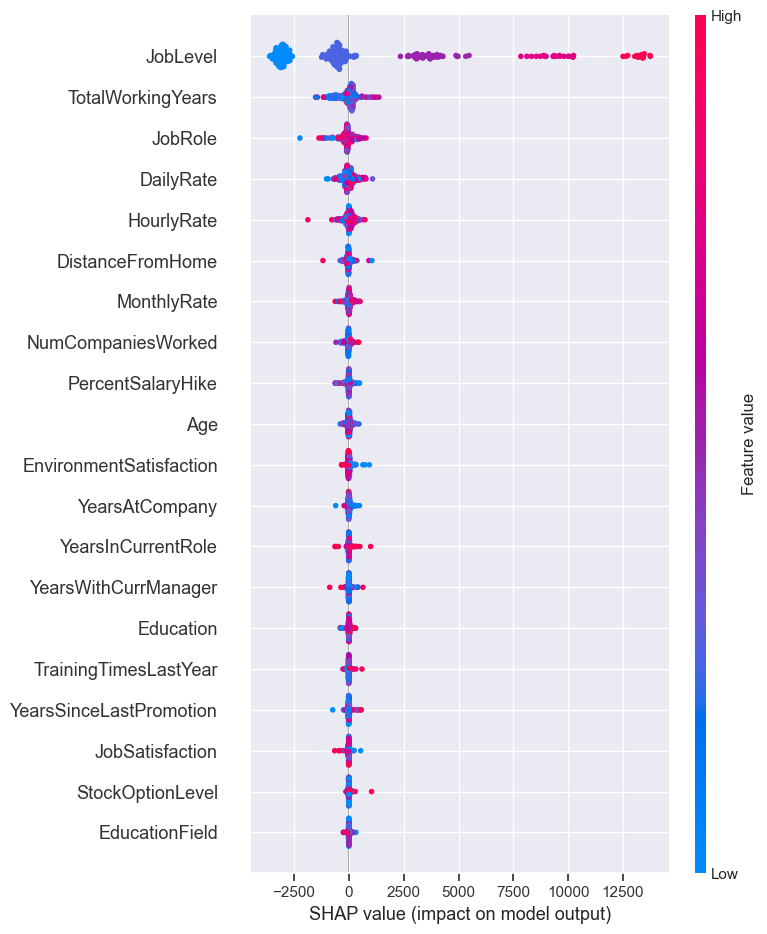
    


```python
explainer = shap.Explainer(dtree, X_test)
shap_values = explainer(X_test)
shap.plots.waterfall(shap_values[0])
```


    
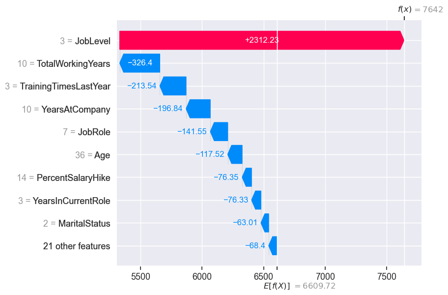
    


```python
from sklearn.ensemble import RandomForestRegressor
rf = RandomForestRegressor(random_state=0, max_depth=None, min_samples_split=2, n_estimators= 100)
rf.fit(X_train, y_train)
```


<style>#sk-container-id-6 {color: black;background-color: white;}#sk-container-id-6 pre{padding: 0;}#sk-container-id-6 div.sk-toggleable {background-color: white;}#sk-container-id-6 label.sk-toggleable__label {cursor: pointer;display: block;width: 100%;margin-bottom: 0;padding: 0.3em;box-sizing: border-box;text-align: center;}#sk-container-id-6 label.sk-toggleable__label-arrow:before {content: "▸";float: left;margin-right: 0.25em;color: #696969;}#sk-container-id-6 label.sk-toggleable__label-arrow:hover:before {color: black;}#sk-container-id-6 div.sk-estimator:hover label.sk-toggleable__label-arrow:before {color: black;}#sk-container-id-6 div.sk-toggleable__content {max-height: 0;max-width: 0;overflow: hidden;text-align: left;background-color: #f0f8ff;}#sk-container-id-6 div.sk-toggleable__content pre {margin: 0.2em;color: black;border-radius: 0.25em;background-color: #f0f8ff;}#sk-container-id-6 input.sk-toggleable__control:checked~div.sk-toggleable__content {max-height: 200px;max-width: 100%;overflow: auto;}#sk-container-id-6 input.sk-toggleable__control:checked~label.sk-toggleable__label-arrow:before {content: "▾";}#sk-container-id-6 div.sk-estimator input.sk-toggleable__control:checked~label.sk-toggleable__label {background-color: #d4ebff;}#sk-container-id-6 div.sk-label input.sk-toggleable__control:checked~label.sk-toggleable__label {background-color: #d4ebff;}#sk-container-id-6 input.sk-hidden--visually {border: 0;clip: rect(1px 1px 1px 1px);clip: rect(1px, 1px, 1px, 1px);height: 1px;margin: -1px;overflow: hidden;padding: 0;position: absolute;width: 1px;}#sk-container-id-6 div.sk-estimator {font-family: monospace;background-color: #f0f8ff;border: 1px dotted black;border-radius: 0.25em;box-sizing: border-box;margin-bottom: 0.5em;}#sk-container-id-6 div.sk-estimator:hover {background-color: #d4ebff;}#sk-container-id-6 div.sk-parallel-item::after {content: "";width: 100%;border-bottom: 1px solid gray;flex-grow: 1;}#sk-container-id-6 div.sk-label:hover label.sk-toggleable__label {background-color: #d4ebff;}#sk-container-id-6 div.sk-serial::before {content: "";position: absolute;border-left: 1px solid gray;box-sizing: border-box;top: 0;bottom: 0;left: 50%;z-index: 0;}#sk-container-id-6 div.sk-serial {display: flex;flex-direction: column;align-items: center;background-color: white;padding-right: 0.2em;padding-left: 0.2em;position: relative;}#sk-container-id-6 div.sk-item {position: relative;z-index: 1;}#sk-container-id-6 div.sk-parallel {display: flex;align-items: stretch;justify-content: center;background-color: white;position: relative;}#sk-container-id-6 div.sk-item::before, #sk-container-id-6 div.sk-parallel-item::before {content: "";position: absolute;border-left: 1px solid gray;box-sizing: border-box;top: 0;bottom: 0;left: 50%;z-index: -1;}#sk-container-id-6 div.sk-parallel-item {display: flex;flex-direction: column;z-index: 1;position: relative;background-color: white;}#sk-container-id-6 div.sk-parallel-item:first-child::after {align-self: flex-end;width: 50%;}#sk-container-id-6 div.sk-parallel-item:last-child::after {align-self: flex-start;width: 50%;}#sk-container-id-6 div.sk-parallel-item:only-child::after {width: 0;}#sk-container-id-6 div.sk-dashed-wrapped {border: 1px dashed gray;margin: 0 0.4em 0.5em 0.4em;box-sizing: border-box;padding-bottom: 0.4em;background-color: white;}#sk-container-id-6 div.sk-label label {font-family: monospace;font-weight: bold;display: inline-block;line-height: 1.2em;}#sk-container-id-6 div.sk-label-container {text-align: center;}#sk-container-id-6 div.sk-container {/* jupyter's `normalize.less` sets `[hidden] { display: none; }` but bootstrap.min.css set `[hidden] { display: none !important; }` so we also need the `!important` here to be able to override the default hidden behavior on the sphinx rendered scikit-learn.org. See: https://github.com/scikit-learn/scikit-learn/issues/21755 */display: inline-block !important;position: relative;}#sk-container-id-6 div.sk-text-repr-fallback {display: none;}</style><div id="sk-container-id-6" class="sk-top-container"><div class="sk-text-repr-fallback"><pre>RandomForestRegressor(random_state=0)</pre><b>In a Jupyter environment, please rerun this cell to show the HTML representation or trust the notebook. <br />On GitHub, the HTML representation is unable to render, please try loading this page with nbviewer.org.</b></div><div class="sk-container" hidden><div class="sk-item"><div class="sk-estimator sk-toggleable"><input class="sk-toggleable__control sk-hidden--visually" id="sk-estimator-id-6" type="checkbox" checked><label for="sk-estimator-id-6" class="sk-toggleable__label sk-toggleable__label-arrow">RandomForestRegressor</label><div class="sk-toggleable__content"><pre>RandomForestRegressor(random_state=0)</pre></div></div></div></div></div>


```python
from sklearn import metrics
from sklearn.metrics import mean_absolute_percentage_error
import math
y_pred = rf.predict(X_test)
mae = metrics.mean_absolute_error(y_test, y_pred)
mape = mean_absolute_percentage_error(y_test, y_pred)
mse = metrics.mean_squared_error(y_test, y_pred)
r2 = metrics.r2_score(y_test, y_pred)
rmse = math.sqrt(mse)

print('MAE is {}'.format(mae))
print('MAPE is {}'.format(mape))
print('MSE is {}'.format(mse))
print('R2 score is {}'.format(r2))
print('RMSE score is {}'.format(rmse))
```

    MAE is 824.4084013605442
    MAPE is 0.15823480076159305
    MSE is 1265245.3369676871
    R2 score is 0.9411212768946191
    RMSE score is 1124.8312482180104
    


```python
imp_df = pd.DataFrame({
    "Feature Name": X_train.columns,
    "Importance": dtree.feature_importances_
})
fi = imp_df.sort_values(by="Importance", ascending=False)

fi2 = fi.head(10)
plt.figure(figsize=(10,8))
sns.barplot(data=fi2, x='Importance', y='Feature Name')
plt.title('Feature Importance Each Attributes (Random Forest Regressor)', fontsize=18)
plt.xlabel ('Importance', fontsize=16)
plt.ylabel ('Feature Name', fontsize=16)
plt.show()
```


    
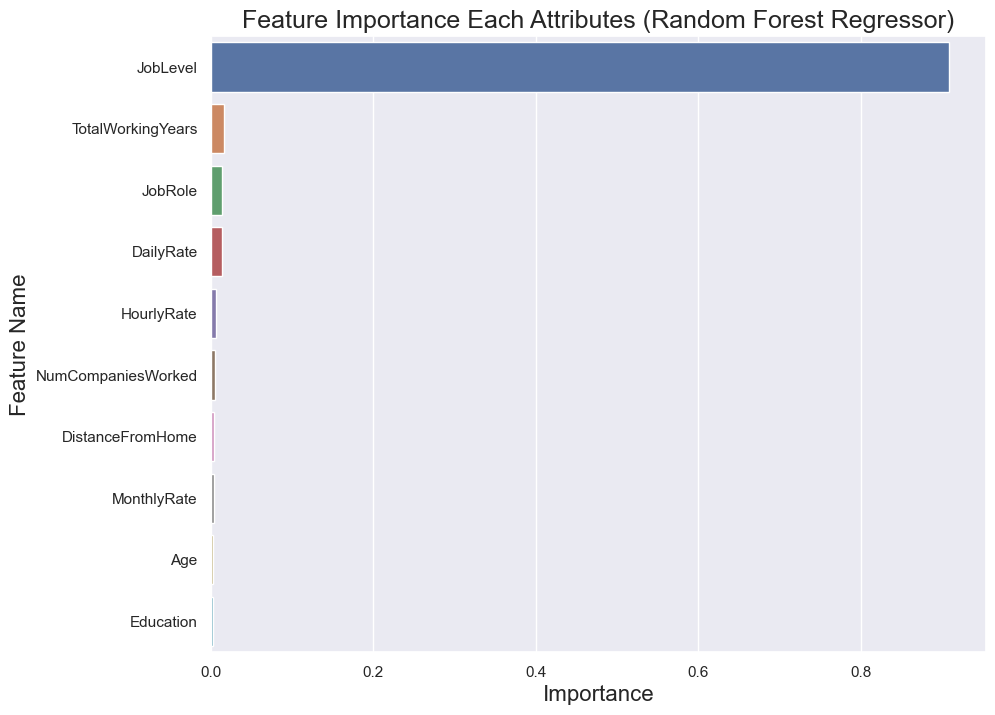
    


```python
import shap
explainer = shap.TreeExplainer(rf)
shap_values = explainer.shap_values(X_test)
shap.summary_plot(shap_values, X_test)
```

    No data for colormapping provided via 'c'. Parameters 'vmin', 'vmax' will be ignored
    


    
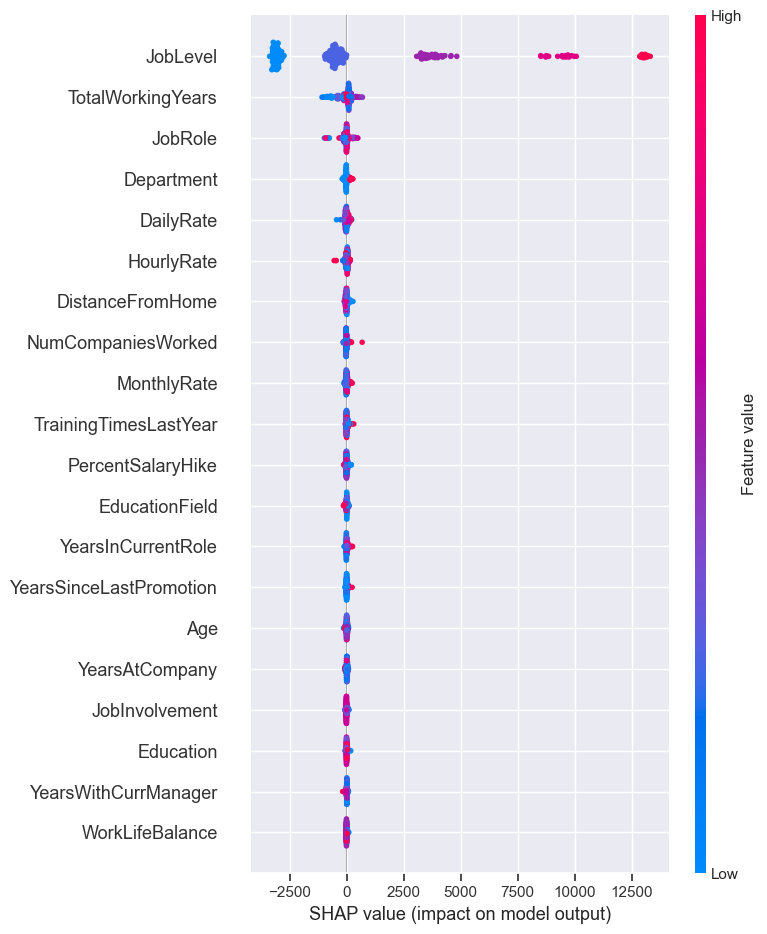
    


```python
explainer = shap.Explainer(rf, X_test, check_additivity=False)
shap_values = explainer(X_test, check_additivity=False)
shap.plots.waterfall(shap_values[0])
```


    
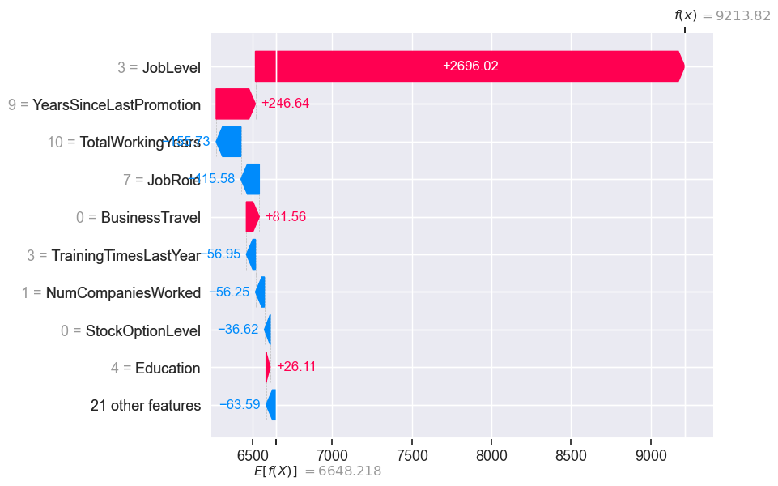
    


```python
from xgboost import XGBRegressor
xgb_regressor = XGBRegressor(learning_rate= 0.1, max_depth= 7, n_estimators= 150)
xgb_regressor.fit(X_train, y_train)
```


<style>#sk-container-id-7 {color: black;background-color: white;}#sk-container-id-7 pre{padding: 0;}#sk-container-id-7 div.sk-toggleable {background-color: white;}#sk-container-id-7 label.sk-toggleable__label {cursor: pointer;display: block;width: 100%;margin-bottom: 0;padding: 0.3em;box-sizing: border-box;text-align: center;}#sk-container-id-7 label.sk-toggleable__label-arrow:before {content: "▸";float: left;margin-right: 0.25em;color: #696969;}#sk-container-id-7 label.sk-toggleable__label-arrow:hover:before {color: black;}#sk-container-id-7 div.sk-estimator:hover label.sk-toggleable__label-arrow:before {color: black;}#sk-container-id-7 div.sk-toggleable__content {max-height: 0;max-width: 0;overflow: hidden;text-align: left;background-color: #f0f8ff;}#sk-container-id-7 div.sk-toggleable__content pre {margin: 0.2em;color: black;border-radius: 0.25em;background-color: #f0f8ff;}#sk-container-id-7 input.sk-toggleable__control:checked~div.sk-toggleable__content {max-height: 200px;max-width: 100%;overflow: auto;}#sk-container-id-7 input.sk-toggleable__control:checked~label.sk-toggleable__label-arrow:before {content: "▾";}#sk-container-id-7 div.sk-estimator input.sk-toggleable__control:checked~label.sk-toggleable__label {background-color: #d4ebff;}#sk-container-id-7 div.sk-label input.sk-toggleable__control:checked~label.sk-toggleable__label {background-color: #d4ebff;}#sk-container-id-7 input.sk-hidden--visually {border: 0;clip: rect(1px 1px 1px 1px);clip: rect(1px, 1px, 1px, 1px);height: 1px;margin: -1px;overflow: hidden;padding: 0;position: absolute;width: 1px;}#sk-container-id-7 div.sk-estimator {font-family: monospace;background-color: #f0f8ff;border: 1px dotted black;border-radius: 0.25em;box-sizing: border-box;margin-bottom: 0.5em;}#sk-container-id-7 div.sk-estimator:hover {background-color: #d4ebff;}#sk-container-id-7 div.sk-parallel-item::after {content: "";width: 100%;border-bottom: 1px solid gray;flex-grow: 1;}#sk-container-id-7 div.sk-label:hover label.sk-toggleable__label {background-color: #d4ebff;}#sk-container-id-7 div.sk-serial::before {content: "";position: absolute;border-left: 1px solid gray;box-sizing: border-box;top: 0;bottom: 0;left: 50%;z-index: 0;}#sk-container-id-7 div.sk-serial {display: flex;flex-direction: column;align-items: center;background-color: white;padding-right: 0.2em;padding-left: 0.2em;position: relative;}#sk-container-id-7 div.sk-item {position: relative;z-index: 1;}#sk-container-id-7 div.sk-parallel {display: flex;align-items: stretch;justify-content: center;background-color: white;position: relative;}#sk-container-id-7 div.sk-item::before, #sk-container-id-7 div.sk-parallel-item::before {content: "";position: absolute;border-left: 1px solid gray;box-sizing: border-box;top: 0;bottom: 0;left: 50%;z-index: -1;}#sk-container-id-7 div.sk-parallel-item {display: flex;flex-direction: column;z-index: 1;position: relative;background-color: white;}#sk-container-id-7 div.sk-parallel-item:first-child::after {align-self: flex-end;width: 50%;}#sk-container-id-7 div.sk-parallel-item:last-child::after {align-self: flex-start;width: 50%;}#sk-container-id-7 div.sk-parallel-item:only-child::after {width: 0;}#sk-container-id-7 div.sk-dashed-wrapped {border: 1px dashed gray;margin: 0 0.4em 0.5em 0.4em;box-sizing: border-box;padding-bottom: 0.4em;background-color: white;}#sk-container-id-7 div.sk-label label {font-family: monospace;font-weight: bold;display: inline-block;line-height: 1.2em;}#sk-container-id-7 div.sk-label-container {text-align: center;}#sk-container-id-7 div.sk-container {/* jupyter's `normalize.less` sets `[hidden] { display: none; }` but bootstrap.min.css set `[hidden] { display: none !important; }` so we also need the `!important` here to be able to override the default hidden behavior on the sphinx rendered scikit-learn.org. See: https://github.com/scikit-learn/scikit-learn/issues/21755 */display: inline-block !important;position: relative;}#sk-container-id-7 div.sk-text-repr-fallback {display: none;}</style><div id="sk-container-id-7" class="sk-top-container"><div class="sk-text-repr-fallback"><pre>XGBRegressor(base_score=None, booster=None, callbacks=None,
             colsample_bylevel=None, colsample_bynode=None,
             colsample_bytree=None, early_stopping_rounds=None,
             enable_categorical=False, eval_metric=None, feature_types=None,
             gamma=None, gpu_id=None, grow_policy=None, importance_type=None,
             interaction_constraints=None, learning_rate=0.1, max_bin=None,
             max_cat_threshold=None, max_cat_to_onehot=None,
             max_delta_step=None, max_depth=7, max_leaves=None,
             min_child_weight=None, missing=nan, monotone_constraints=None,
             n_estimators=150, n_jobs=None, num_parallel_tree=None,
             predictor=None, random_state=None, ...)</pre><b>In a Jupyter environment, please rerun this cell to show the HTML representation or trust the notebook. <br />On GitHub, the HTML representation is unable to render, please try loading this page with nbviewer.org.</b></div><div class="sk-container" hidden><div class="sk-item"><div class="sk-estimator sk-toggleable"><input class="sk-toggleable__control sk-hidden--visually" id="sk-estimator-id-7" type="checkbox" checked><label for="sk-estimator-id-7" class="sk-toggleable__label sk-toggleable__label-arrow">XGBRegressor</label><div class="sk-toggleable__content"><pre>XGBRegressor(base_score=None, booster=None, callbacks=None,
             colsample_bylevel=None, colsample_bynode=None,
             colsample_bytree=None, early_stopping_rounds=None,
             enable_categorical=False, eval_metric=None, feature_types=None,
             gamma=None, gpu_id=None, grow_policy=None, importance_type=None,
             interaction_constraints=None, learning_rate=0.1, max_bin=None,
             max_cat_threshold=None, max_cat_to_onehot=None,
             max_delta_step=None, max_depth=7, max_leaves=None,
             min_child_weight=None, missing=nan, monotone_constraints=None,
             n_estimators=150, n_jobs=None, num_parallel_tree=None,
             predictor=None, random_state=None, ...)</pre></div></div></div></div></div>


```python
from sklearn import metrics
from sklearn.metrics import mean_absolute_percentage_error
import math
y_pred = xgb_regressor.predict(X_test)
mae = metrics.mean_absolute_error(y_test, y_pred)
mape = mean_absolute_percentage_error(y_test, y_pred)
mse = metrics.mean_squared_error(y_test, y_pred)
r2 = metrics.r2_score(y_test, y_pred)
rmse = math.sqrt(mse)

print('MAE is {}'.format(mae))
print('MAPE is {}'.format(mape))
print('MSE is {}'.format(mse))
print('R2 score is {}'.format(r2))
print('RMSE score is {}'.format(rmse))
```

    MAE is 855.2207770315157
    MAPE is 0.1637233702540566
    MSE is 1298166.5994534201
    R2 score is 0.9395892721193061
    RMSE score is 1139.3711421013875
    


```python
import shap
explainer = shap.TreeExplainer(xgb_regressor)
shap_values = explainer.shap_values(X_test)
shap.summary_plot(shap_values, X_test)
```

    No data for colormapping provided via 'c'. Parameters 'vmin', 'vmax' will be ignored
    


    
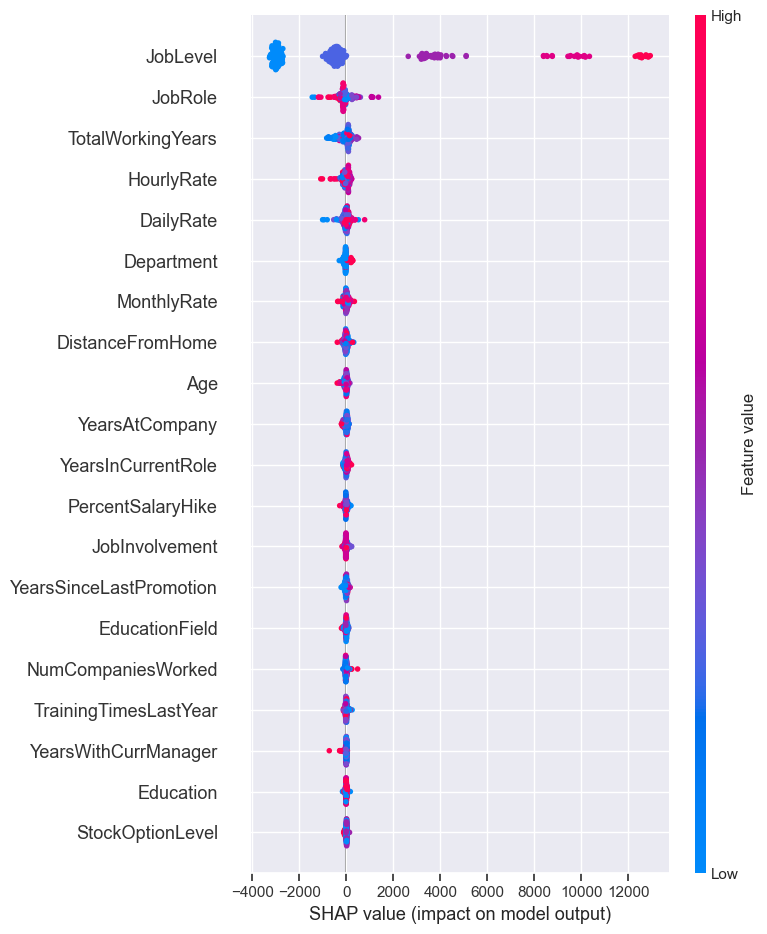
    


```python
explainer = shap.Explainer(xgb_regressor, X_test, check_additivity=False)
shap_values = explainer(X_test, check_additivity=False)
shap.plots.waterfall(shap_values[0])
```


    
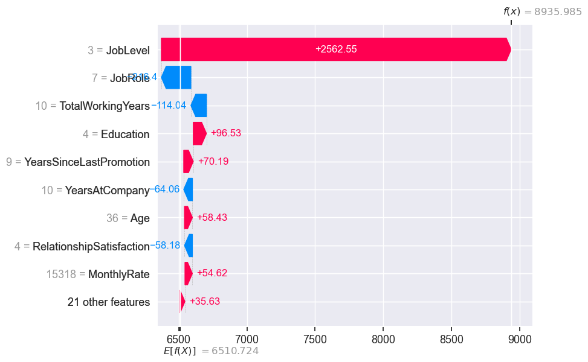
    


```python
import numpy as np
from sklearn.linear_model import LinearRegression

# Train linear regression model
linreg = LinearRegression(fit_intercept=True)
linreg.fit(X_train, y_train)

```


<style>#sk-container-id-8 {color: black;background-color: white;}#sk-container-id-8 pre{padding: 0;}#sk-container-id-8 div.sk-toggleable {background-color: white;}#sk-container-id-8 label.sk-toggleable__label {cursor: pointer;display: block;width: 100%;margin-bottom: 0;padding: 0.3em;box-sizing: border-box;text-align: center;}#sk-container-id-8 label.sk-toggleable__label-arrow:before {content: "▸";float: left;margin-right: 0.25em;color: #696969;}#sk-container-id-8 label.sk-toggleable__label-arrow:hover:before {color: black;}#sk-container-id-8 div.sk-estimator:hover label.sk-toggleable__label-arrow:before {color: black;}#sk-container-id-8 div.sk-toggleable__content {max-height: 0;max-width: 0;overflow: hidden;text-align: left;background-color: #f0f8ff;}#sk-container-id-8 div.sk-toggleable__content pre {margin: 0.2em;color: black;border-radius: 0.25em;background-color: #f0f8ff;}#sk-container-id-8 input.sk-toggleable__control:checked~div.sk-toggleable__content {max-height: 200px;max-width: 100%;overflow: auto;}#sk-container-id-8 input.sk-toggleable__control:checked~label.sk-toggleable__label-arrow:before {content: "▾";}#sk-container-id-8 div.sk-estimator input.sk-toggleable__control:checked~label.sk-toggleable__label {background-color: #d4ebff;}#sk-container-id-8 div.sk-label input.sk-toggleable__control:checked~label.sk-toggleable__label {background-color: #d4ebff;}#sk-container-id-8 input.sk-hidden--visually {border: 0;clip: rect(1px 1px 1px 1px);clip: rect(1px, 1px, 1px, 1px);height: 1px;margin: -1px;overflow: hidden;padding: 0;position: absolute;width: 1px;}#sk-container-id-8 div.sk-estimator {font-family: monospace;background-color: #f0f8ff;border: 1px dotted black;border-radius: 0.25em;box-sizing: border-box;margin-bottom: 0.5em;}#sk-container-id-8 div.sk-estimator:hover {background-color: #d4ebff;}#sk-container-id-8 div.sk-parallel-item::after {content: "";width: 100%;border-bottom: 1px solid gray;flex-grow: 1;}#sk-container-id-8 div.sk-label:hover label.sk-toggleable__label {background-color: #d4ebff;}#sk-container-id-8 div.sk-serial::before {content: "";position: absolute;border-left: 1px solid gray;box-sizing: border-box;top: 0;bottom: 0;left: 50%;z-index: 0;}#sk-container-id-8 div.sk-serial {display: flex;flex-direction: column;align-items: center;background-color: white;padding-right: 0.2em;padding-left: 0.2em;position: relative;}#sk-container-id-8 div.sk-item {position: relative;z-index: 1;}#sk-container-id-8 div.sk-parallel {display: flex;align-items: stretch;justify-content: center;background-color: white;position: relative;}#sk-container-id-8 div.sk-item::before, #sk-container-id-8 div.sk-parallel-item::before {content: "";position: absolute;border-left: 1px solid gray;box-sizing: border-box;top: 0;bottom: 0;left: 50%;z-index: -1;}#sk-container-id-8 div.sk-parallel-item {display: flex;flex-direction: column;z-index: 1;position: relative;background-color: white;}#sk-container-id-8 div.sk-parallel-item:first-child::after {align-self: flex-end;width: 50%;}#sk-container-id-8 div.sk-parallel-item:last-child::after {align-self: flex-start;width: 50%;}#sk-container-id-8 div.sk-parallel-item:only-child::after {width: 0;}#sk-container-id-8 div.sk-dashed-wrapped {border: 1px dashed gray;margin: 0 0.4em 0.5em 0.4em;box-sizing: border-box;padding-bottom: 0.4em;background-color: white;}#sk-container-id-8 div.sk-label label {font-family: monospace;font-weight: bold;display: inline-block;line-height: 1.2em;}#sk-container-id-8 div.sk-label-container {text-align: center;}#sk-container-id-8 div.sk-container {/* jupyter's `normalize.less` sets `[hidden] { display: none; }` but bootstrap.min.css set `[hidden] { display: none !important; }` so we also need the `!important` here to be able to override the default hidden behavior on the sphinx rendered scikit-learn.org. See: https://github.com/scikit-learn/scikit-learn/issues/21755 */display: inline-block !important;position: relative;}#sk-container-id-8 div.sk-text-repr-fallback {display: none;}</style><div id="sk-container-id-8" class="sk-top-container"><div class="sk-text-repr-fallback"><pre>LinearRegression()</pre><b>In a Jupyter environment, please rerun this cell to show the HTML representation or trust the notebook. <br />On GitHub, the HTML representation is unable to render, please try loading this page with nbviewer.org.</b></div><div class="sk-container" hidden><div class="sk-item"><div class="sk-estimator sk-toggleable"><input class="sk-toggleable__control sk-hidden--visually" id="sk-estimator-id-8" type="checkbox" checked><label for="sk-estimator-id-8" class="sk-toggleable__label sk-toggleable__label-arrow">LinearRegression</label><div class="sk-toggleable__content"><pre>LinearRegression()</pre></div></div></div></div></div>


```python
from sklearn import metrics
from sklearn.metrics import mean_absolute_percentage_error
import math
y_pred = linreg.predict(X_test)
mae = metrics.mean_absolute_error(y_test, y_pred)
mape = mean_absolute_percentage_error(y_test, y_pred)
mse = metrics.mean_squared_error(y_test, y_pred)
r2 = metrics.r2_score(y_test, y_pred)
rmse = math.sqrt(mse)

print('MAE is {}'.format(mae))
print('MAPE is {}'.format(mape))
print('MSE is {}'.format(mse))
print('R2 score is {}'.format(r2))
print('RMSE score is {}'.format(rmse))
```

    MAE is 1072.7583953678734
    MAPE is 0.2100788760814782
    MSE is 1890852.5058035417
    R2 score is 0.9120083845642613
    RMSE score is 1375.0827268944738
    


```python
imp_df = pd.DataFrame({
    "Feature Name": X_train.columns,
    "Importance": np.abs(linreg.coef_)
})

# Sort by importance (absolute value of coefficients)
fi = imp_df.sort_values(by="Importance", ascending=False)

# Select the top 10 features
fi2 = fi.head(10)

# Plot the feature importance
plt.figure(figsize=(10, 8))
sns.barplot(data=fi2, x='Importance', y='Feature Name')
plt.title('Feature Importance Each Attribute (Linear Regression)', fontsize=18)
plt.xlabel('Importance', fontsize=16)
plt.ylabel('Feature Name', fontsize=16)
plt.show()
```


    
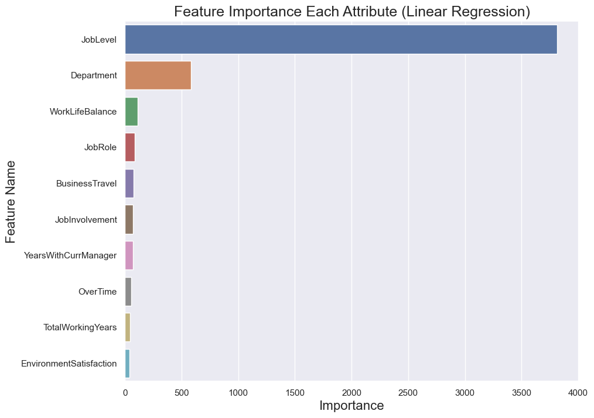
    


```python
from sklearn.linear_model import LinearRegression
from sklearn.tree import DecisionTreeRegressor
from sklearn.ensemble import RandomForestRegressor
from xgboost import XGBRegressor
from sklearn.metrics import mean_squared_error, mean_absolute_error
from sklearn.metrics import mean_absolute_percentage_error as MAPE

# Regressor 1: Linear Regression
linear_regressor = LinearRegression(fit_intercept=True)
linear_regressor.fit(X_train, y_train)

y_train_pred_linear = linear_regressor.predict(X_train)
y_test_pred_linear = linear_regressor.predict(X_test)

# Calculate metrics for Linear Regression
linear_r2_train = linear_regressor.score(X_train, y_train)
linear_r2_test = linear_regressor.score(X_test, y_test)
linear_mse_train = mean_squared_error(y_train, y_train_pred_linear)
linear_mse_test = mean_squared_error(y_test, y_test_pred_linear)
linear_rmse_train = np.sqrt(linear_mse_train)
linear_rmse_test = np.sqrt(linear_mse_test)
linear_mae_train = mean_absolute_error(y_train, y_train_pred_linear)
linear_mae_test = mean_absolute_error(y_test, y_test_pred_linear)
linear_mape_train = MAPE(y_train, y_train_pred_linear)
linear_mape_test = MAPE(y_test, y_test_pred_linear)

# Regressor 2: Decision Tree Regressor
dt_regressor = DecisionTreeRegressor(random_state=0, max_depth=None, max_features='auto', min_samples_leaf=1, min_samples_split=2)
dt_regressor.fit(X_train, y_train)

y_train_pred_dt = dt_regressor.predict(X_train)
y_test_pred_dt = dt_regressor.predict(X_test)

# Calculate metrics for Decision Tree Regressor
dt_r2_train = dt_regressor.score(X_train, y_train)
dt_r2_test = dt_regressor.score(X_test, y_test)
dt_mse_train = mean_squared_error(y_train, y_train_pred_dt)
dt_mse_test = mean_squared_error(y_test, y_test_pred_dt)
dt_rmse_train = np.sqrt(dt_mse_train)
dt_rmse_test = np.sqrt(dt_mse_test)
dt_mae_train = mean_absolute_error(y_train, y_train_pred_dt)
dt_mae_test = mean_absolute_error(y_test, y_test_pred_dt)
dt_mape_train = MAPE(y_train, y_train_pred_dt)
dt_mape_test = MAPE(y_test, y_test_pred_dt)

# Regressor 3: Random Forest Regressor
rf_regressor = RandomForestRegressor(random_state=0, max_depth=None, min_samples_split=2, n_estimators= 100)
rf_regressor.fit(X_train, y_train)

y_train_pred_rf = rf_regressor.predict(X_train)
y_test_pred_rf = rf_regressor.predict(X_test)

# Calculate metrics for Random Forest Regressor
rf_r2_train = rf_regressor.score(X_train, y_train)
rf_r2_test = rf_regressor.score(X_test, y_test)
rf_mse_train = mean_squared_error(y_train, y_train_pred_rf)
rf_mse_test = mean_squared_error(y_test, y_test_pred_rf)
rf_rmse_train = np.sqrt(rf_mse_train)
rf_rmse_test = np.sqrt(rf_mse_test)
rf_mae_train = mean_absolute_error(y_train, y_train_pred_rf)
rf_mae_test = mean_absolute_error(y_test, y_test_pred_rf)
rf_mape_train = MAPE(y_train, y_train_pred_rf)
rf_mape_test = MAPE(y_test, y_test_pred_rf)

# Regressor 4: XGBoost Regressor
xgb_regressor = XGBRegressor(learning_rate= 0.1, max_depth= 7, n_estimators= 150)
xgb_regressor.fit(X_train, y_train)

y_train_pred_xgb = xgb_regressor.predict(X_train)
y_test_pred_xgb = xgb_regressor.predict(X_test)

# Calculate metrics for XGBoost Regressor
xgb_r2_train = xgb_regressor.score(X_train, y_train)
xgb_r2_test = xgb_regressor.score(X_test, y_test)
xgb_mse_train = mean_squared_error(y_train, y_train_pred_xgb)
xgb_mse_test = mean_squared_error(y_test, y_test_pred_xgb)
xgb_rmse_train = np.sqrt(xgb_mse_train)
xgb_rmse_test = np.sqrt(xgb_mse_test)
xgb_mae_train = mean_absolute_error(y_train, y_train_pred_xgb)
xgb_mae_test = mean_absolute_error(y_test, y_test_pred_xgb)
xgb_mape_train = MAPE(y_train, y_train_pred_xgb)
xgb_mape_test = MAPE(y_test, y_test_pred_xgb)

# Create a dataframe to compare the performance of the regressors
metrics_data = {
    'Regressor': ['Linear Regression', 'Decision Tree Regressor', 'Random Forest Regressor', 'XGBoost Regressor'],
    'R2 (Train)': [linear_r2_train, dt_r2_train, rf_r2_train, xgb_r2_train],
    'R2 (Test)': [linear_r2_test, dt_r2_test, rf_r2_test, xgb_r2_test],
    'MSE (Train)': [linear_mse_train, dt_mse_train, rf_mse_train, xgb_mse_train],
    'MSE (Test)': [linear_mse_test, dt_mse_test, rf_mse_test, xgb_mse_test],
    'RMSE (Train)': [linear_rmse_train, dt_rmse_train, rf_rmse_train, xgb_rmse_train],
    'RMSE (Test)': [linear_rmse_test, dt_rmse_test, rf_rmse_test, xgb_rmse_test],
    'MAE (Train)': [linear_mae_train, dt_mae_train, rf_mae_train, xgb_mae_train],
    'MAE (Test)': [linear_mae_test, dt_mae_test, rf_mae_test, xgb_mae_test],
    'MAPE (Train)': [linear_mape_train, dt_mape_train, rf_mape_train, xgb_mape_train],
    'MAPE (Test)': [linear_mape_test, dt_mape_test, rf_mape_test, xgb_mape_test]
}

metrics_df = pd.DataFrame(metrics_data)
metrics_df
```

    `max_features='auto'` has been deprecated in 1.1 and will be removed in 1.3. To keep the past behaviour, explicitly set `max_features=1.0'`.
    


<div>
<style scoped>
    .dataframe tbody tr th:only-of-type {
        vertical-align: middle;
    }

    .dataframe tbody tr th {
        vertical-align: top;
    }

    .dataframe thead th {
        text-align: right;
    }
</style>
<table border="1" class="dataframe">
  <thead>
    <tr style="text-align: right;">
      <th></th>
      <th>Regressor</th>
      <th>R2 (Train)</th>
      <th>R2 (Test)</th>
      <th>MSE (Train)</th>
      <th>MSE (Test)</th>
      <th>RMSE (Train)</th>
      <th>RMSE (Test)</th>
      <th>MAE (Train)</th>
      <th>MAE (Test)</th>
      <th>MAPE (Train)</th>
      <th>MAPE (Test)</th>
    </tr>
  </thead>
  <tbody>
    <tr>
      <th>0</th>
      <td>Linear Regression</td>
      <td>0.892196</td>
      <td>0.912008</td>
      <td>1.967478e+06</td>
      <td>1.890853e+06</td>
      <td>1402.668045</td>
      <td>1375.082727</td>
      <td>1046.836380</td>
      <td>1072.758395</td>
      <td>0.217434</td>
      <td>0.210079</td>
    </tr>
    <tr>
      <th>1</th>
      <td>Decision Tree Regressor</td>
      <td>1.000000</td>
      <td>0.894750</td>
      <td>0.000000e+00</td>
      <td>2.261715e+06</td>
      <td>0.000000</td>
      <td>1503.899850</td>
      <td>0.000000</td>
      <td>1057.717687</td>
      <td>0.000000</td>
      <td>0.200839</td>
    </tr>
    <tr>
      <th>2</th>
      <td>Random Forest Regressor</td>
      <td>0.989246</td>
      <td>0.941121</td>
      <td>1.962651e+05</td>
      <td>1.265245e+06</td>
      <td>443.018128</td>
      <td>1124.831248</td>
      <td>321.622367</td>
      <td>824.408401</td>
      <td>0.070875</td>
      <td>0.158235</td>
    </tr>
    <tr>
      <th>3</th>
      <td>XGBoost Regressor</td>
      <td>0.999487</td>
      <td>0.939589</td>
      <td>9.366562e+03</td>
      <td>1.298167e+06</td>
      <td>96.780998</td>
      <td>1139.371142</td>
      <td>65.340653</td>
      <td>855.220777</td>
      <td>0.016758</td>
      <td>0.163723</td>
    </tr>
  </tbody>
</table>
</div>


```python
import pandas as pd

# Read the CSV file into DataFrame
df2 = pd.read_csv('employee.csv')

# Print the column names and the first few rows of the DataFrame
print("Column Names:", df2.columns)
print(df2.head())

# Drop specified columns if they exist
columns_to_drop = ['EmployeeNumber', 'StandardHours', 'Over18', 'PerformanceRating']
df2.drop(columns=columns_to_drop, inplace=True)

```

    Column Names: Index(['Age', 'Attrition', 'BusinessTravel', 'DailyRate', 'Department',
           'DistanceFromHome', 'Education', 'EducationField', 'EmployeeCount',
           'EmployeeNumber', 'EnvironmentSatisfaction', 'Gender', 'HourlyRate',
           'JobInvolvement', 'JobLevel', 'JobRole', 'JobSatisfaction',
           'MaritalStatus', 'MonthlyIncome', 'MonthlyRate', 'NumCompaniesWorked',
           'Over18', 'OverTime', 'PercentSalaryHike', 'PerformanceRating',
           'RelationshipSatisfaction', 'StandardHours', 'StockOptionLevel',
           'TotalWorkingYears', 'TrainingTimesLastYear', 'WorkLifeBalance',
           'YearsAtCompany', 'YearsInCurrentRole', 'YearsSinceLastPromotion',
           'YearsWithCurrManager'],
          dtype='object')
       Age Attrition     BusinessTravel  DailyRate              Department  \
    0   41       Yes      Travel_Rarely       1102                   Sales   
    1   49        No  Travel_Frequently        279  Research & Development   
    2   37       Yes      Travel_Rarely       1373  Research & Development   
    3   33        No  Travel_Frequently       1392  Research & Development   
    4   27        No      Travel_Rarely        591  Research & Development   
    
       DistanceFromHome  Education EducationField  EmployeeCount  EmployeeNumber  \
    0                 1          2  Life Sciences              1               1   
    1                 8          1  Life Sciences              1               2   
    2                 2          2          Other              1               4   
    3                 3          4  Life Sciences              1               5   
    4                 2          1        Medical              1               7   
    
       EnvironmentSatisfaction  Gender  HourlyRate  JobInvolvement  JobLevel  \
    0                        2  Female          94               3         2   
    1                        3    Male          61               2         2   
    2                        4    Male          92               2         1   
    3                        4  Female          56               3         1   
    4                        1    Male          40               3         1   
    
                     JobRole  JobSatisfaction MaritalStatus  MonthlyIncome  \
    0        Sales Executive                4        Single           5993   
    1     Research Scientist                2       Married           5130   
    2  Laboratory Technician                3        Single           2090   
    3     Research Scientist                3       Married           2909   
    4  Laboratory Technician                2       Married           3468   
    
       MonthlyRate  NumCompaniesWorked Over18 OverTime  PercentSalaryHike  \
    0        19479                   8      Y      Yes                 11   
    1        24907                   1      Y       No                 23   
    2         2396                   6      Y      Yes                 15   
    3        23159                   1      Y      Yes                 11   
    4        16632                   9      Y       No                 12   
    
       PerformanceRating  RelationshipSatisfaction  StandardHours  \
    0                  3                         1             80   
    1                  4                         4             80   
    2                  3                         2             80   
    3                  3                         3             80   
    4                  3                         4             80   
    
       StockOptionLevel  TotalWorkingYears  TrainingTimesLastYear  \
    0                 0                  8                      0   
    1                 1                 10                      3   
    2                 0                  7                      3   
    3                 0                  8                      3   
    4                 1                  6                      3   
    
       WorkLifeBalance  YearsAtCompany  YearsInCurrentRole  \
    0                1               6                   4   
    1                3              10                   7   
    2                3               0                   0   
    3                3               8                   7   
    4                3               2                   2   
    
       YearsSinceLastPromotion  YearsWithCurrManager  
    0                        0                     5  
    1                        1                     7  
    2                        0                     0  
    3                        3                     0  
    4                        2                     2  
    


```python
from sklearn.cluster import KMeans
from sklearn.metrics import silhouette_score

# Function to find optimal k using the Elbow Method
def find_optimal_k_elbow(X, max_k):
    inertias = []
    for k in range(1, max_k + 1):
        kmeans = KMeans(n_clusters=k, random_state=42)
        kmeans.fit(X)
        inertias.append(kmeans.inertia_)

    # Plot Elbow graph
    plt.figure(figsize=(8, 6))
    plt.plot(range(1, max_k + 1), inertias, marker='o')
    plt.xlabel('Number of clusters (k)')
    plt.ylabel('Inertia')
    plt.title('Elbow Method')
    plt.show()

# Function to find optimal k using the Silhouette Score
def find_optimal_k_silhouette(X, max_k):
    silhouette_scores = []
    for k in range(2, max_k + 1):
        kmeans = KMeans(n_clusters=k, random_state=42)
        kmeans.fit(X)
        labels = kmeans.labels_
        silhouette_scores.append(silhouette_score(X, labels))

    # Plot Silhouette Score graph
    plt.figure(figsize=(8, 6))
    plt.plot(range(2, max_k + 1), silhouette_scores, marker='o')
    plt.xlabel('Number of clusters (k)')
    plt.ylabel('Silhouette Score')
    plt.title('Silhouette Score')
    plt.show()

selected_columns = ['MonthlyIncome', 'Age', 'DailyRate']
X = df2[selected_columns]

# Mencari nilai k optimal menggunakan Elbow Method
max_k = 10
find_optimal_k_elbow(X, max_k)

# Mencari nilai k optimal menggunakan Silhouette Score
find_optimal_k_silhouette(X, max_k)
```

    The default value of `n_init` will change from 10 to 'auto' in 1.4. Set the value of `n_init` explicitly to suppress the warning
    KMeans is known to have a memory leak on Windows with MKL, when there are less chunks than available threads. You can avoid it by setting the environment variable OMP_NUM_THREADS=6.
    The default value of `n_init` will change from 10 to 'auto' in 1.4. Set the value of `n_init` explicitly to suppress the warning
    KMeans is known to have a memory leak on Windows with MKL, when there are less chunks than available threads. You can avoid it by setting the environment variable OMP_NUM_THREADS=6.
    The default value of `n_init` will change from 10 to 'auto' in 1.4. Set the value of `n_init` explicitly to suppress the warning
    KMeans is known to have a memory leak on Windows with MKL, when there are less chunks than available threads. You can avoid it by setting the environment variable OMP_NUM_THREADS=6.
    The default value of `n_init` will change from 10 to 'auto' in 1.4. Set the value of `n_init` explicitly to suppress the warning
    KMeans is known to have a memory leak on Windows with MKL, when there are less chunks than available threads. You can avoid it by setting the environment variable OMP_NUM_THREADS=6.
    The default value of `n_init` will change from 10 to 'auto' in 1.4. Set the value of `n_init` explicitly to suppress the warning
    KMeans is known to have a memory leak on Windows with MKL, when there are less chunks than available threads. You can avoid it by setting the environment variable OMP_NUM_THREADS=6.
    The default value of `n_init` will change from 10 to 'auto' in 1.4. Set the value of `n_init` explicitly to suppress the warning
    KMeans is known to have a memory leak on Windows with MKL, when there are less chunks than available threads. You can avoid it by setting the environment variable OMP_NUM_THREADS=6.
    The default value of `n_init` will change from 10 to 'auto' in 1.4. Set the value of `n_init` explicitly to suppress the warning
    KMeans is known to have a memory leak on Windows with MKL, when there are less chunks than available threads. You can avoid it by setting the environment variable OMP_NUM_THREADS=6.
    The default value of `n_init` will change from 10 to 'auto' in 1.4. Set the value of `n_init` explicitly to suppress the warning
    KMeans is known to have a memory leak on Windows with MKL, when there are less chunks than available threads. You can avoid it by setting the environment variable OMP_NUM_THREADS=6.
    The default value of `n_init` will change from 10 to 'auto' in 1.4. Set the value of `n_init` explicitly to suppress the warning
    KMeans is known to have a memory leak on Windows with MKL, when there are less chunks than available threads. You can avoid it by setting the environment variable OMP_NUM_THREADS=6.
    The default value of `n_init` will change from 10 to 'auto' in 1.4. Set the value of `n_init` explicitly to suppress the warning
    KMeans is known to have a memory leak on Windows with MKL, when there are less chunks than available threads. You can avoid it by setting the environment variable OMP_NUM_THREADS=6.
    


    
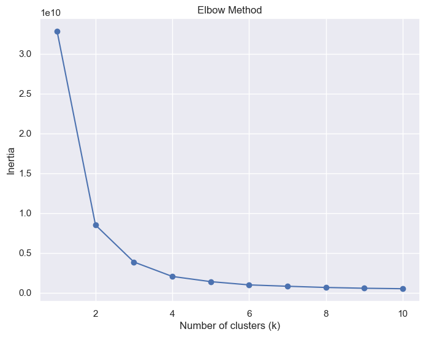
    


    The default value of `n_init` will change from 10 to 'auto' in 1.4. Set the value of `n_init` explicitly to suppress the warning
    KMeans is known to have a memory leak on Windows with MKL, when there are less chunks than available threads. You can avoid it by setting the environment variable OMP_NUM_THREADS=6.
    The default value of `n_init` will change from 10 to 'auto' in 1.4. Set the value of `n_init` explicitly to suppress the warning
    KMeans is known to have a memory leak on Windows with MKL, when there are less chunks than available threads. You can avoid it by setting the environment variable OMP_NUM_THREADS=6.
    The default value of `n_init` will change from 10 to 'auto' in 1.4. Set the value of `n_init` explicitly to suppress the warning
    KMeans is known to have a memory leak on Windows with MKL, when there are less chunks than available threads. You can avoid it by setting the environment variable OMP_NUM_THREADS=6.
    The default value of `n_init` will change from 10 to 'auto' in 1.4. Set the value of `n_init` explicitly to suppress the warning
    KMeans is known to have a memory leak on Windows with MKL, when there are less chunks than available threads. You can avoid it by setting the environment variable OMP_NUM_THREADS=6.
    The default value of `n_init` will change from 10 to 'auto' in 1.4. Set the value of `n_init` explicitly to suppress the warning
    KMeans is known to have a memory leak on Windows with MKL, when there are less chunks than available threads. You can avoid it by setting the environment variable OMP_NUM_THREADS=6.
    The default value of `n_init` will change from 10 to 'auto' in 1.4. Set the value of `n_init` explicitly to suppress the warning
    KMeans is known to have a memory leak on Windows with MKL, when there are less chunks than available threads. You can avoid it by setting the environment variable OMP_NUM_THREADS=6.
    The default value of `n_init` will change from 10 to 'auto' in 1.4. Set the value of `n_init` explicitly to suppress the warning
    KMeans is known to have a memory leak on Windows with MKL, when there are less chunks than available threads. You can avoid it by setting the environment variable OMP_NUM_THREADS=6.
    The default value of `n_init` will change from 10 to 'auto' in 1.4. Set the value of `n_init` explicitly to suppress the warning
    KMeans is known to have a memory leak on Windows with MKL, when there are less chunks than available threads. You can avoid it by setting the environment variable OMP_NUM_THREADS=6.
    The default value of `n_init` will change from 10 to 'auto' in 1.4. Set the value of `n_init` explicitly to suppress the warning
    KMeans is known to have a memory leak on Windows with MKL, when there are less chunks than available threads. You can avoid it by setting the environment variable OMP_NUM_THREADS=6.
    


    
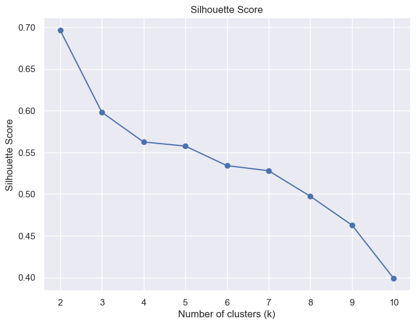
    


```python
from sklearn.cluster import KMeans
from sklearn.metrics import silhouette_score

# Function to find optimal k using the Elbow Method
def find_optimal_k_elbow(X, max_k):
    inertias = []
    for k in range(1, max_k + 1):
        kmeans = KMeans(n_clusters=k, random_state=42)
        kmeans.fit(X)
        inertias.append(kmeans.inertia_)

    # Plot Elbow graph
    plt.figure(figsize=(8, 6))
    plt.plot(range(1, max_k + 1), inertias, marker='o')
    plt.xlabel('Number of clusters (k)')
    plt.ylabel('Inertia')
    plt.title('Elbow Method')
    plt.show()

    # Return the fitted KMeans model with optimal k
    optimal_k = np.argmin(np.diff(inertias)) + 2
    kmeans = KMeans(n_clusters=optimal_k, random_state=42)
    kmeans.fit(X)
    return kmeans

# Function to find optimal k using the Silhouette Score
def find_optimal_k_silhouette(X, max_k):
    silhouette_scores = []
    for k in range(2, max_k + 1):
        kmeans = KMeans(n_clusters=k, random_state=42)
        kmeans.fit(X)
        labels = kmeans.labels_
        silhouette_scores.append(silhouette_score(X, labels))

    # Plot Silhouette Score graph
    plt.figure(figsize=(8, 6))
    plt.plot(range(2, max_k + 1), silhouette_scores, marker='o')
    plt.xlabel('Number of clusters (k)')
    plt.ylabel('Silhouette Score')
    plt.title('Silhouette Score')
    plt.show()

    # Return the fitted KMeans model with optimal k
    optimal_k = np.argmax(silhouette_scores) + 2
    kmeans = KMeans(n_clusters=optimal_k, random_state=42)
    kmeans.fit(X)
    return kmeans


selected_columns = ['MonthlyIncome', 'Age', 'DailyRate']
X = df2[selected_columns]

# Mencari nilai k optimal menggunakan Elbow Method
max_k = 10
kmeans_model = find_optimal_k_elbow(X, max_k)

# Predict cluster labels and add 'label' column to the DataFrame
df2['label'] = kmeans_model.predict(X)

df2

```

    The default value of `n_init` will change from 10 to 'auto' in 1.4. Set the value of `n_init` explicitly to suppress the warning
    KMeans is known to have a memory leak on Windows with MKL, when there are less chunks than available threads. You can avoid it by setting the environment variable OMP_NUM_THREADS=6.
    The default value of `n_init` will change from 10 to 'auto' in 1.4. Set the value of `n_init` explicitly to suppress the warning
    KMeans is known to have a memory leak on Windows with MKL, when there are less chunks than available threads. You can avoid it by setting the environment variable OMP_NUM_THREADS=6.
    The default value of `n_init` will change from 10 to 'auto' in 1.4. Set the value of `n_init` explicitly to suppress the warning
    KMeans is known to have a memory leak on Windows with MKL, when there are less chunks than available threads. You can avoid it by setting the environment variable OMP_NUM_THREADS=6.
    The default value of `n_init` will change from 10 to 'auto' in 1.4. Set the value of `n_init` explicitly to suppress the warning
    KMeans is known to have a memory leak on Windows with MKL, when there are less chunks than available threads. You can avoid it by setting the environment variable OMP_NUM_THREADS=6.
    The default value of `n_init` will change from 10 to 'auto' in 1.4. Set the value of `n_init` explicitly to suppress the warning
    KMeans is known to have a memory leak on Windows with MKL, when there are less chunks than available threads. You can avoid it by setting the environment variable OMP_NUM_THREADS=6.
    The default value of `n_init` will change from 10 to 'auto' in 1.4. Set the value of `n_init` explicitly to suppress the warning
    KMeans is known to have a memory leak on Windows with MKL, when there are less chunks than available threads. You can avoid it by setting the environment variable OMP_NUM_THREADS=6.
    The default value of `n_init` will change from 10 to 'auto' in 1.4. Set the value of `n_init` explicitly to suppress the warning
    KMeans is known to have a memory leak on Windows with MKL, when there are less chunks than available threads. You can avoid it by setting the environment variable OMP_NUM_THREADS=6.
    The default value of `n_init` will change from 10 to 'auto' in 1.4. Set the value of `n_init` explicitly to suppress the warning
    KMeans is known to have a memory leak on Windows with MKL, when there are less chunks than available threads. You can avoid it by setting the environment variable OMP_NUM_THREADS=6.
    The default value of `n_init` will change from 10 to 'auto' in 1.4. Set the value of `n_init` explicitly to suppress the warning
    KMeans is known to have a memory leak on Windows with MKL, when there are less chunks than available threads. You can avoid it by setting the environment variable OMP_NUM_THREADS=6.
    The default value of `n_init` will change from 10 to 'auto' in 1.4. Set the value of `n_init` explicitly to suppress the warning
    KMeans is known to have a memory leak on Windows with MKL, when there are less chunks than available threads. You can avoid it by setting the environment variable OMP_NUM_THREADS=6.
    


    

    


    The default value of `n_init` will change from 10 to 'auto' in 1.4. Set the value of `n_init` explicitly to suppress the warning
    KMeans is known to have a memory leak on Windows with MKL, when there are less chunks than available threads. You can avoid it by setting the environment variable OMP_NUM_THREADS=6.
    


<div>
<style scoped>
    .dataframe tbody tr th:only-of-type {
        vertical-align: middle;
    }

    .dataframe tbody tr th {
        vertical-align: top;
    }

    .dataframe thead th {
        text-align: right;
    }
</style>
<table border="1" class="dataframe">
  <thead>
    <tr style="text-align: right;">
      <th></th>
      <th>Age</th>
      <th>Attrition</th>
      <th>BusinessTravel</th>
      <th>DailyRate</th>
      <th>Department</th>
      <th>DistanceFromHome</th>
      <th>Education</th>
      <th>EducationField</th>
      <th>EmployeeCount</th>
      <th>EnvironmentSatisfaction</th>
      <th>Gender</th>
      <th>HourlyRate</th>
      <th>JobInvolvement</th>
      <th>JobLevel</th>
      <th>JobRole</th>
      <th>JobSatisfaction</th>
      <th>MaritalStatus</th>
      <th>MonthlyIncome</th>
      <th>MonthlyRate</th>
      <th>NumCompaniesWorked</th>
      <th>OverTime</th>
      <th>PercentSalaryHike</th>
      <th>RelationshipSatisfaction</th>
      <th>StockOptionLevel</th>
      <th>TotalWorkingYears</th>
      <th>TrainingTimesLastYear</th>
      <th>WorkLifeBalance</th>
      <th>YearsAtCompany</th>
      <th>YearsInCurrentRole</th>
      <th>YearsSinceLastPromotion</th>
      <th>YearsWithCurrManager</th>
      <th>label</th>
    </tr>
  </thead>
  <tbody>
    <tr>
      <th>0</th>
      <td>41</td>
      <td>Yes</td>
      <td>Travel_Rarely</td>
      <td>1102</td>
      <td>Sales</td>
      <td>1</td>
      <td>2</td>
      <td>Life Sciences</td>
      <td>1</td>
      <td>2</td>
      <td>Female</td>
      <td>94</td>
      <td>3</td>
      <td>2</td>
      <td>Sales Executive</td>
      <td>4</td>
      <td>Single</td>
      <td>5993</td>
      <td>19479</td>
      <td>8</td>
      <td>Yes</td>
      <td>11</td>
      <td>1</td>
      <td>0</td>
      <td>8</td>
      <td>0</td>
      <td>1</td>
      <td>6</td>
      <td>4</td>
      <td>0</td>
      <td>5</td>
      <td>1</td>
    </tr>
    <tr>
      <th>1</th>
      <td>49</td>
      <td>No</td>
      <td>Travel_Frequently</td>
      <td>279</td>
      <td>Research &amp; Development</td>
      <td>8</td>
      <td>1</td>
      <td>Life Sciences</td>
      <td>1</td>
      <td>3</td>
      <td>Male</td>
      <td>61</td>
      <td>2</td>
      <td>2</td>
      <td>Research Scientist</td>
      <td>2</td>
      <td>Married</td>
      <td>5130</td>
      <td>24907</td>
      <td>1</td>
      <td>No</td>
      <td>23</td>
      <td>4</td>
      <td>1</td>
      <td>10</td>
      <td>3</td>
      <td>3</td>
      <td>10</td>
      <td>7</td>
      <td>1</td>
      <td>7</td>
      <td>1</td>
    </tr>
    <tr>
      <th>2</th>
      <td>37</td>
      <td>Yes</td>
      <td>Travel_Rarely</td>
      <td>1373</td>
      <td>Research &amp; Development</td>
      <td>2</td>
      <td>2</td>
      <td>Other</td>
      <td>1</td>
      <td>4</td>
      <td>Male</td>
      <td>92</td>
      <td>2</td>
      <td>1</td>
      <td>Laboratory Technician</td>
      <td>3</td>
      <td>Single</td>
      <td>2090</td>
      <td>2396</td>
      <td>6</td>
      <td>Yes</td>
      <td>15</td>
      <td>2</td>
      <td>0</td>
      <td>7</td>
      <td>3</td>
      <td>3</td>
      <td>0</td>
      <td>0</td>
      <td>0</td>
      <td>0</td>
      <td>1</td>
    </tr>
    <tr>
      <th>3</th>
      <td>33</td>
      <td>No</td>
      <td>Travel_Frequently</td>
      <td>1392</td>
      <td>Research &amp; Development</td>
      <td>3</td>
      <td>4</td>
      <td>Life Sciences</td>
      <td>1</td>
      <td>4</td>
      <td>Female</td>
      <td>56</td>
      <td>3</td>
      <td>1</td>
      <td>Research Scientist</td>
      <td>3</td>
      <td>Married</td>
      <td>2909</td>
      <td>23159</td>
      <td>1</td>
      <td>Yes</td>
      <td>11</td>
      <td>3</td>
      <td>0</td>
      <td>8</td>
      <td>3</td>
      <td>3</td>
      <td>8</td>
      <td>7</td>
      <td>3</td>
      <td>0</td>
      <td>1</td>
    </tr>
    <tr>
      <th>4</th>
      <td>27</td>
      <td>No</td>
      <td>Travel_Rarely</td>
      <td>591</td>
      <td>Research &amp; Development</td>
      <td>2</td>
      <td>1</td>
      <td>Medical</td>
      <td>1</td>
      <td>1</td>
      <td>Male</td>
      <td>40</td>
      <td>3</td>
      <td>1</td>
      <td>Laboratory Technician</td>
      <td>2</td>
      <td>Married</td>
      <td>3468</td>
      <td>16632</td>
      <td>9</td>
      <td>No</td>
      <td>12</td>
      <td>4</td>
      <td>1</td>
      <td>6</td>
      <td>3</td>
      <td>3</td>
      <td>2</td>
      <td>2</td>
      <td>2</td>
      <td>2</td>
      <td>1</td>
    </tr>
    <tr>
      <th>...</th>
      <td>...</td>
      <td>...</td>
      <td>...</td>
      <td>...</td>
      <td>...</td>
      <td>...</td>
      <td>...</td>
      <td>...</td>
      <td>...</td>
      <td>...</td>
      <td>...</td>
      <td>...</td>
      <td>...</td>
      <td>...</td>
      <td>...</td>
      <td>...</td>
      <td>...</td>
      <td>...</td>
      <td>...</td>
      <td>...</td>
      <td>...</td>
      <td>...</td>
      <td>...</td>
      <td>...</td>
      <td>...</td>
      <td>...</td>
      <td>...</td>
      <td>...</td>
      <td>...</td>
      <td>...</td>
      <td>...</td>
      <td>...</td>
    </tr>
    <tr>
      <th>1465</th>
      <td>36</td>
      <td>No</td>
      <td>Travel_Frequently</td>
      <td>884</td>
      <td>Research &amp; Development</td>
      <td>23</td>
      <td>2</td>
      <td>Medical</td>
      <td>1</td>
      <td>3</td>
      <td>Male</td>
      <td>41</td>
      <td>4</td>
      <td>2</td>
      <td>Laboratory Technician</td>
      <td>4</td>
      <td>Married</td>
      <td>2571</td>
      <td>12290</td>
      <td>4</td>
      <td>No</td>
      <td>17</td>
      <td>3</td>
      <td>1</td>
      <td>17</td>
      <td>3</td>
      <td>3</td>
      <td>5</td>
      <td>2</td>
      <td>0</td>
      <td>3</td>
      <td>1</td>
    </tr>
    <tr>
      <th>1466</th>
      <td>39</td>
      <td>No</td>
      <td>Travel_Rarely</td>
      <td>613</td>
      <td>Research &amp; Development</td>
      <td>6</td>
      <td>1</td>
      <td>Medical</td>
      <td>1</td>
      <td>4</td>
      <td>Male</td>
      <td>42</td>
      <td>2</td>
      <td>3</td>
      <td>Healthcare Representative</td>
      <td>1</td>
      <td>Married</td>
      <td>9991</td>
      <td>21457</td>
      <td>4</td>
      <td>No</td>
      <td>15</td>
      <td>1</td>
      <td>1</td>
      <td>9</td>
      <td>5</td>
      <td>3</td>
      <td>7</td>
      <td>7</td>
      <td>1</td>
      <td>7</td>
      <td>0</td>
    </tr>
    <tr>
      <th>1467</th>
      <td>27</td>
      <td>No</td>
      <td>Travel_Rarely</td>
      <td>155</td>
      <td>Research &amp; Development</td>
      <td>4</td>
      <td>3</td>
      <td>Life Sciences</td>
      <td>1</td>
      <td>2</td>
      <td>Male</td>
      <td>87</td>
      <td>4</td>
      <td>2</td>
      <td>Manufacturing Director</td>
      <td>2</td>
      <td>Married</td>
      <td>6142</td>
      <td>5174</td>
      <td>1</td>
      <td>Yes</td>
      <td>20</td>
      <td>2</td>
      <td>1</td>
      <td>6</td>
      <td>0</td>
      <td>3</td>
      <td>6</td>
      <td>2</td>
      <td>0</td>
      <td>3</td>
      <td>1</td>
    </tr>
    <tr>
      <th>1468</th>
      <td>49</td>
      <td>No</td>
      <td>Travel_Frequently</td>
      <td>1023</td>
      <td>Sales</td>
      <td>2</td>
      <td>3</td>
      <td>Medical</td>
      <td>1</td>
      <td>4</td>
      <td>Male</td>
      <td>63</td>
      <td>2</td>
      <td>2</td>
      <td>Sales Executive</td>
      <td>2</td>
      <td>Married</td>
      <td>5390</td>
      <td>13243</td>
      <td>2</td>
      <td>No</td>
      <td>14</td>
      <td>4</td>
      <td>0</td>
      <td>17</td>
      <td>3</td>
      <td>2</td>
      <td>9</td>
      <td>6</td>
      <td>0</td>
      <td>8</td>
      <td>1</td>
    </tr>
    <tr>
      <th>1469</th>
      <td>34</td>
      <td>No</td>
      <td>Travel_Rarely</td>
      <td>628</td>
      <td>Research &amp; Development</td>
      <td>8</td>
      <td>3</td>
      <td>Medical</td>
      <td>1</td>
      <td>2</td>
      <td>Male</td>
      <td>82</td>
      <td>4</td>
      <td>2</td>
      <td>Laboratory Technician</td>
      <td>3</td>
      <td>Married</td>
      <td>4404</td>
      <td>10228</td>
      <td>2</td>
      <td>No</td>
      <td>12</td>
      <td>1</td>
      <td>0</td>
      <td>6</td>
      <td>3</td>
      <td>4</td>
      <td>4</td>
      <td>3</td>
      <td>1</td>
      <td>2</td>
      <td>1</td>
    </tr>
  </tbody>
</table>
<p>1470 rows × 32 columns</p>
</div>


```python
from mpl_toolkits.mplot3d import Axes3D

# 3D Visualization of the Clusters
fig = plt.figure(figsize=(10, 8))
ax = fig.add_subplot(111, projection='3d')

# Create a colormap for the clusters
colors = plt.cm.tab10(df2['label'] / float(max(df2['label'])))

# Plot the data points
ax.scatter(df2['MonthlyIncome'], df2['Age'], df2['DailyRate'], c=colors, s=50)

# Set labels for the axes
ax.set_xlabel('MonthlyIncome')
ax.set_ylabel('Age')
ax.set_zlabel('DailyRate')

# Set the title
ax.set_title('Employee Cluster')

plt.show()
```


    
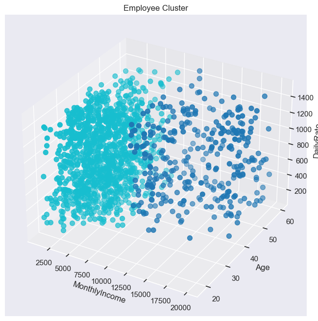
    

